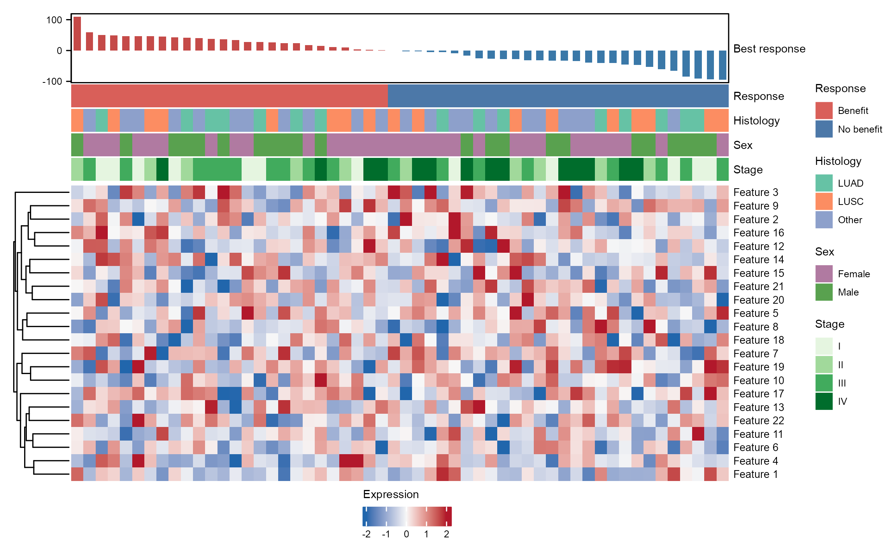
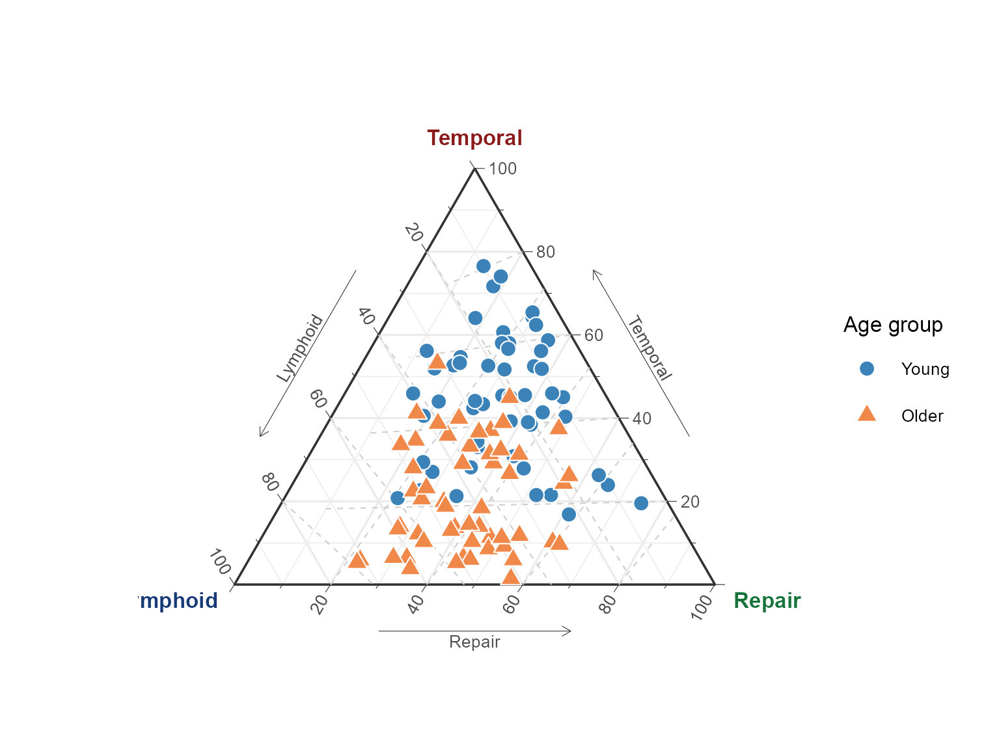
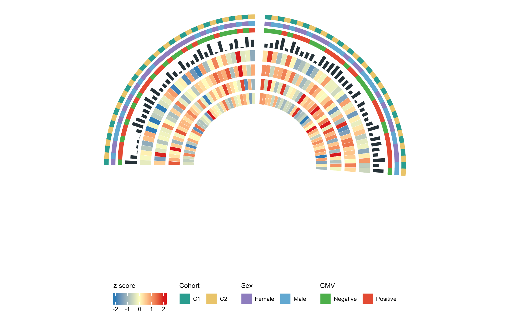
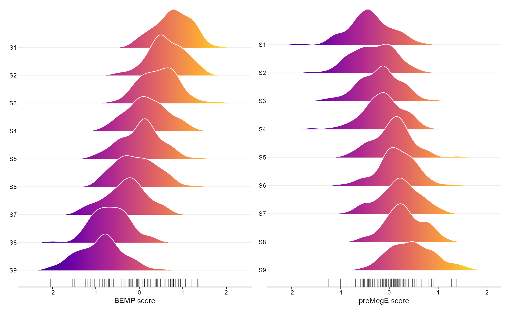
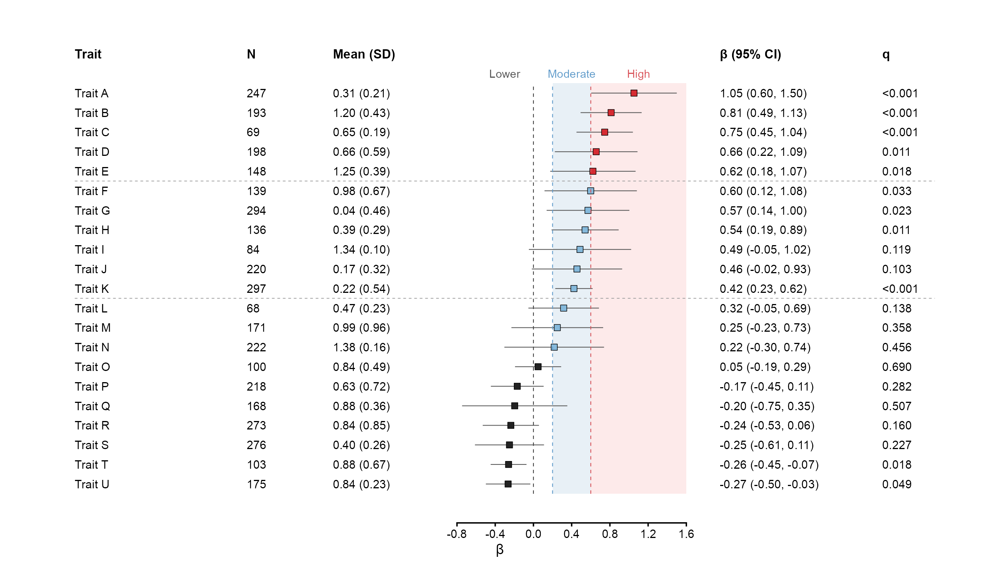
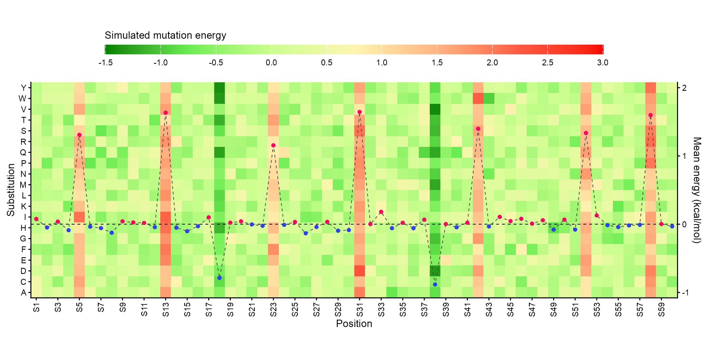

# BioFigure

用 R 为主的工作流，绘制、调整和检查生物科研图。

[](docs/RELEASE-NOTES-3.5.1.md)
[](LICENSE)

[安装与使用](#安装与使用) · [图廊](docs/GALLERY.md) · [中文手册](docs/HANDBOOK.zh-CN.md) · [English handbook](docs/HANDBOOK.en.md) · [更新说明](docs/RELEASE-NOTES-3.5.1.md)

BioFigure 是供编码助手读取的 Skill。它把图型选择、数据检查、R 包用法、布局要求和验收脚本放在一起，帮助助手在写代码前确定画什么、用什么方法、最后检查什么。默认使用 R，也支持 Python。

## 部分示例

以下图使用模拟数据，由仓库中的 R 脚本生成，用于展示版式和方法。它们不是论文研究结果，也不代表所有图型已经通过验证。点击图片可查看大图。

| 临床注释热图 | 三元分组图 |
|---|---|
|  |  |

| 半圆多轨热图 | 山峦与条码 |
|---|---|
|  |  |

| β 森林图 | 突变能量热图 |
|---|---|
|  |  |

[浏览全部精选图和复现代码](docs/GALLERY.md)。首页只放六张，图廊按图型展开。

## 安装与使用

将完整的 `biofigure` 文件夹放入项目的 `.agents/skills/`，或个人的 `~/.agents/skills/`。保留目录里的脚本、参考资料和配置；仅复制 `SKILL.md` 无法运行检查工具。

在支持 Skills 的 Codex 环境中调用：

```text
$biofigure 用 expression.csv 和 metadata.csv 画分组热图。
样本顺序按元数据，保留行名，输出 PNG；先检查输入，再绘图和验图。
```

VS Code 的 Codex 扩展使用说明见 [这里](biofigure/references/vscode-execution.md)。其他助手是否识别相同目录，需按其文档确认。

先安装 Python 检查工具依赖；R 包按所选图型安装：

```bash
python3 -m pip install -r biofigure/requirements.txt
```

请求不完整时，先补齐图型、数据字段和科学含义。可以采用默认字体和背景，但不能擅自决定配对关系、统计检验或编造测量值。

## 这一版改了什么

- 方法规划器先匹配图型与数据结构；歧义请求返回 `NEEDS_SPEC`，不会直接挑一个案例渲染。
- 记录专用 R 包、必要图层、字体和布局要求；修图后重新检查当前文件。
- 将来源复现、独立迁移和压力测试分开，旧案例的通过标记不自动变成新标准认证。
- 补充 SciDraw 方法记录、测试和 VS Code 使用说明。

## 验证范围

本次 77 项 Python 自动测试通过，包结构与版本一致性检查通过。完整 V2 benchmark 仍未完成：231 个登记案例尚无完成全部三类证据的认证案例。示例展示、代码可运行和完整验收是不同状态。

这些规则不会改变模型参数，也不能保证每种模型、每个推理档位都得到相同结果。实际绘图仍须检查数据和最终成图。查看 [验收规则](biofigure/references/benchmark-protocol.md) 与 [本版审计](docs/release-audit-3.5.1.json)。

```bash
python3 -m unittest discover -s biofigure/tests -q
python3 biofigure/scripts/audit_skill_release.py
```

## 反馈与来源

使用问题和建议可以发到 [Discussions](https://github.com/Woyekun-cell/BioFigure/discussions)；可复现的错误请提交 [Issue](https://github.com/Woyekun-cell/BioFigure/issues/new/choose)，附数据结构、代码、包版本和成图。

方法来源与适用范围见 [设计来源](docs/DESIGN-SOURCES.md) 和 [案例记录](biofigure/atlas)。本次图廊展示自行生成的示例图；来源文章的原图、网页与原始代码不随本次更新上传。
