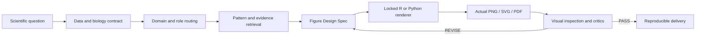

<div align="center">

# BioFigure

**参考引导的生物科研图设计 Skill**<br>
**A reference-guided design skill for biological scientific figures**

[](biofigure/SKILL.md)
[](biofigure/renderer-registry.yaml)
[](biofigure/renderer-registry.yaml)

[中文](#中文) · [English](#english) · [图例 Gallery](#gallery) · [完整手册 Full handbook](docs/HANDBOOK.zh-CN.md)

</div>

## Gallery

所有图均由仓库内 R 脚本和明确标记的模拟数据生成。它们展示视觉语法与 QA，不代表生物学发现。<br>
All figures are rendered by repository R scripts using explicitly simulated data. They demonstrate visual grammar and QA, not biological findings.

| 方格表达热图 / Square expression heatmap | 火山图 / Volcano plot | 单细胞气泡图 / Single-cell dot plot |
|---|---|---|
|  |  |  |
| 系统树与轨道 / Phylogeny with tracks | 云雨图 / Raincloud plot | 雷达图 / Radar profile |
|  |  |  |

## 中文

BioFigure 把科研语义与绘图代码之间缺失的设计层补齐。它先检查实体、样本、重复、尺度、统计与坐标，再检索合适的 Pattern 和参考证据，生成 Figure Design Spec，锁定 R 或 Python 后端，实际渲染并打开成图，最后由科学、视觉、投稿和领域专项 Critic 决定修订或交付。

它覆盖转录组、代谢组、多组学、单细胞/空间组学、ATAC/ChIP/甲基化/Hi-C、基因组与结构变异、系统发育与共线性、图像实验、机器学习、机制图和多面板主图。默认使用 R；AnnData/Scanpy 等原生对象可选择 Python。同一张图的预览、导出和布局 QA 必须保持同一后端。

### 快速调用

```text
$biofigure 用R读取 expression.tsv 和 metadata.tsv，绘制四组表达热图；
样本顺序按元数据，格子保持方形，输出PNG和可编辑SVG。
```

只说图名也可以。系统会从数据结构和研究目的路由到相应规则；实验单位、配对关系或比较方向无法安全判断时才询问。没有真实数值时只能生成明确标记的示意或模拟图，不能补造结果。

### 为什么不是模板套壳

Pattern 描述可复用视觉语法；Atlas 保存来源、正例和失败边界；Renderer 把 Design Spec 实现为代码；Critics 审查实际图；Benchmark 衡量整个 Skill 在多任务上的表现。五者职责不同，详见[中文完整手册](docs/HANDBOOK.zh-CN.md)。

## English

BioFigure inserts an explicit design layer between biological semantics and plotting code. It verifies entities, samples, replicates, scales, statistics, and coordinates; retrieves a suitable pattern and traceable references; writes a Figure Design Spec; locks either R or Python; renders and opens the artifact; and then runs scientific, visual, publication, and domain-specific critics.

Its routing covers transcriptomics, metabolomics, multi-omics, single-cell and spatial data, ATAC/ChIP/methylation/Hi-C, genome variation, phylogeny and synteny, imaging assays, machine learning, mechanism diagrams, and multi-panel figures. R is the default. Python remains available for native ecosystems such as AnnData and Scanpy. Preview, export, and layout QA for one figure stay on the locked backend.

### Quick invocation

```text
$biofigure Use R to read expression.tsv and metadata.tsv and draw a four-group
expression heatmap. Preserve metadata sample order, keep square cells, and export
a PNG plus an editable SVG.
```

A chart name alone is enough to start routing. The system infers the relevant rules from data topology and scientific intent, asking only when experimental units, pairing, or comparison direction cannot be inferred safely. Missing measurements are never invented.

Patterns encode reusable visual grammar; the Atlas records evidence and failure boundaries; renderers implement the Design Spec; critics inspect the rendered artifact; benchmarks evaluate the whole skill across tasks. See the [full English handbook](docs/HANDBOOK.en.md).

## Architecture



## Reproduce the gallery

```bash
Rscript --vanilla biofigure/examples/gallery/generate_core_gallery.R docs/assets/gallery
Rscript --vanilla biofigure/examples/gallery/generate_advanced_gallery.R /tmp/biofigure-gallery
```

Required packages are listed beside each script. The core script fails on missing Arial instead of silently substituting a font. Advanced examples also export underlying simulated tables and statistics to the requested output directory.

## Validation

```bash
python3 -m unittest discover -s biofigure/tests -p 'test_*.py'
Rscript --vanilla biofigure/tests/test_style.R
python3 biofigure/scripts/validate_pattern.py
python3 biofigure/scripts/validate_palette_library.py
```

Passing these checks does not guarantee journal acceptance. A final figure still requires inspection at its intended physical size, correct biological interpretation, and task-specific evidence.

## Design references

The gallery-first README, concise capability statement, runnable examples, documentation links, and explicit stability boundaries were informed by established projects including [ComplexHeatmap](https://github.com/jokergoo/ComplexHeatmap), [Scanpy](https://github.com/scverse/scanpy), [ggtree](https://github.com/YuLab-SMU/ggtree), and [ggpubr](https://github.com/kassambara/ggpubr). BioFigure does not copy their figures or claim endorsement. Source notes and observed repository metrics are recorded in [DESIGN-SOURCES.md](docs/DESIGN-SOURCES.md).

## Status and rights

BioFigure 3.1 is an actively maintained personal research workflow. Third-party code and images are not redistributed as BioFigure-owned assets. No repository-wide software license has been declared yet; reuse beyond evaluation requires permission from the repository owner and verification of upstream licenses.
