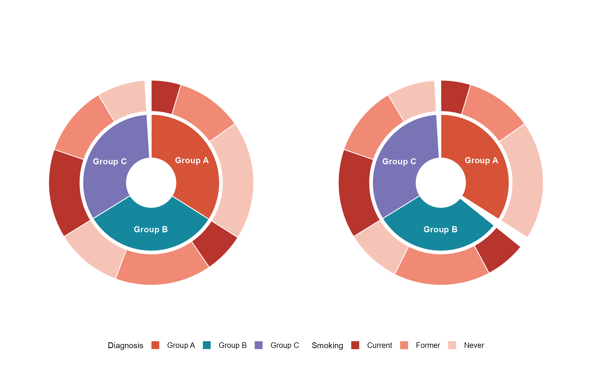
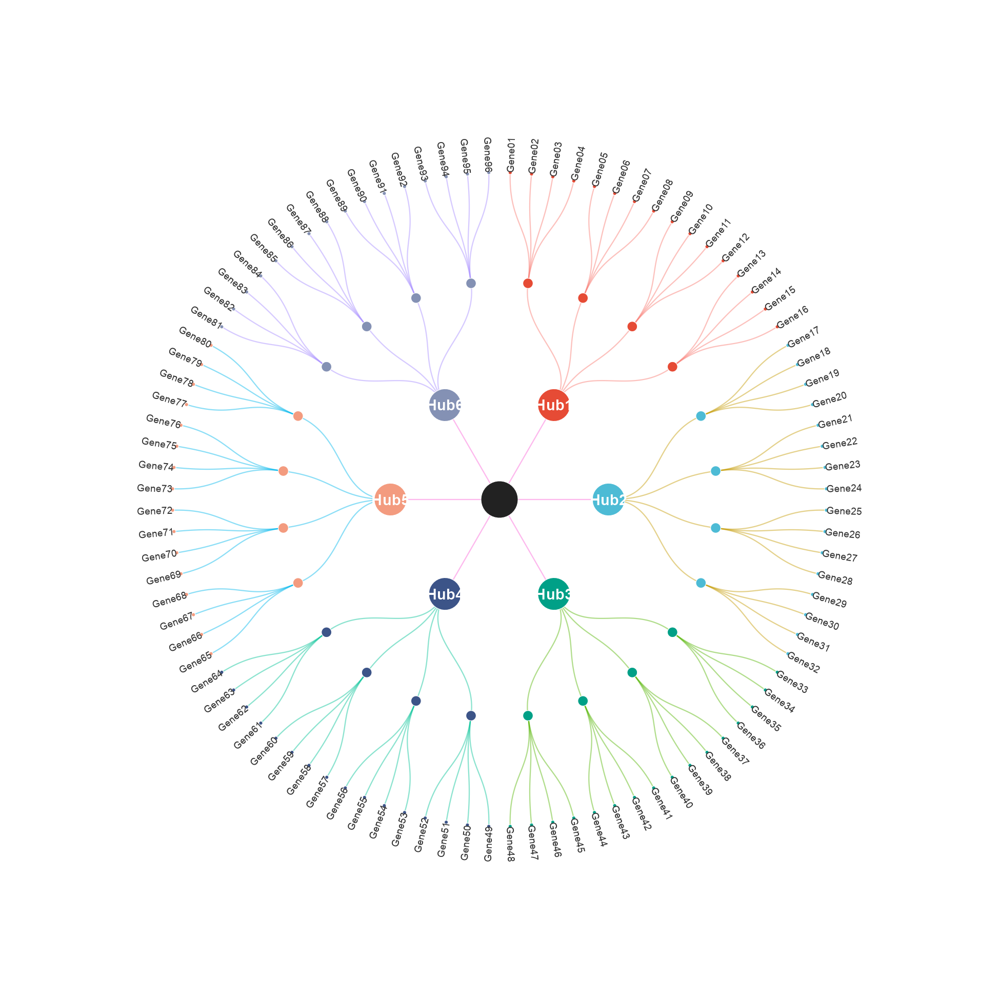
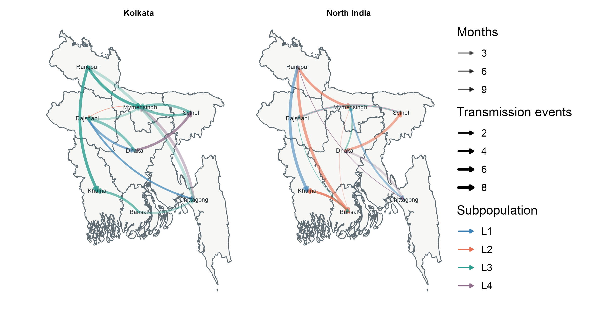

# BioFigure 图廊

[返回首页](../README.md) · [复现代码](../biofigure/examples/reproduction-gallery)

以下为固定种子模拟数据生成的版式示例。颜色和布局用于演示，不应据此解释真实生物学结果。来源复现与完整 benchmark 状态分别记录，展示不代表认证。

- [临床注释热图](#figure-1)
- [三元分组图](#figure-2)
- [半圆多轨热图](#figure-3)
- [山峦与条码](#figure-4)
- [双层环图](#figure-5)
- [层级网络](#figure-6)
- [带注释泳道图](#figure-7)
- [流向地图](#figure-8)

## 临床注释热图

[查看原尺寸](assets/reproduction-gallery/figure_077_issue068_clinical_heatmap.png) · [脚本与数据](../biofigure/examples/reproduction-gallery) · [回到目录](#biofigure-图廊)

## 三元分组图

[查看原尺寸](assets/reproduction-gallery/figure_073_issue065_ternary_groups.png) · [脚本与数据](../biofigure/examples/reproduction-gallery) · [回到目录](#biofigure-图廊)

## 半圆多轨热图

[查看原尺寸](assets/reproduction-gallery/figure_076_issue067_circlize_rainbow_heatmap.png) · [脚本与数据](../biofigure/examples/reproduction-gallery) · [回到目录](#biofigure-图廊)

## 山峦与条码

[查看原尺寸](assets/reproduction-gallery/figure_088_issue077_ridgeline_barcode.png) · [脚本与数据](../biofigure/examples/reproduction-gallery) · [回到目录](#biofigure-图廊)

## 双层环图

[查看原尺寸](assets/reproduction-gallery/figure_083_issue072_nested_piedonut.png) · [脚本与数据](../biofigure/examples/reproduction-gallery) · [回到目录](#biofigure-图廊)

## 层级网络

[查看原尺寸](assets/reproduction-gallery/figure_086_issue074_petal_network.png) · [脚本与数据](../biofigure/examples/reproduction-gallery) · [回到目录](#biofigure-图廊)

## 带注释泳道图

[查看原尺寸](assets/reproduction-gallery/figure_081_issue070_annotated_swimmer.png) · [脚本与数据](../biofigure/examples/reproduction-gallery) · [回到目录](#biofigure-图廊)

## 流向地图

[查看原尺寸](assets/reproduction-gallery/figure_090_issue080_flow_map.png) · [脚本与数据](../biofigure/examples/reproduction-gallery) · [回到目录](#biofigure-图廊)

## 新增：β 森林图

## 新增：突变能量热图

两图为本轮来源知情迁移预览，尚未完成全部CP验收；使用模拟数据。[独立R代码与运行说明](../biofigure/examples/reference-transfer)。
