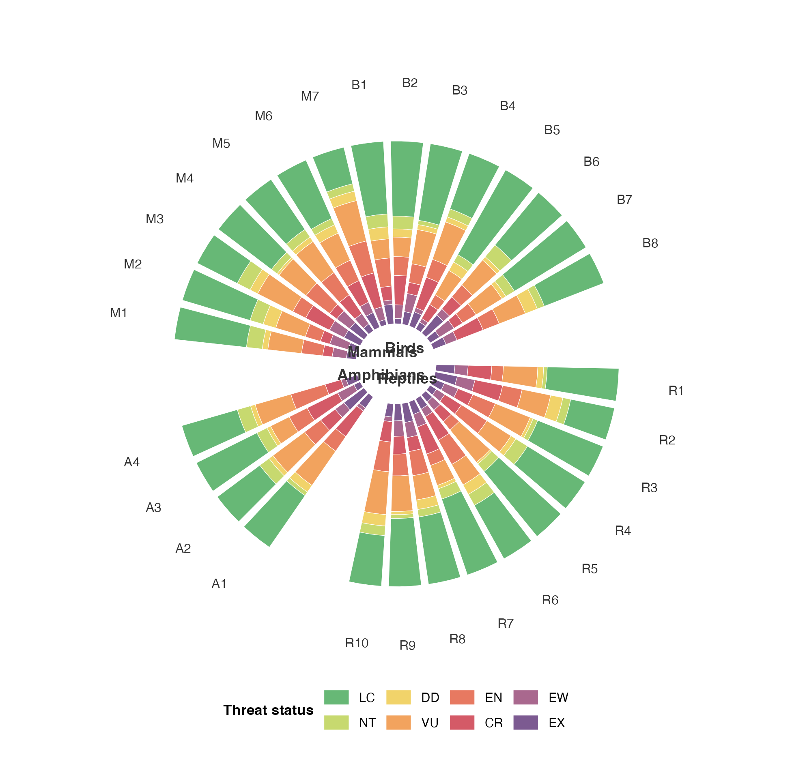
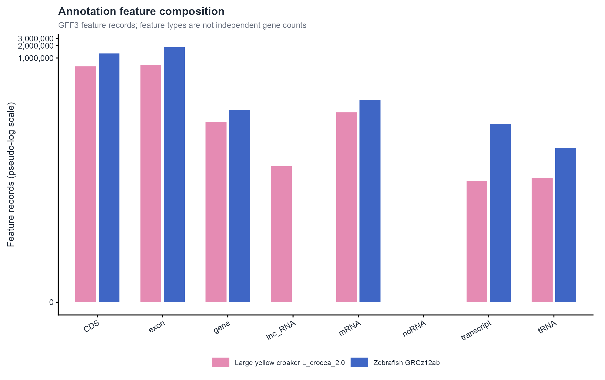
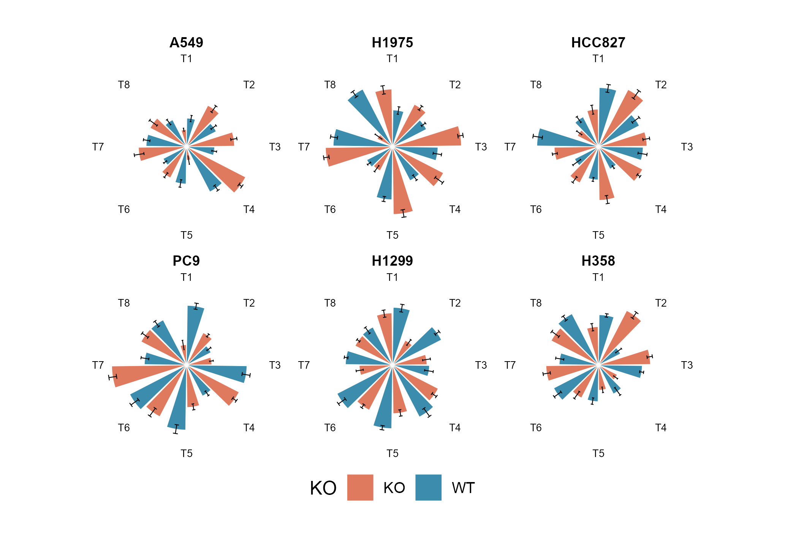

# 柱形、棒棒糖与花瓣图 / Bars and lollipops

[全部分类 / Categories](../GALLERY.md) · [首页 / Home](../../README.md) · [逐图清单 / Inventory](catalog.csv)

本类 **14 张**；第 **2/2 页**。页码：[1](bars.md) · **2**

图型与数据来源分别标注；旧版折叠保留。收录不等于原论文数据复现或完整 CP 验收。 Data origin is stated per figure. Historical versions are folded. Inclusion does not certify scientific fidelity.

## BF-0140 · 顶刊案例002：径向堆积柱图

模拟数据／方法展示；非原论文数据复现。

状态：方法展示／仍待修订，不能视为高保真验收通过。

[原尺寸](../../docs/assets/archive-gallery/topjournal-001-010/02_radial_stacked_bar.png) · [脚本](../../biofigure/examples/archive-gallery/topjournal-001-010/scripts/render_topjournal_001_010.R) · [记录](catalog.csv)

## BF-0169 · 双物种注释类型组成

斑马鱼与大黄鱼公开参考组装／注释示例；无全基因组比对或 SV calling。

[原尺寸](../../docs/assets/archive-gallery/comparative-genomics/03_annotation_feature_composition.png) · [脚本](../../biofigure/examples/archive-gallery/comparative-genomics/scripts/analysis.R) · [记录](catalog.csv)

## BF-0187 · 断轴堆积柱图

模拟数据／方法展示；非原论文数据复现。

[原尺寸](../../docs/assets/archive-gallery/full-reproduction/figure_062_ggbreak_stacked_code_driven.png) · [脚本](../../biofigure/examples/archive-gallery/full-reproduction/scripts/non_single_cell_055_069.R) · [记录](catalog.csv)

## BF-0200 · 分面极坐标柱图

模拟数据／方法展示；非原论文数据复现。

[原尺寸](../../docs/assets/archive-gallery/full-reproduction/figure_084_issue073_polar_bars.png) · [脚本](../../biofigure/examples/archive-gallery/full-reproduction/scripts/code_driven_071_087.R) · [记录](catalog.csv)

## BF-0201 · 样条花瓣图

模拟数据／方法展示；非原论文数据复现。

[原尺寸](../../docs/assets/archive-gallery/full-reproduction/figure_085_issue073_spline_petals.png) · [脚本](../../biofigure/examples/archive-gallery/full-reproduction/scripts/code_driven_071_087.R) · [记录](catalog.csv)

## BF-0207 · 肿瘤变化瀑布图

模拟数据／方法展示；非原论文数据复现。

[原尺寸](../../docs/assets/archive-gallery/full-reproduction/revision_v1_44_waterfall.png) · [脚本](../../biofigure/examples/archive-gallery/full-reproduction/scripts/batch41_50_reproduction.R) · [记录](catalog.csv)

页码：[1](bars.md) · **2**

[全部分类](../GALLERY.md) · [脚本存档说明](../../biofigure/examples/archive-gallery/README.md)
