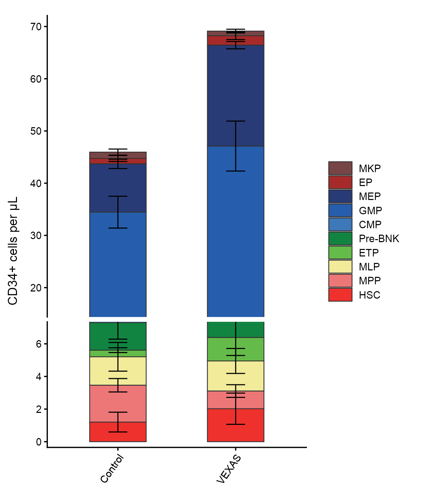
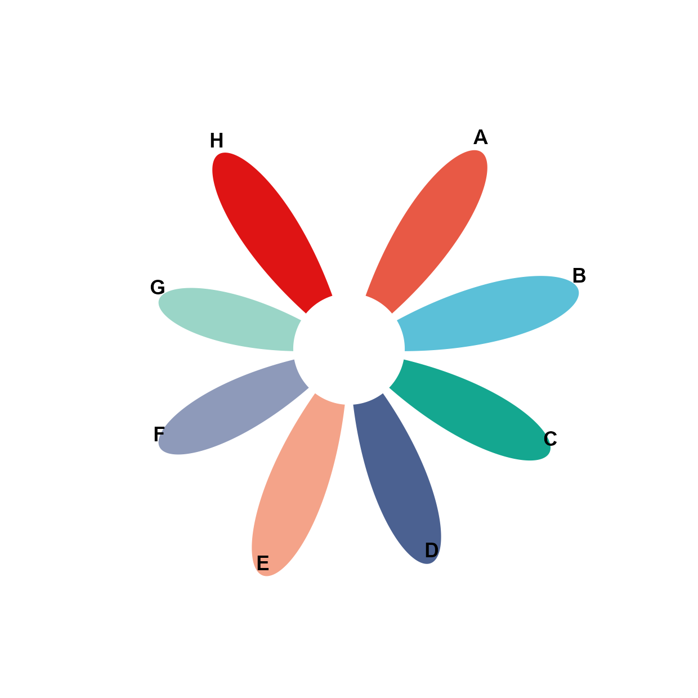
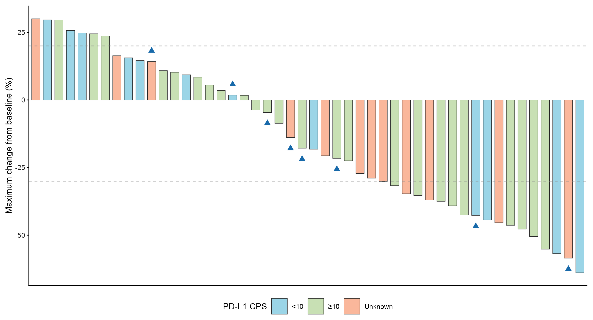

# 柱形、棒棒糖与花瓣图 / Bars and lollipops

[全部分类 / Categories](../GALLERY.md) · [首页 / Home](../../README.md) · [逐图清单 / Inventory](catalog.csv)

本类 **6 张代表图**，每个细分图型保留一例。

按结构与用途选取代表图，去除同类配色、数据集及历史变体。数据来源逐图标注；收录不等于完整 CP 验收。 One representative per visual subtype; color-only, dataset-only and historical variants are omitted. Inclusion does not certify scientific fidelity.

## BF-0068 · 环形分组柱与误差线

图型：环形分组柱。模拟数据／方法展示；非原论文数据复现。

[原尺寸](../../docs/assets/archive-gallery/random-three/circular.png) · [脚本](../../biofigure/examples/archive-gallery/random-three/scripts/draw_three.R) · [记录](catalog.csv)

## BF-0088 · 嵌套分组柱状图

图型：分组柱。模拟数据／方法展示；非原论文数据复现。

[原尺寸](../../docs/assets/archive-gallery/scidraw-001-065/15_nested_bar.png) · [批次脚本](../../biofigure/examples/archive-gallery/scidraw-001-065/scripts) · [方法来源](https://mp.weixin.qq.com/s/2FDViuydPNLybOrfM9eW9w) · [记录](catalog.csv)

## BF-0127 · 堆积柱与哑铃图

图型：堆积柱与哑铃。模拟数据／方法展示；非原论文数据复现。

状态：方法展示／仍待修订，不能视为高保真验收通过。

[原尺寸](../../docs/assets/archive-gallery/scidraw-001-065/54_stacked_bar_dumbbell.png) · [脚本](../../biofigure/examples/archive-gallery/scidraw-001-065/scripts/render_cases_46_55.R) · [方法来源](https://mp.weixin.qq.com/s/SlQfiOpHiUNfu2SPR_UhMw) · [记录](catalog.csv)

## BF-0187 · 断轴堆积柱图

图型：断轴堆积柱。模拟数据／方法展示；非原论文数据复现。

[原尺寸](../../docs/assets/archive-gallery/full-reproduction/figure_062_ggbreak_stacked_code_driven.png) · [脚本](../../biofigure/examples/archive-gallery/full-reproduction/scripts/non_single_cell_055_069.R) · [记录](catalog.csv)

## BF-0201 · 样条花瓣图

图型：花瓣图。模拟数据／方法展示；非原论文数据复现。

[原尺寸](../../docs/assets/archive-gallery/full-reproduction/figure_085_issue073_spline_petals.png) · [脚本](../../biofigure/examples/archive-gallery/full-reproduction/scripts/code_driven_071_087.R) · [记录](catalog.csv)

## BF-0207 · 肿瘤变化瀑布图

图型：瀑布图。模拟数据／方法展示；非原论文数据复现。

[原尺寸](../../docs/assets/archive-gallery/full-reproduction/revision_v1_44_waterfall.png) · [脚本](../../biofigure/examples/archive-gallery/full-reproduction/scripts/batch41_50_reproduction.R) · [记录](catalog.csv)

[全部分类](../GALLERY.md) · [脚本存档说明](../../biofigure/examples/archive-gallery/README.md)
