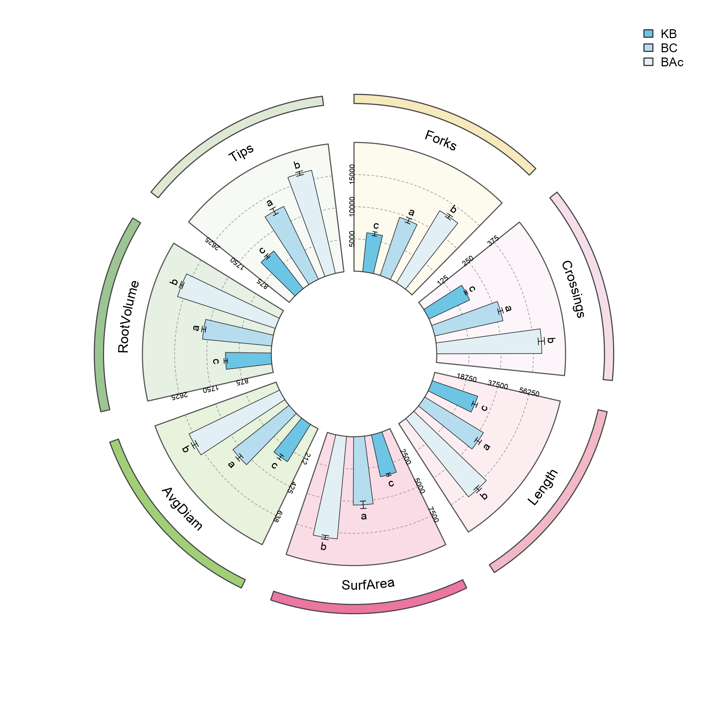
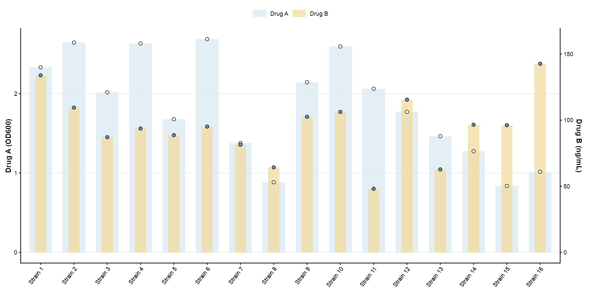
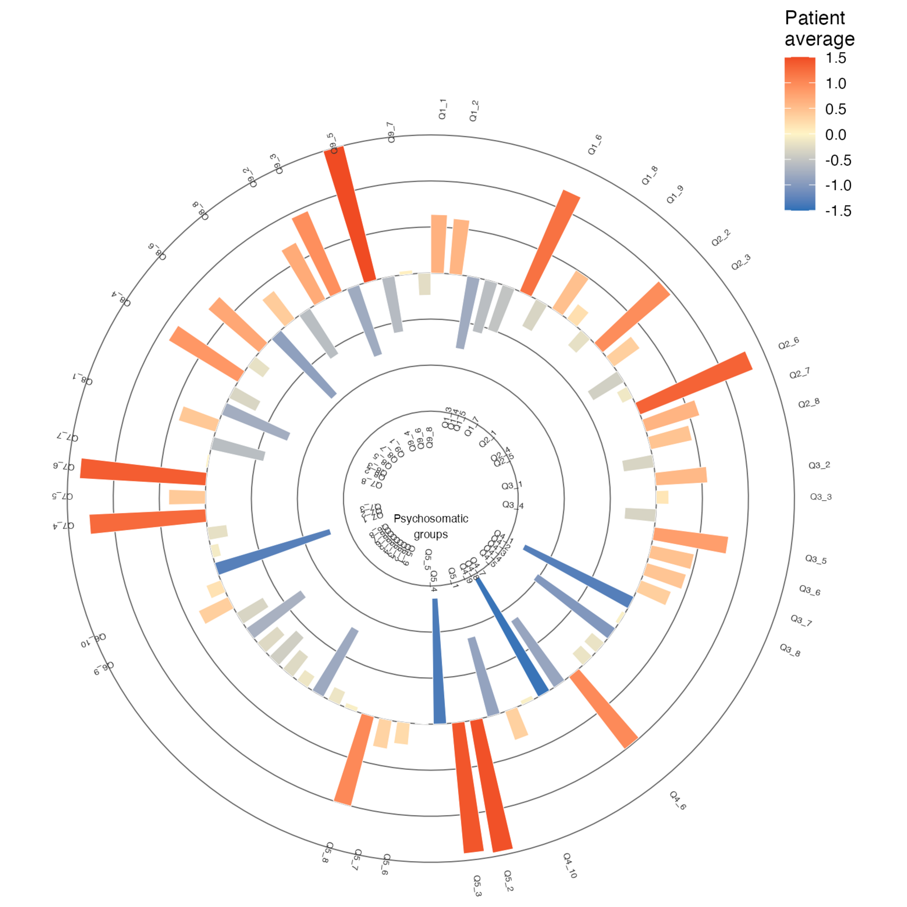
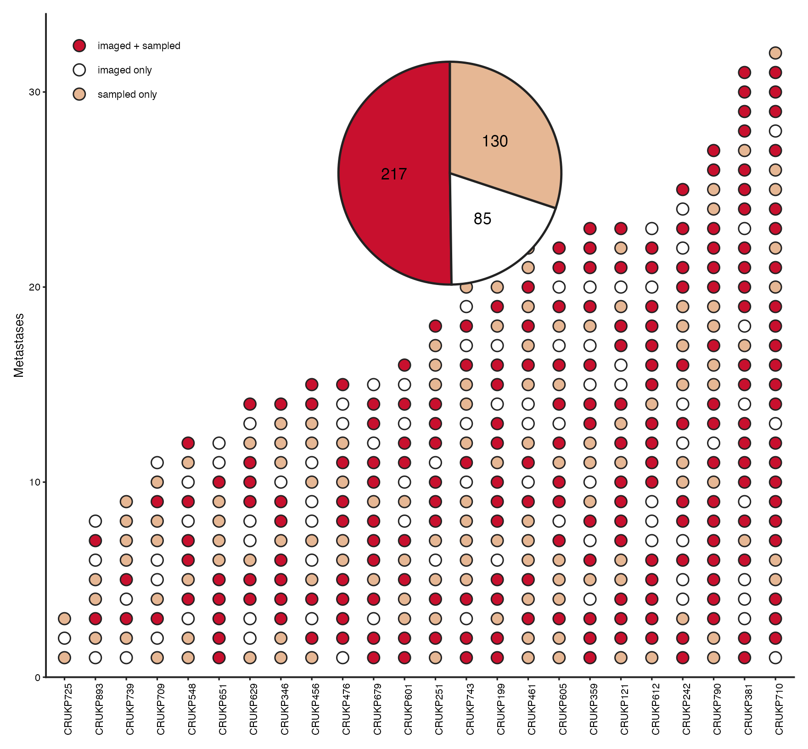
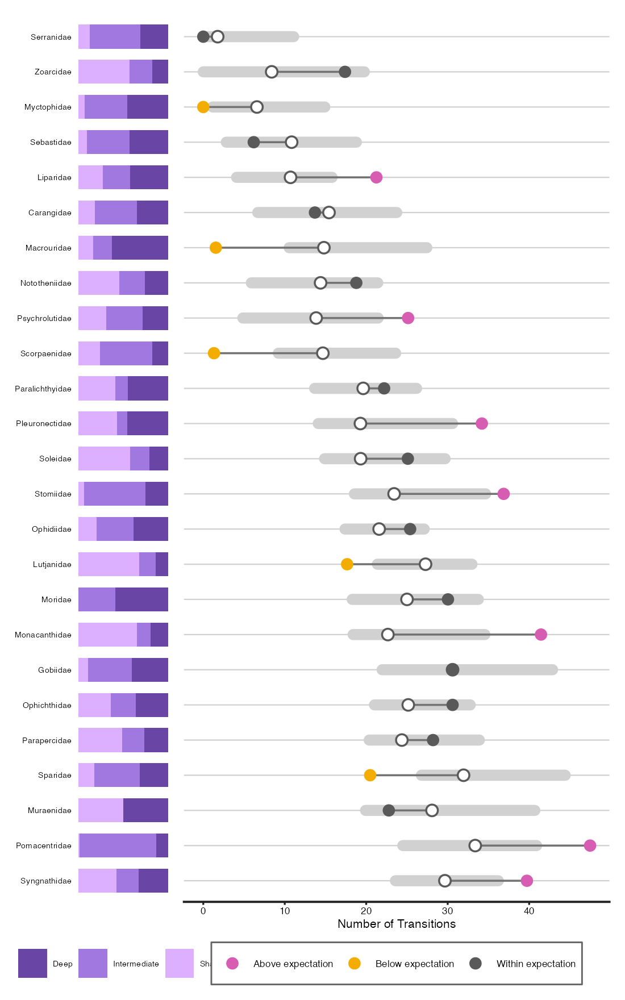
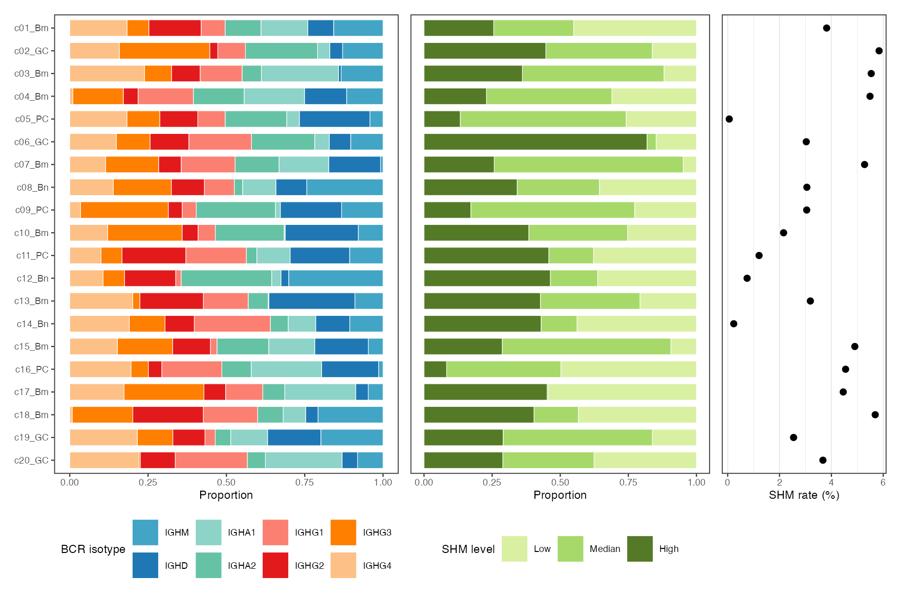
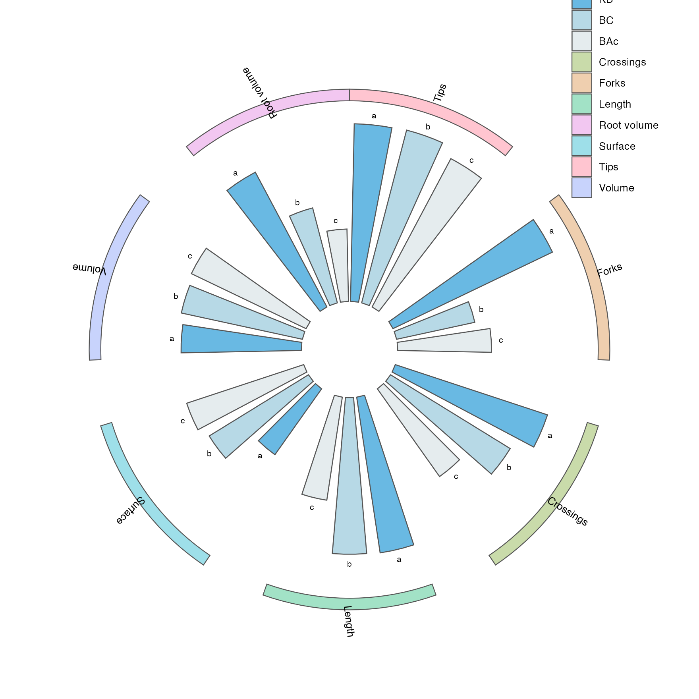
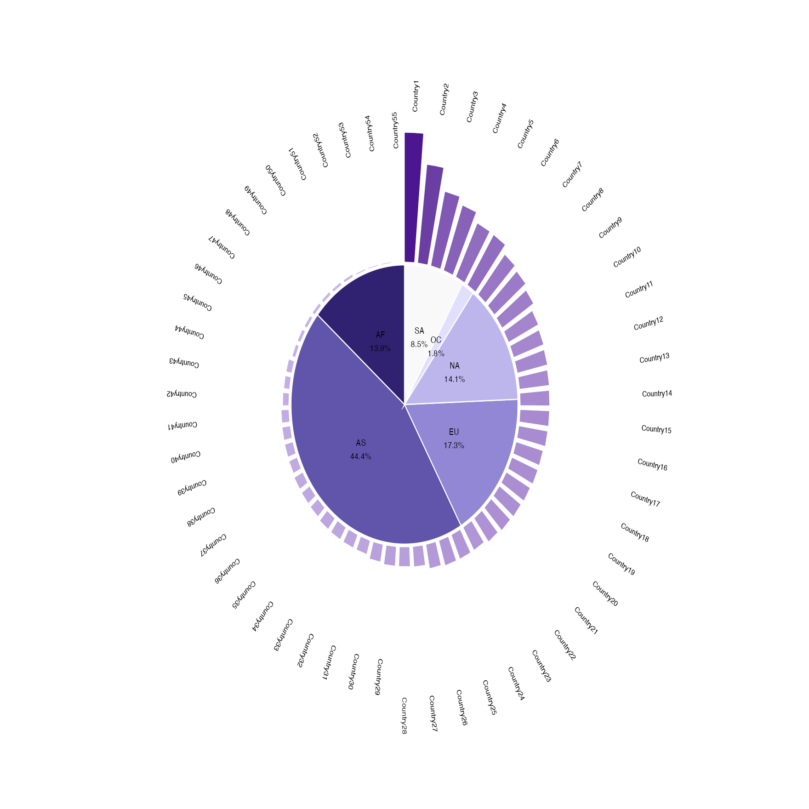

# 柱形、棒棒糖与花瓣图 / Bars and lollipops

[全部分类 / Categories](../GALLERY.md) · [首页 / Home](../../README.md) · [逐图清单 / Inventory](catalog.csv)

本类 **14 张**；第 **1/2 页**。页码：**1** · [2](bars-2.md)

图型与数据来源分别标注；旧版折叠保留。收录不等于原论文数据复现或完整 CP 验收。 Data origin is stated per figure. Historical versions are folded. Inclusion does not certify scientific fidelity.

## BF-0068 · 环形分组柱与误差线

模拟数据／方法展示；非原论文数据复现。

[原尺寸](../../docs/assets/archive-gallery/random-three/circular.png) · [脚本](../../biofigure/examples/archive-gallery/random-three/scripts/draw_three.R) · [记录](catalog.csv)

## BF-0088 · 嵌套分组柱状图

模拟数据／方法展示；非原论文数据复现。

[原尺寸](../../docs/assets/archive-gallery/scidraw-001-065/15_nested_bar.png) · [批次脚本](../../biofigure/examples/archive-gallery/scidraw-001-065/scripts) · [方法来源](https://mp.weixin.qq.com/s/2FDViuydPNLybOrfM9eW9w) · [记录](catalog.csv)

## BF-0124 · 渐变分组环形柱图

模拟数据／方法展示；非原论文数据复现。

状态：方法展示／仍待修订，不能视为高保真验收通过。

[原尺寸](../../docs/assets/archive-gallery/scidraw-001-065/51_grouped_gradient_circular_bar.png) · [脚本](../../biofigure/examples/archive-gallery/scidraw-001-065/scripts/render_cases_46_55.R) · [方法来源](https://mp.weixin.qq.com/s/u8IgzYxdRHu8xwnnlvgawQ) · [记录](catalog.csv)

## BF-0125 · 堆叠点与嵌入饼图

模拟数据／方法展示；非原论文数据复现。

状态：方法展示／仍待修订，不能视为高保真验收通过。

[原尺寸](../../docs/assets/archive-gallery/scidraw-001-065/52_stacked_dot_inset_pie.png) · [脚本](../../biofigure/examples/archive-gallery/scidraw-001-065/scripts/render_cases_46_55.R) · [方法来源](https://mp.weixin.qq.com/s/4ambuuw1fI07X0PoipIGsA) · [记录](catalog.csv)

## BF-0127 · 堆积柱与哑铃图

模拟数据／方法展示；非原论文数据复现。

状态：方法展示／仍待修订，不能视为高保真验收通过。

[原尺寸](../../docs/assets/archive-gallery/scidraw-001-065/54_stacked_bar_dumbbell.png) · [脚本](../../biofigure/examples/archive-gallery/scidraw-001-065/scripts/render_cases_46_55.R) · [方法来源](https://mp.weixin.qq.com/s/SlQfiOpHiUNfu2SPR_UhMw) · [记录](catalog.csv)

## BF-0133 · 对齐堆积柱与点图

模拟数据／方法展示；非原论文数据复现。

状态：方法展示／仍待修订，不能视为高保真验收通过。

[原尺寸](../../docs/assets/archive-gallery/scidraw-001-065/60_stacked_bar_dot_aligned.png) · [脚本](../../biofigure/examples/archive-gallery/scidraw-001-065/scripts/render_cases_56_65.R) · [方法来源](https://mp.weixin.qq.com/s/13HZqQU5AhK3-Ib2UKt4YQ) · [记录](catalog.csv)

## BF-0134 · 七瓣环形柱图

模拟数据／方法展示；非原论文数据复现。

状态：方法展示／仍待修订，不能视为高保真验收通过。

[原尺寸](../../docs/assets/archive-gallery/scidraw-001-065/61_seven_petal_circular_bar.png) · [脚本](../../biofigure/examples/archive-gallery/scidraw-001-065/scripts/render_cases_56_65.R) · [方法来源](https://mp.weixin.qq.com/s/RRVWmv8Iaiso5e_YaOtrRw) · [记录](catalog.csv)

## BF-0135 · 环形柱与嵌入饼图

模拟数据／方法展示；非原论文数据复现。

状态：方法展示／仍待修订，不能视为高保真验收通过。

[原尺寸](../../docs/assets/archive-gallery/scidraw-001-065/62_circular_bar_inset_pie.png) · [脚本](../../biofigure/examples/archive-gallery/scidraw-001-065/scripts/render_cases_56_65.R) · [方法来源](https://mp.weixin.qq.com/s/vizpuhFSYiKTm6cdvaxoZQ) · [记录](catalog.csv)

页码：**1** · [2](bars-2.md)

[全部分类](../GALLERY.md) · [脚本存档说明](../../biofigure/examples/archive-gallery/README.md)
