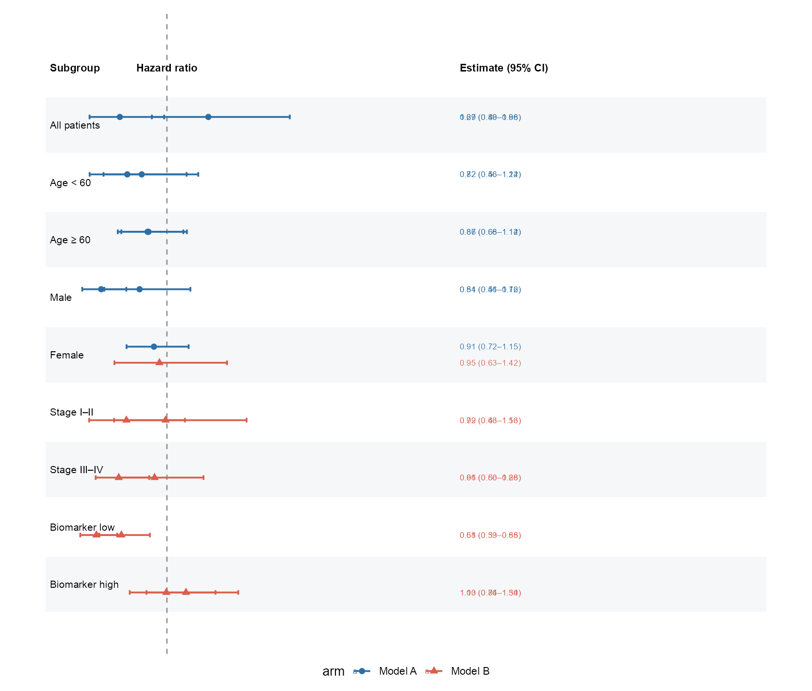
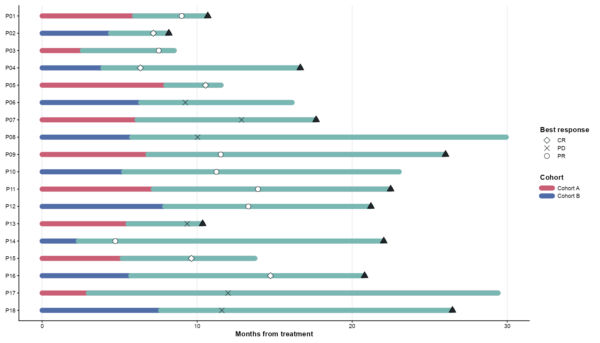
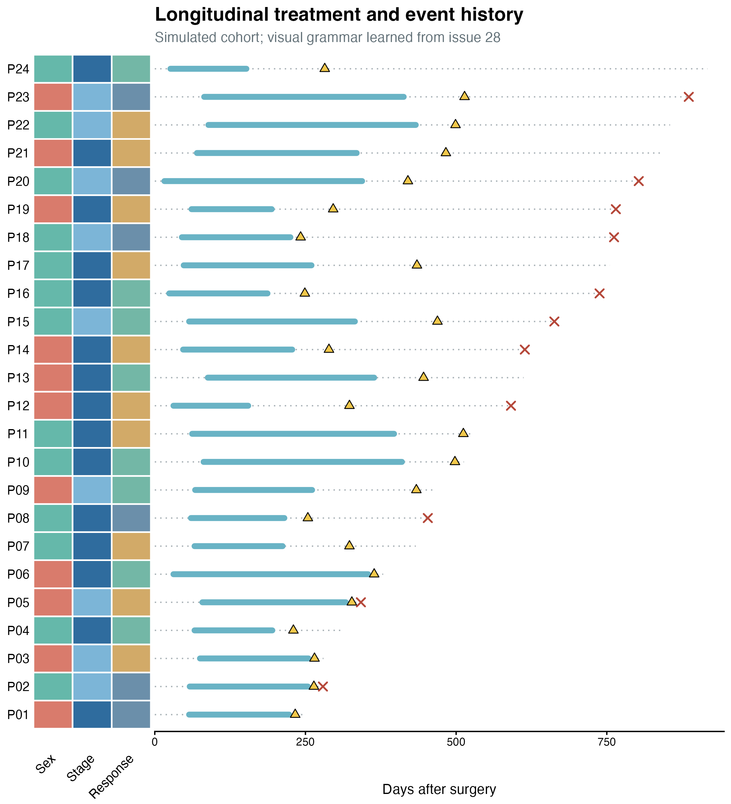
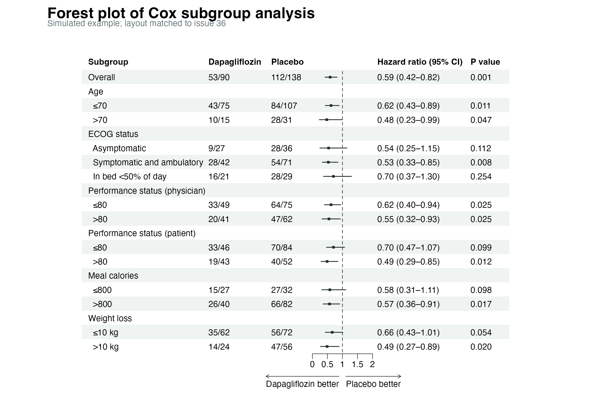
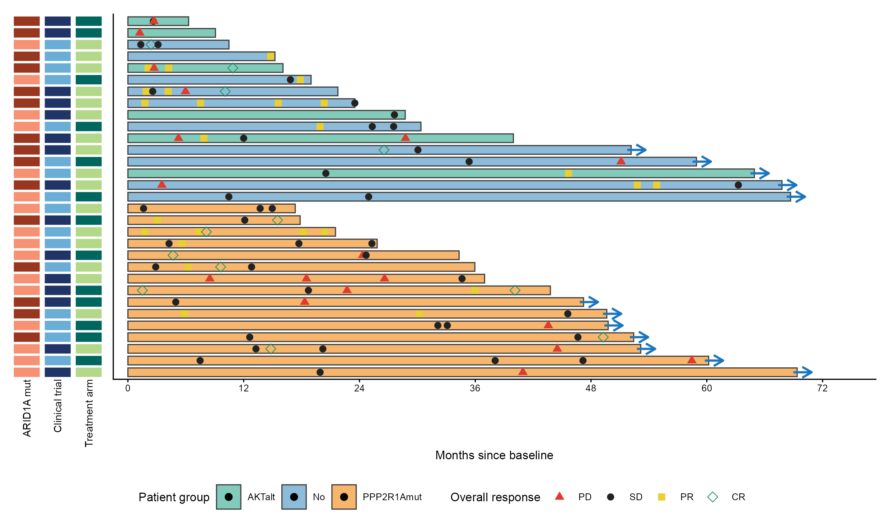
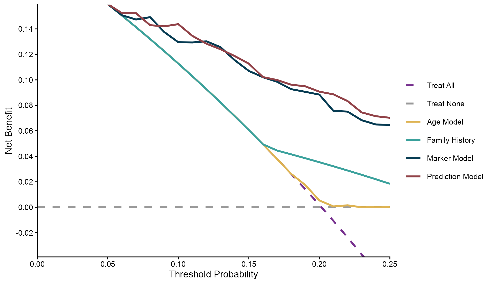
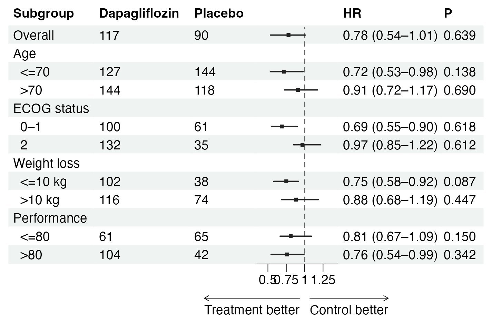
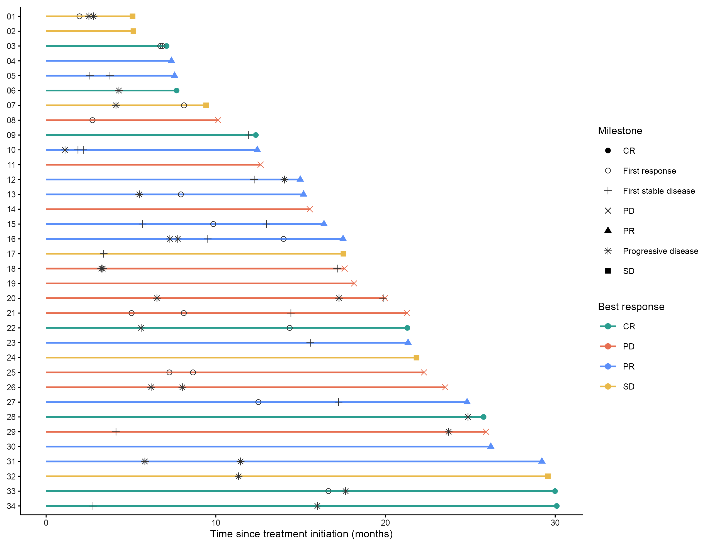

# 生存、森林与患者轨迹 / Clinical plots

[全部分类 / Categories](../GALLERY.md) · [首页 / Home](../../README.md) · [逐图清单 / Inventory](catalog.csv)

本类 **18 张**；第 **2/3 页**。页码：[1](clinical.md) · **2** · [3](clinical-3.md)

图型与数据来源分别标注；旧版折叠保留。收录不等于原论文数据复现或完整 CP 验收。 Data origin is stated per figure. Historical versions are folded. Inclusion does not certify scientific fidelity.

## BF-0076 · 双列 HR 森林图

模拟数据／方法展示；非原论文数据复现。

[原尺寸](../../docs/assets/archive-gallery/scidraw-001-065/04_dual_hr_forest.png) · [批次脚本](../../biofigure/examples/archive-gallery/scidraw-001-065/scripts) · [方法来源](https://mp.weixin.qq.com/s/2B95P3is3_NWGJmcY9prsQ) · [记录](catalog.csv)

## BF-0077 · 治疗事件泳道图

模拟数据／方法展示；非原论文数据复现。

[原尺寸](../../docs/assets/archive-gallery/scidraw-001-065/05_swimmer.png) · [批次脚本](../../biofigure/examples/archive-gallery/scidraw-001-065/scripts) · [方法来源](https://mp.weixin.qq.com/s/DWxaxZvIFW0_Ve1yDRYSZQ) · [记录](catalog.csv)

## BF-0176 · 纵向患者泳道与临床注释

模拟数据／方法展示；非原论文数据复现。

[原尺寸](../../docs/assets/archive-gallery/topjournal-early/issue028_swimmer.png) · [脚本](../../biofigure/examples/archive-gallery/topjournal-early/scripts/issue028_swimmer_reproduction.R) · [记录](catalog.csv)

## BF-0177 · Cox 亚组森林图布局

模拟数据／方法展示；非原论文数据复现。

[原尺寸](../../docs/assets/archive-gallery/topjournal-early/issue036_forest.png) · [脚本](../../biofigure/examples/archive-gallery/topjournal-early/scripts/issue036_forest_reproduction.R) · [记录](catalog.csv)

## BF-0185 · 患者泳道与多列注释

模拟数据／方法展示；非原论文数据复现。

[原尺寸](../../docs/assets/archive-gallery/full-reproduction/figure_060_swimmer_code_driven.png) · [脚本](../../biofigure/examples/archive-gallery/full-reproduction/scripts/non_single_cell_055_069.R) · [记录](catalog.csv)

## BF-0190 · 决策曲线

模拟数据／方法展示；非原论文数据复现。

[原尺寸](../../docs/assets/archive-gallery/full-reproduction/figure_068_dcurves_code_driven.png) · [脚本](../../biofigure/examples/archive-gallery/full-reproduction/scripts/non_single_cell_055_069.R) · [记录](catalog.csv)

## BF-0206 · 亚组森林图：修订版

模拟数据／方法展示；非原论文数据复现。

[原尺寸](../../docs/assets/archive-gallery/full-reproduction/revision_v1_43_subgroup_forest.png) · [脚本](../../biofigure/examples/archive-gallery/full-reproduction/scripts/batch41_50_reproduction.R) · [记录](catalog.csv)

## BF-0208 · 患者泳道：修订版

模拟数据／方法展示；非原论文数据复现。

[原尺寸](../../docs/assets/archive-gallery/full-reproduction/revision_v1_45_swimmer.png) · [脚本](../../biofigure/examples/archive-gallery/full-reproduction/scripts/batch41_50_reproduction.R) · [记录](catalog.csv)

页码：[1](clinical.md) · **2** · [3](clinical-3.md)

[全部分类](../GALLERY.md) · [脚本存档说明](../../biofigure/examples/archive-gallery/README.md)
