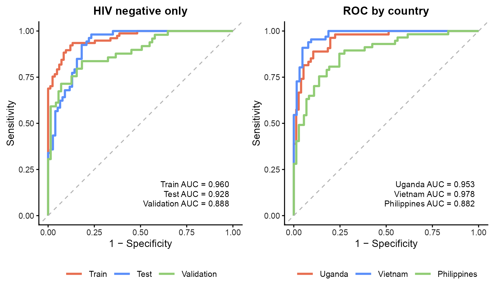
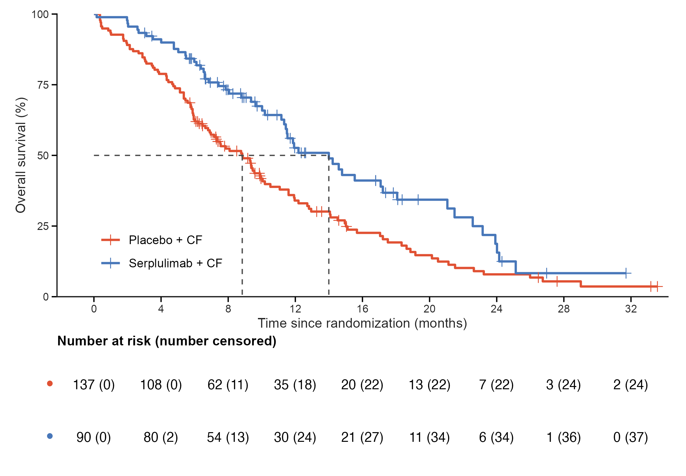

# 生存、森林与患者轨迹 / Clinical plots

[全部分类 / Categories](../GALLERY.md) · [首页 / Home](../../README.md) · [逐图清单 / Inventory](catalog.csv)

本类 **18 张**；第 **3/3 页**。页码：[1](clinical.md) · [2](clinical-2.md) · **3**

图型与数据来源分别标注；旧版折叠保留。收录不等于原论文数据复现或完整 CP 验收。 Data origin is stated per figure. Historical versions are folded. Inclusion does not certify scientific fidelity.

## BF-0211 · 双组 ROC 曲线

模拟数据／方法展示；非原论文数据复现。

[原尺寸](../../docs/assets/archive-gallery/full-reproduction/revision_v1_48_dual_roc.png) · [脚本](../../biofigure/examples/archive-gallery/full-reproduction/scripts/batch41_50_reproduction.R) · [记录](catalog.csv)

BF-0173 · 生存曲线与风险表：历史标签错误示例（历史存档，点击展开）

## BF-0173 · 生存曲线与风险表：历史标签错误示例

历史错误示例：survival::lung 的 sex 被误标为药物组，图中药物比较无效。仅存档，不可用于疗效解读。

[原尺寸](../../docs/assets/archive-gallery/topjournal-early/issue020_survival.png) · [脚本](../../biofigure/examples/archive-gallery/topjournal-early/scripts/issue020_survival_reproduction.R) · [记录](catalog.csv)

页码：[1](clinical.md) · [2](clinical-2.md) · **3**

[全部分类](../GALLERY.md) · [脚本存档说明](../../biofigure/examples/archive-gallery/README.md)
