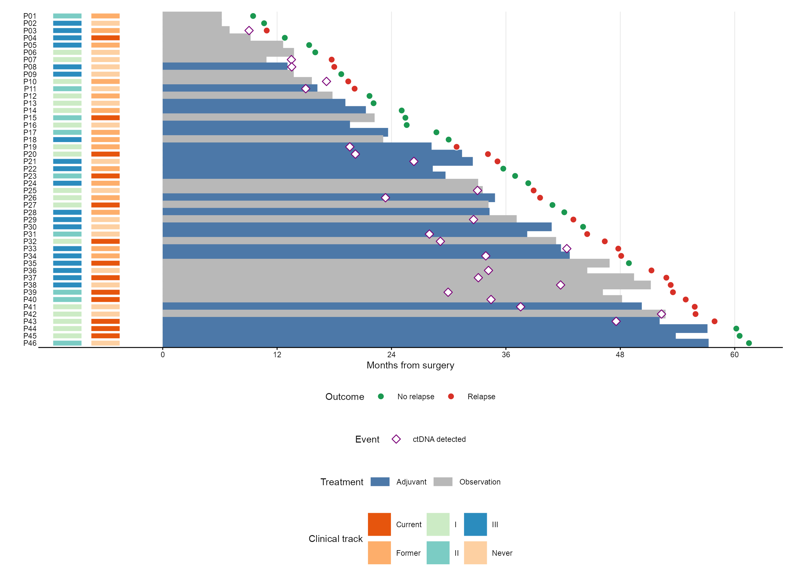
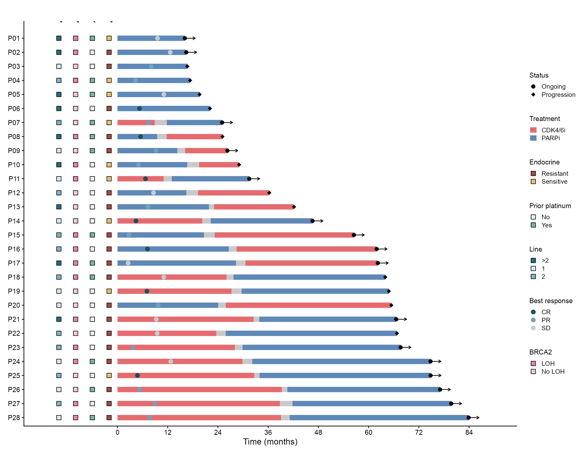
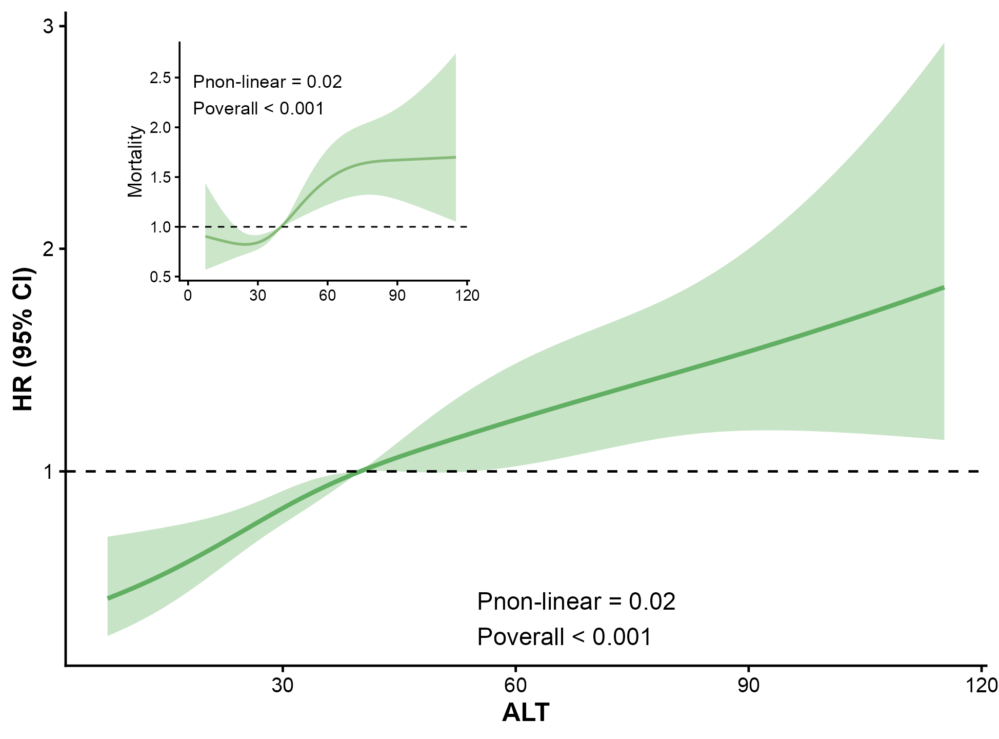
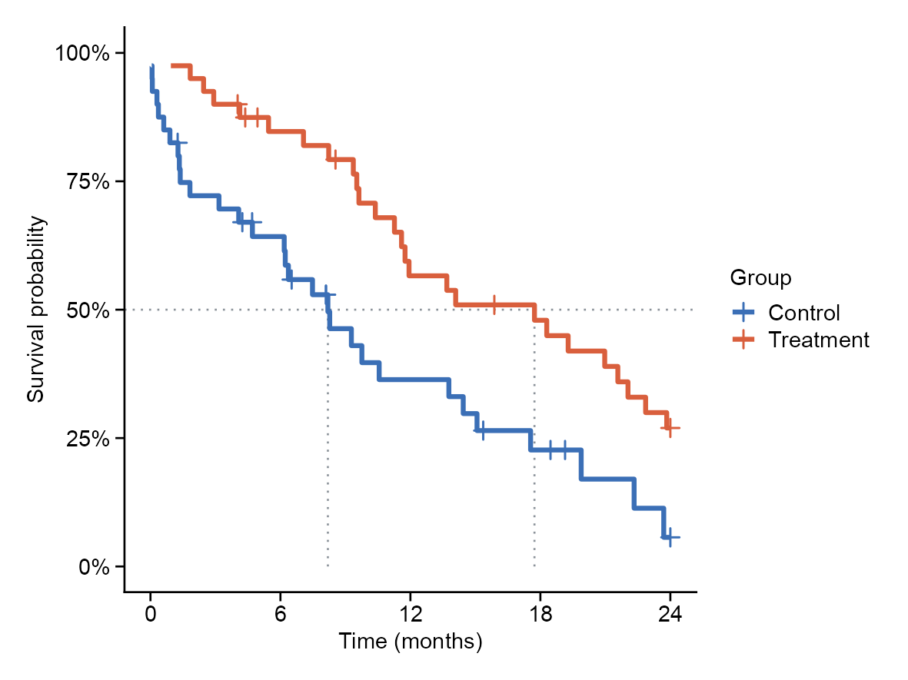
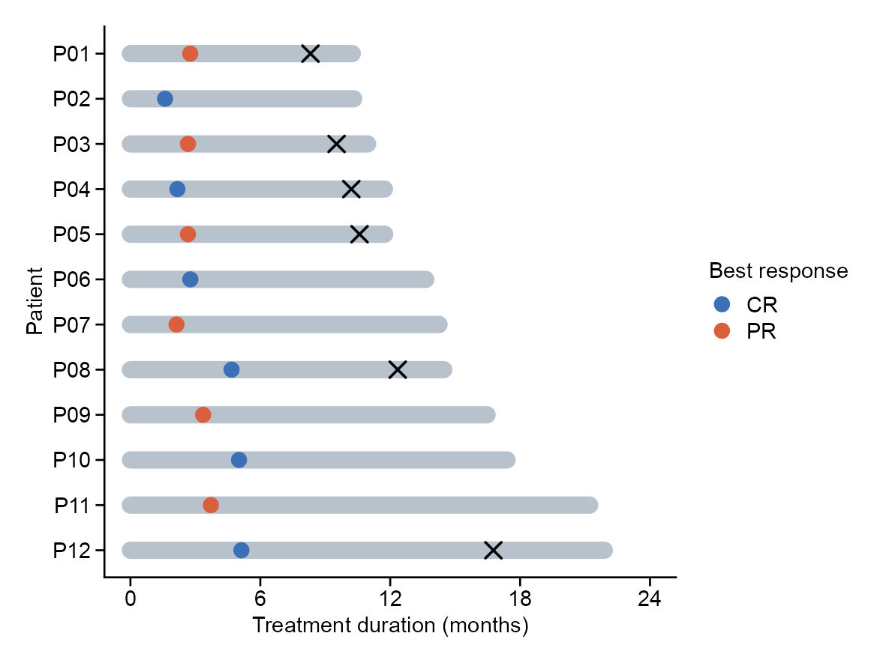
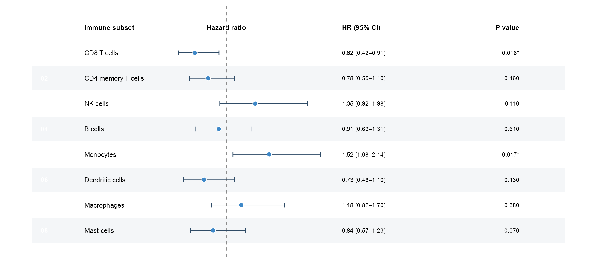

# 生存、森林与患者轨迹 / Clinical plots

[全部分类 / Categories](../GALLERY.md) · [首页 / Home](../../README.md) · [逐图清单 / Inventory](catalog.csv)

本类 **18 张**；第 **1/3 页**。页码：**1** · [2](clinical-2.md) · [3](clinical-3.md)

图型与数据来源分别标注；旧版折叠保留。收录不等于原论文数据复现或完整 CP 验收。 Data origin is stated per figure. Historical versions are folded. Inclusion does not certify scientific fidelity.

## BF-0006 · ROC 与校准曲线

模拟数据／方法展示；非原论文数据复现。

[原尺寸](../../docs/assets/gallery/domain-ml-evaluation.png) · [脚本](../../biofigure/examples/gallery/generate_domain_gallery.R) · [记录](catalog.csv)

## BF-0020 · β 森林图

模拟数据／方法展示；非原论文数据复现。

[原尺寸](../../docs/assets/reference-transfer/forest.png) · [脚本](../../biofigure/examples/reference-transfer/scripts/draw.R) · [记录](catalog.csv)

## BF-0025 · 带注释泳道图

模拟数据／方法展示；非原论文数据复现。

[原尺寸](../../docs/assets/reproduction-gallery/figure_081_issue070_annotated_swimmer.png) · [脚本](../../biofigure/examples/reproduction-gallery/generate_064_080_gallery.R) · [记录](catalog.csv)

## BF-0033 · 患者泳道图

模拟数据／方法展示；非原论文数据复现。

[原尺寸](../../docs/assets/scidraw-gallery/04_patient_swimmer.png) · [脚本](../../biofigure/examples/scidraw-gallery/scripts/generate_six_scidraw.R) · [记录](catalog.csv)

## BF-0036 · 限制性立方样条

模拟数据／方法展示；非原论文数据复现。

[原尺寸](../../docs/assets/scidraw-gallery/scidraw_rcs.png) · [脚本](../../biofigure/examples/scidraw-gallery/scripts/scidraw_rcs_reproduction.R) · [记录](catalog.csv)

## BF-0064 · 基准：生存曲线

模拟数据／方法展示；非原论文数据复现。

[原尺寸](../../docs/assets/archive-gallery/benchmark-six/survival.png) · [脚本](../../biofigure/examples/archive-gallery/benchmark-six/scripts/generate_natural_r_benchmarks.R) · [记录](catalog.csv)

## BF-0065 · 基准：治疗泳道

模拟数据／方法展示；非原论文数据复现。

[原尺寸](../../docs/assets/archive-gallery/benchmark-six/swimmer.png) · [脚本](../../biofigure/examples/archive-gallery/benchmark-six/scripts/generate_natural_r_benchmarks.R) · [记录](catalog.csv)

## BF-0075 · 免疫指标森林图

模拟数据／方法展示；非原论文数据复现。

[原尺寸](../../docs/assets/archive-gallery/scidraw-001-065/03_immune_forest.png) · [批次脚本](../../biofigure/examples/archive-gallery/scidraw-001-065/scripts) · [方法来源](https://mp.weixin.qq.com/s/2B95P3is3_NWGJmcY9prsQ) · [记录](catalog.csv)

页码：**1** · [2](clinical-2.md) · [3](clinical-3.md)

[全部分类](../GALLERY.md) · [脚本存档说明](../../biofigure/examples/archive-gallery/README.md)
