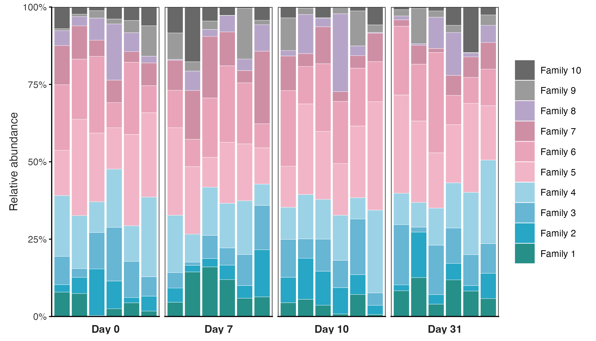
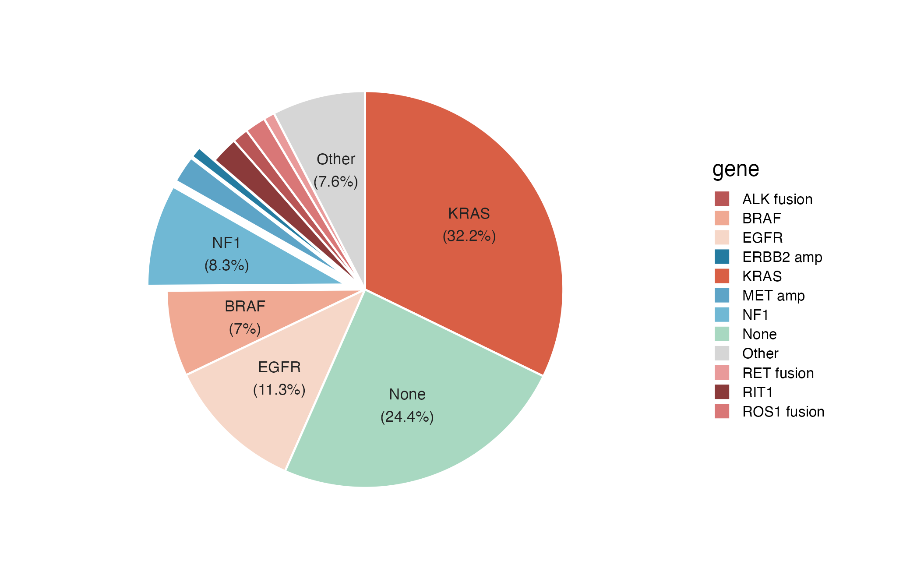
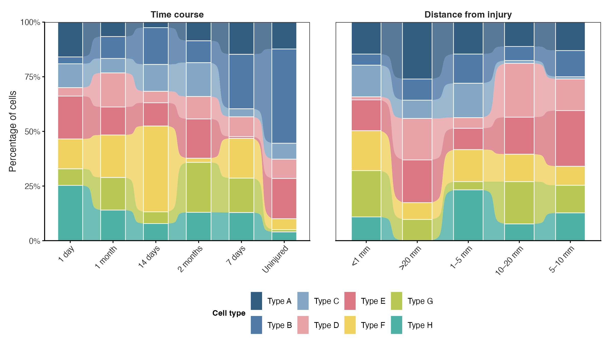
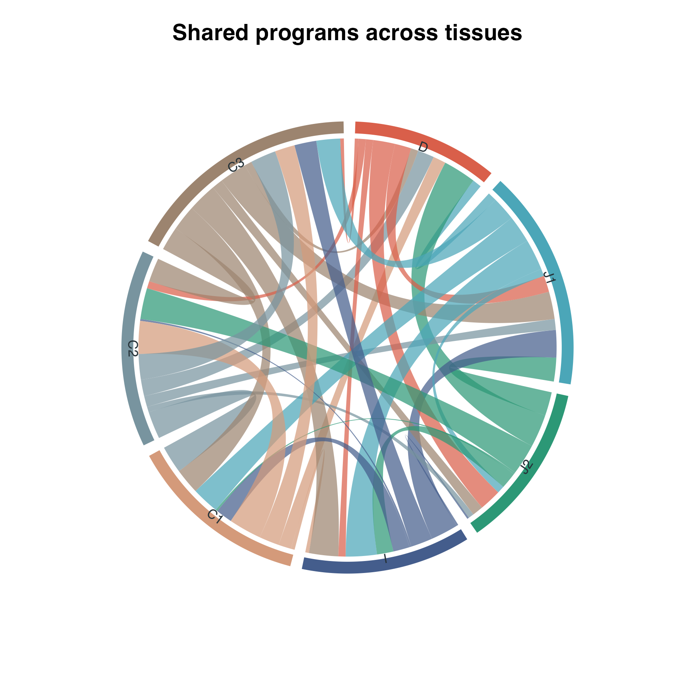
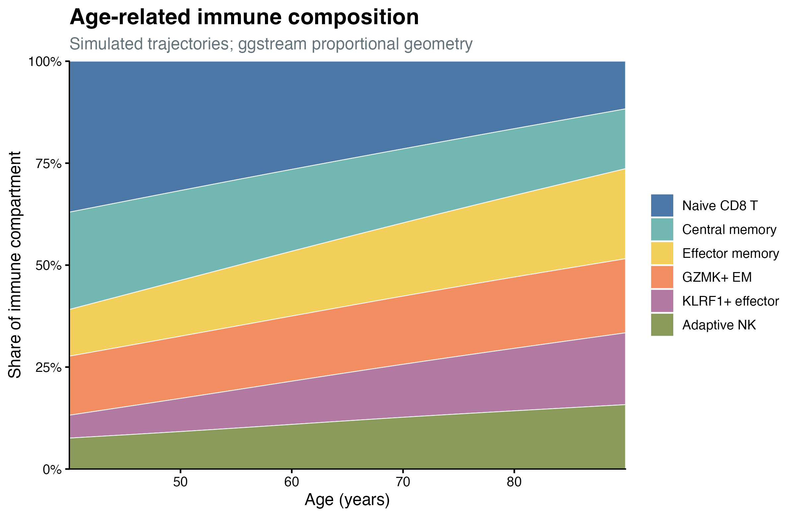
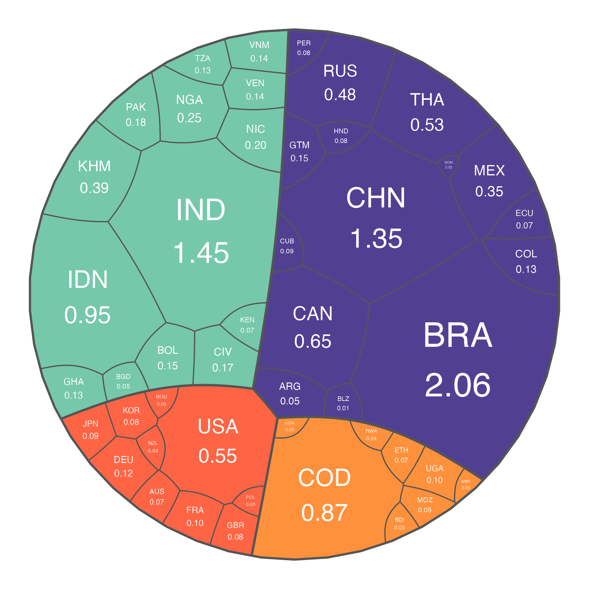
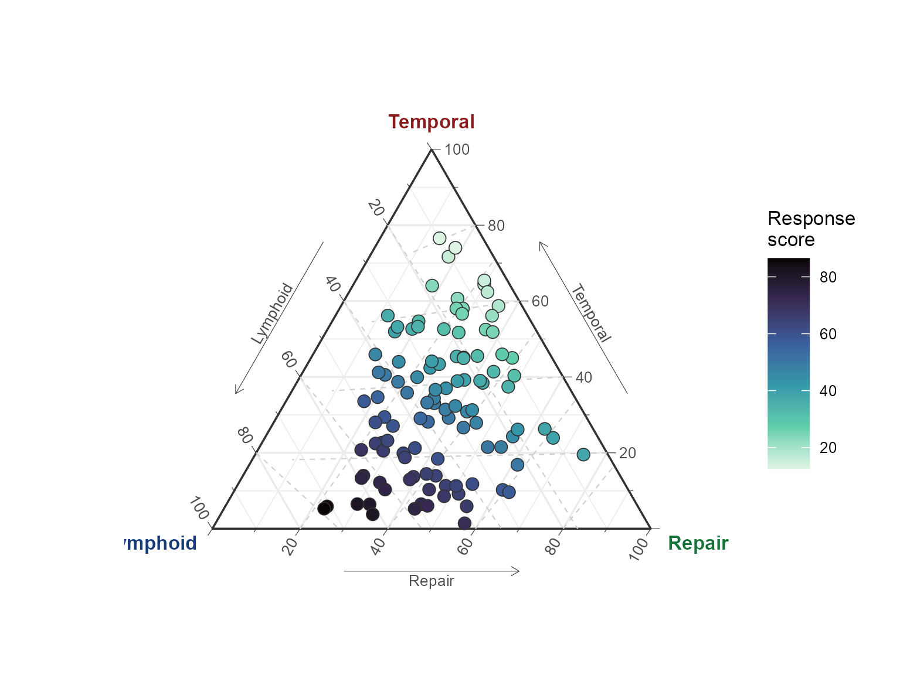
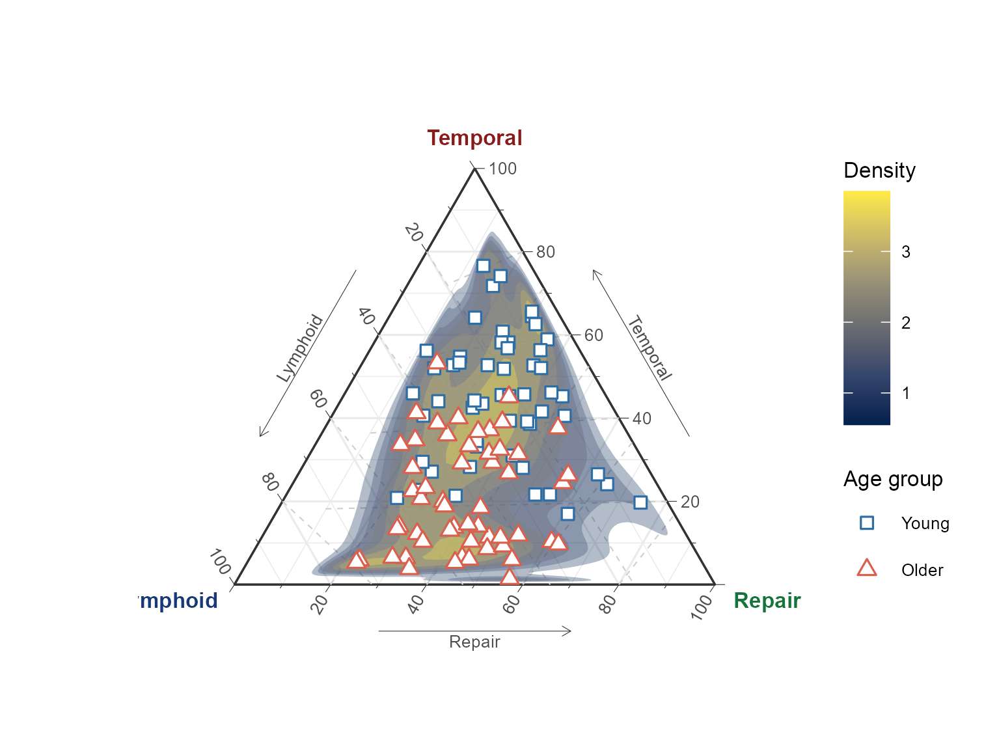

# 组成、桑基与三元图 / Composition and flows

[全部分类 / Categories](../GALLERY.md) · [首页 / Home](../../README.md) · [逐图清单 / Inventory](catalog.csv)

本类 **19 张**；第 **2/3 页**。页码：[1](composition.md) · **2** · [3](composition-3.md)

图型与数据来源分别标注；旧版折叠保留。收录不等于原论文数据复现或完整 CP 验收。 Data origin is stated per figure. Historical versions are folded. Inclusion does not certify scientific fidelity.

## BF-0139 · 顶刊案例001：分面堆积组成

模拟数据／方法展示；非原论文数据复现。

状态：方法展示／仍待修订，不能视为高保真验收通过。

[原尺寸](../../docs/assets/archive-gallery/topjournal-001-010/01_faceted_stacked_composition.png) · [脚本](../../biofigure/examples/archive-gallery/topjournal-001-010/scripts/render_topjournal_001_010.R) · [记录](catalog.csv)

## BF-0145 · 顶刊案例007：突出扇区饼图

模拟数据／方法展示；非原论文数据复现。

状态：方法展示／仍待修订，不能视为高保真验收通过。

[原尺寸](../../docs/assets/archive-gallery/topjournal-001-010/07_exploded_pie.png) · [脚本](../../biofigure/examples/archive-gallery/topjournal-001-010/scripts/render_topjournal_001_010.R) · [记录](catalog.csv)

## BF-0147 · 顶刊案例009：流向与堆积组成

模拟数据／方法展示；非原论文数据复现。

状态：方法展示／仍待修订，不能视为高保真验收通过。

[原尺寸](../../docs/assets/archive-gallery/topjournal-001-010/09_alluvial_stacked_composition.png) · [脚本](../../biofigure/examples/archive-gallery/topjournal-001-010/scripts/render_topjournal_001_010.R) · [记录](catalog.csv)

## BF-0174 · 组织间弦图

模拟数据／方法展示；非原论文数据复现。

[原尺寸](../../docs/assets/archive-gallery/topjournal-early/issue025_chord.png) · [脚本](../../biofigure/examples/archive-gallery/topjournal-early/scripts/issue025_chord_upset_reproduction.R) · [记录](catalog.csv)

## BF-0179 · 年龄分层组成流图

模拟数据／方法展示；非原论文数据复现。

[原尺寸](../../docs/assets/archive-gallery/topjournal-early/issue066_stream.png) · [脚本](../../biofigure/examples/archive-gallery/topjournal-early/scripts/issue066_stream_reproduction.R) · [记录](catalog.csv)

## BF-0189 · 加权 Voronoi 组成图

模拟数据／方法展示；非原论文数据复现。

[原尺寸](../../docs/assets/archive-gallery/full-reproduction/figure_067_weighted_voronoi_code_driven.png) · [脚本](../../biofigure/examples/archive-gallery/full-reproduction/scripts/non_single_cell_055_069.R) · [记录](catalog.csv)

## BF-0194 · 连续变量三元图

模拟数据／方法展示；非原论文数据复现。

[原尺寸](../../docs/assets/archive-gallery/full-reproduction/figure_074_issue065_ternary_continuous.png) · [脚本](../../biofigure/examples/archive-gallery/full-reproduction/scripts/code_driven_071_087.R) · [记录](catalog.csv)

## BF-0195 · 三元密度图

模拟数据／方法展示；非原论文数据复现。

[原尺寸](../../docs/assets/archive-gallery/full-reproduction/figure_075_issue065_ternary_density.png) · [脚本](../../biofigure/examples/archive-gallery/full-reproduction/scripts/code_driven_071_087.R) · [记录](catalog.csv)

页码：[1](composition.md) · **2** · [3](composition-3.md)

[全部分类](../GALLERY.md) · [脚本存档说明](../../biofigure/examples/archive-gallery/README.md)
