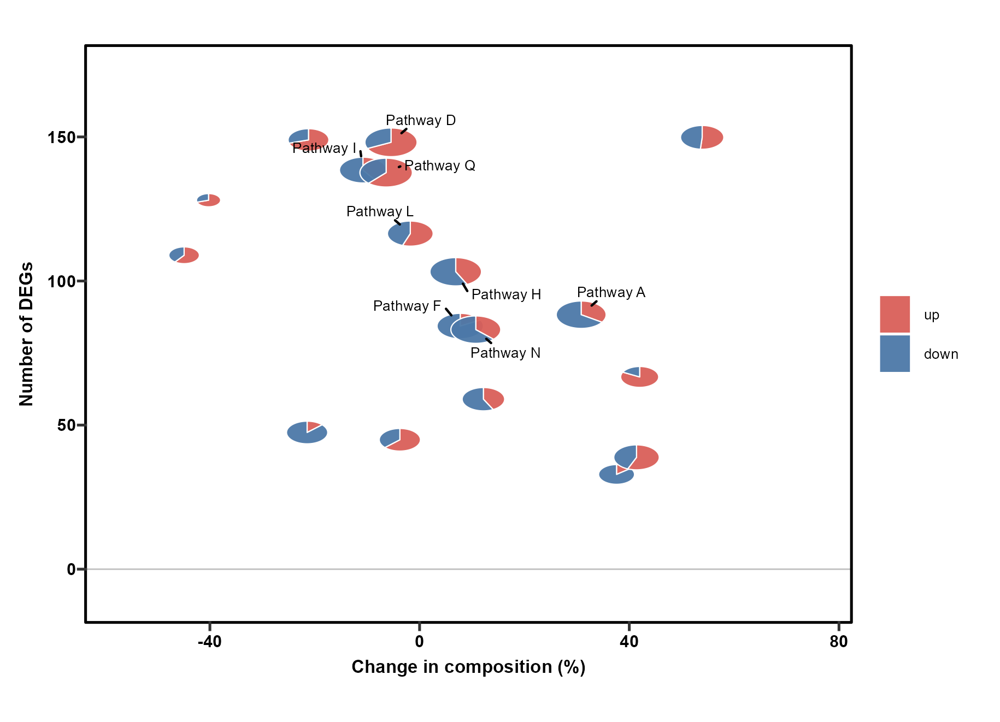

# 组成、桑基与三元图 / Composition and flows

[全部分类 / Categories](../GALLERY.md) · [首页 / Home](../../README.md) · [逐图清单 / Inventory](catalog.csv)

本类 **19 张**；第 **3/3 页**。页码：[1](composition.md) · [2](composition-2.md) · **3**

图型与数据来源分别标注；旧版折叠保留。收录不等于原论文数据复现或完整 CP 验收。 Data origin is stated per figure. Historical versions are folded. Inclusion does not certify scientific fidelity.

## BF-0199 · 多层旭日图

模拟数据／方法展示；非原论文数据复现。

[原尺寸](../../docs/assets/archive-gallery/full-reproduction/figure_082_issue071_sunburst.png) · [脚本](../../biofigure/examples/archive-gallery/full-reproduction/scripts/code_driven_071_087.R) · [记录](catalog.csv)

## BF-0202 · 组成变化散点饼图

模拟数据／方法展示；非原论文数据复现。

[原尺寸](../../docs/assets/archive-gallery/full-reproduction/figure_087_issue075_scatterpie.png) · [脚本](../../biofigure/examples/archive-gallery/full-reproduction/scripts/code_driven_071_087.R) · [记录](catalog.csv)

## BF-0203 · 分面流图

模拟数据／方法展示；非原论文数据复现。

[原尺寸](../../docs/assets/archive-gallery/full-reproduction/figure_089_issue079_streamgraph.png) · [脚本](../../biofigure/examples/archive-gallery/full-reproduction/scripts/code_driven_071_087.R) · [记录](catalog.csv)

页码：[1](composition.md) · [2](composition-2.md) · **3**

[全部分类](../GALLERY.md) · [脚本存档说明](../../biofigure/examples/archive-gallery/README.md)
