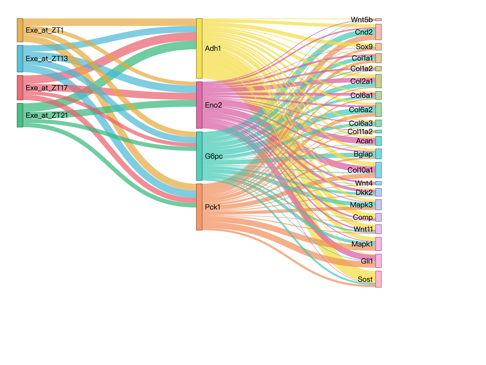
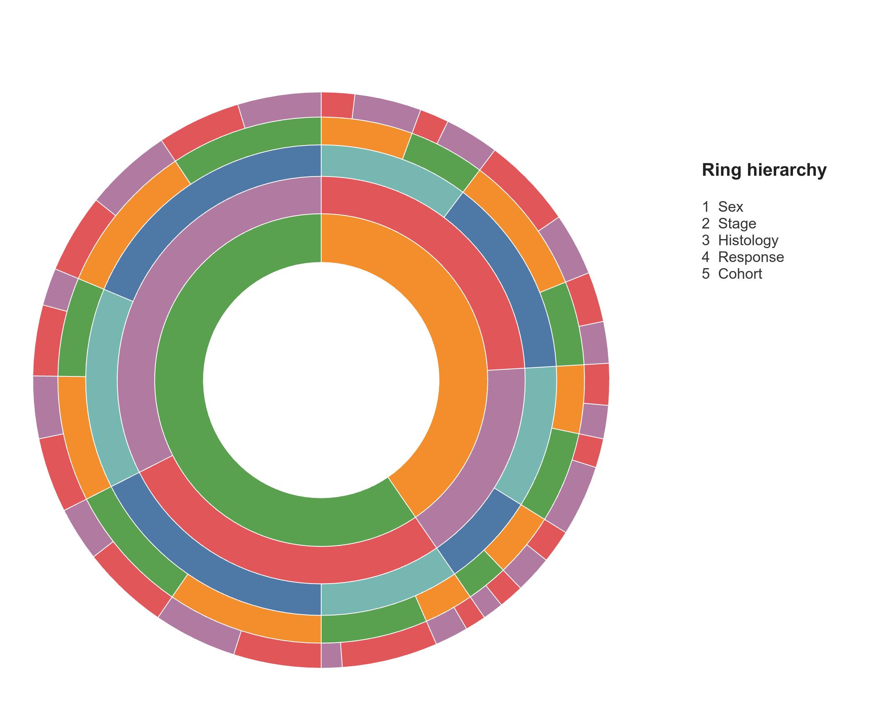
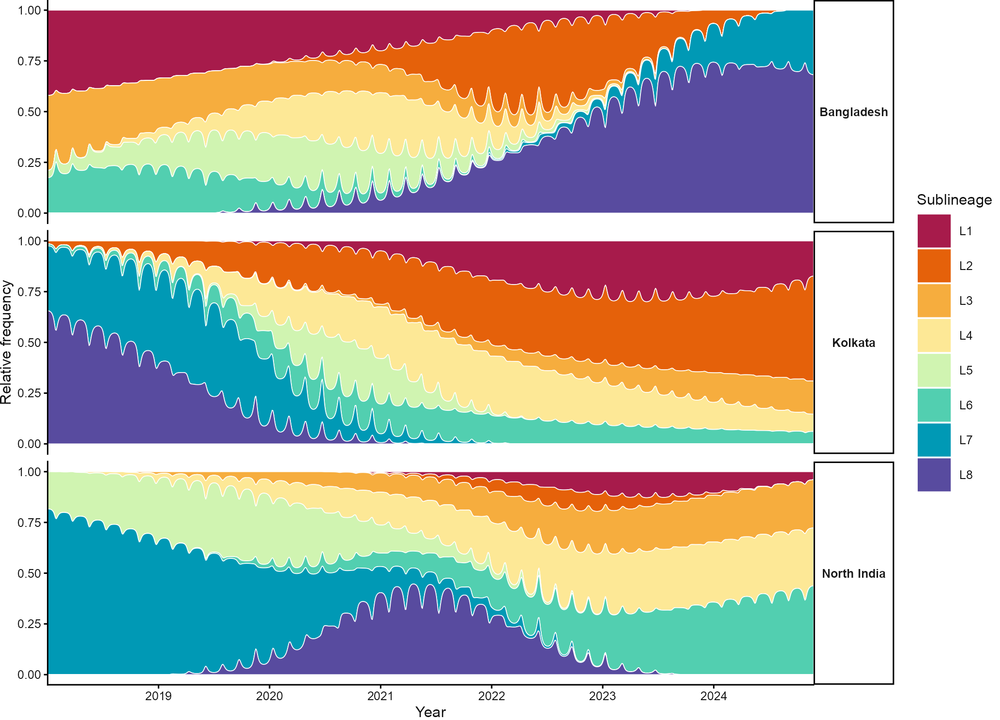

# 组成、桑基与三元图 / Composition and flows

[全部分类 / Categories](../GALLERY.md) · [首页 / Home](../../README.md) · [逐图清单 / Inventory](catalog.csv)

本类 **7 张代表图**，每个细分图型保留一例。

按结构与用途选取代表图，去除同类配色、数据集及历史变体。数据来源逐图标注；收录不等于完整 CP 验收。 One representative per visual subtype; color-only, dataset-only and historical variants are omitted. Inclusion does not certify scientific fidelity.

## BF-0022 · 三元分组图

图型：三元组成。模拟数据／方法展示；非原论文数据复现。

[原尺寸](../../docs/assets/reproduction-gallery/figure_073_issue065_ternary_groups.png) · [脚本](../../biofigure/examples/reproduction-gallery/generate_064_080_gallery.R) · [记录](catalog.csv)

## BF-0026 · 双层环图

图型：嵌套环图。模拟数据／方法展示；非原论文数据复现。

[原尺寸](../../docs/assets/reproduction-gallery/figure_083_issue072_nested_piedonut.png) · [脚本](../../biofigure/examples/reproduction-gallery/generate_064_080_gallery.R) · [记录](catalog.csv)

## BF-0034 · 弦图与外层注释轨道

图型：弦图。模拟数据／方法展示；非原论文数据复现。

[原尺寸](../../docs/assets/scidraw-gallery/05_chord_outer_track.png) · [脚本](../../biofigure/examples/scidraw-gallery/scripts/generate_six_scidraw.R) · [记录](catalog.csv)

## BF-0109 · 渐变桑基图

图型：桑基图。模拟数据／方法展示；非原论文数据复现。

状态：方法展示／仍待修订，不能视为高保真验收通过。

[原尺寸](../../docs/assets/archive-gallery/scidraw-001-065/36_gradient_sankey.png) · [脚本](../../biofigure/examples/archive-gallery/scidraw-001-065/scripts/render_cases_36_45.R) · [方法来源](https://mp.weixin.qq.com/s/iDi21LdR2_V3fVRMos0LqQ) · [记录](catalog.csv)

## BF-0189 · 加权 Voronoi 组成图

图型：Voronoi组成。模拟数据／方法展示；非原论文数据复现。

[原尺寸](../../docs/assets/archive-gallery/full-reproduction/figure_067_weighted_voronoi_code_driven.png) · [脚本](../../biofigure/examples/archive-gallery/full-reproduction/scripts/non_single_cell_055_069.R) · [记录](catalog.csv)

## BF-0199 · 多层旭日图

图型：旭日图。模拟数据／方法展示；非原论文数据复现。

[原尺寸](../../docs/assets/archive-gallery/full-reproduction/figure_082_issue071_sunburst.png) · [脚本](../../biofigure/examples/archive-gallery/full-reproduction/scripts/code_driven_071_087.R) · [记录](catalog.csv)

## BF-0203 · 分面流图

图型：流图。模拟数据／方法展示；非原论文数据复现。

[原尺寸](../../docs/assets/archive-gallery/full-reproduction/figure_089_issue079_streamgraph.png) · [脚本](../../biofigure/examples/archive-gallery/full-reproduction/scripts/code_driven_071_087.R) · [记录](catalog.csv)

[全部分类](../GALLERY.md) · [脚本存档说明](../../biofigure/examples/archive-gallery/README.md)
