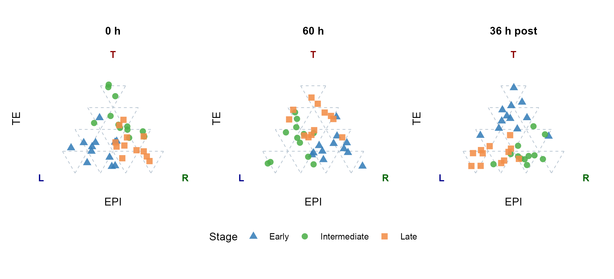
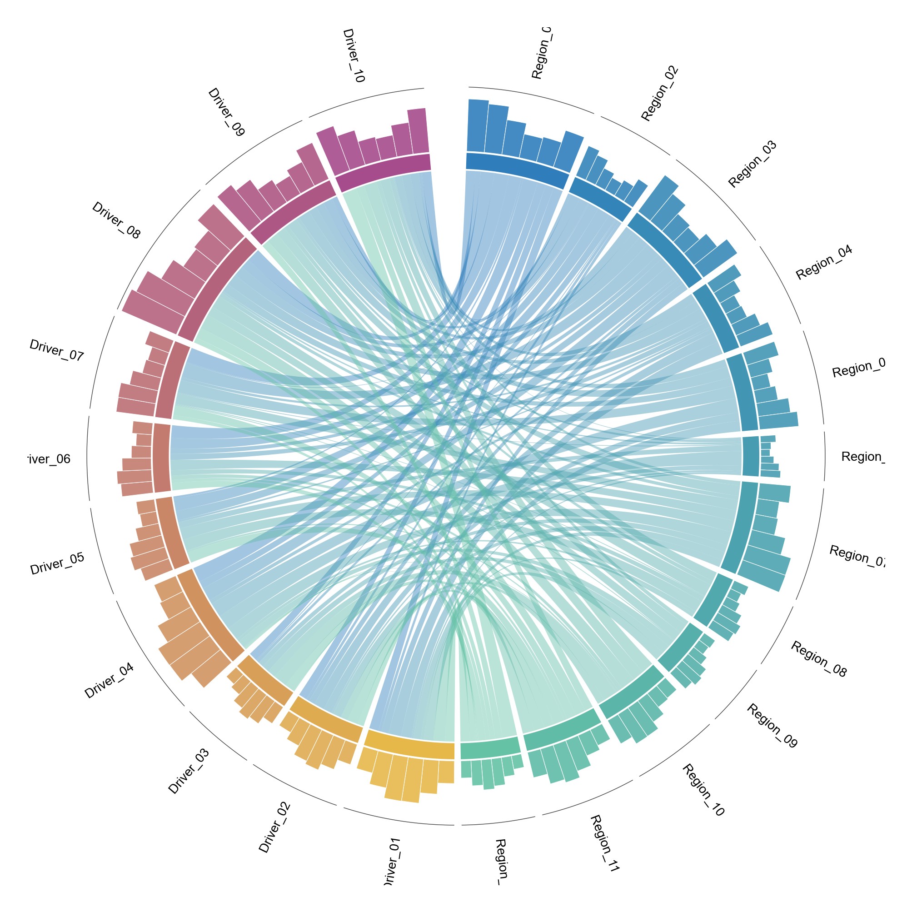

# 组成、三元与环图 / Composition

[全部分类 / All categories](../GALLERY.md) · [首页 / Home](../../README.md)

三元比例、双层环图及弦图。 共 4 张。

全部为模拟数据示例；展示不代表完整验收，不能据此推断真实生物学结论。 Simulated examples only; display does not imply full validation or biological findings.

## 1. 三元分组图

64–80 期方法迁移示例。

[原尺寸 / Full size](../assets/reproduction-gallery/figure_073_issue065_ternary_groups.png) · [生成脚本 / Script](../../biofigure/examples/reproduction-gallery/generate_064_080_gallery.R) · [运行说明 / Instructions](../../biofigure/examples/reproduction-gallery/README.md) · [分类目录 / Categories](../GALLERY.md)

## 2. 双层环图

64–80 期方法迁移示例。

[原尺寸 / Full size](../assets/reproduction-gallery/figure_083_issue072_nested_piedonut.png) · [生成脚本 / Script](../../biofigure/examples/reproduction-gallery/generate_064_080_gallery.R) · [运行说明 / Instructions](../../biofigure/examples/reproduction-gallery/README.md) · [分类目录 / Categories](../GALLERY.md)

## 3. 细胞状态三元图

SciDraw 方法迁移示例。

[原尺寸 / Full size](../assets/scidraw-gallery/02_ternary_cell_state.png) · [生成脚本 / Script](../../biofigure/examples/scidraw-gallery/scripts/generate_six_scidraw.R) · [运行说明 / Instructions](../../biofigure/examples/scidraw-gallery/README.md) · [分类目录 / Categories](../GALLERY.md)

## 4. 弦图与外层注释轨道

SciDraw 方法迁移示例。

[原尺寸 / Full size](../assets/scidraw-gallery/05_chord_outer_track.png) · [生成脚本 / Script](../../biofigure/examples/scidraw-gallery/scripts/generate_six_scidraw.R) · [运行说明 / Instructions](../../biofigure/examples/scidraw-gallery/README.md) · [分类目录 / Categories](../GALLERY.md)

来源与边界：[来源声明](../../NOTICE.md) · [设计来源](../DESIGN-SOURCES.md) · [验收规则](../../biofigure/references/benchmark-protocol.md)。
