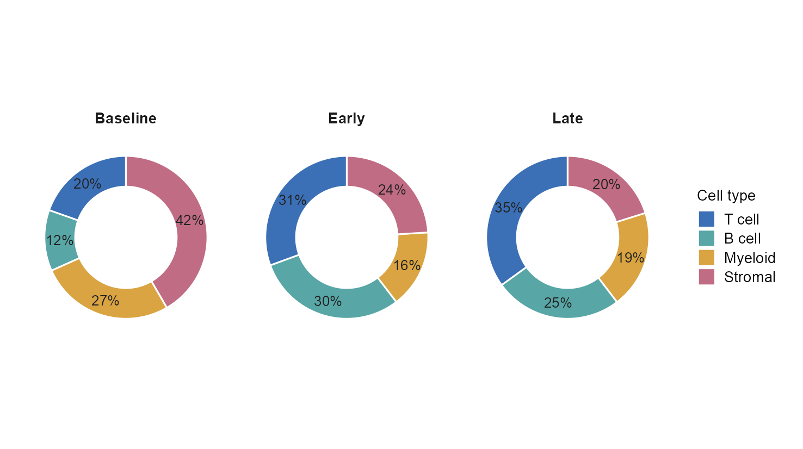
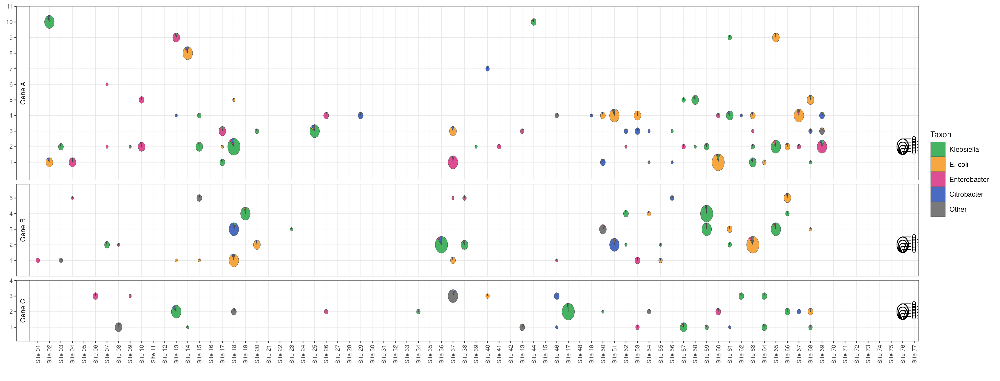
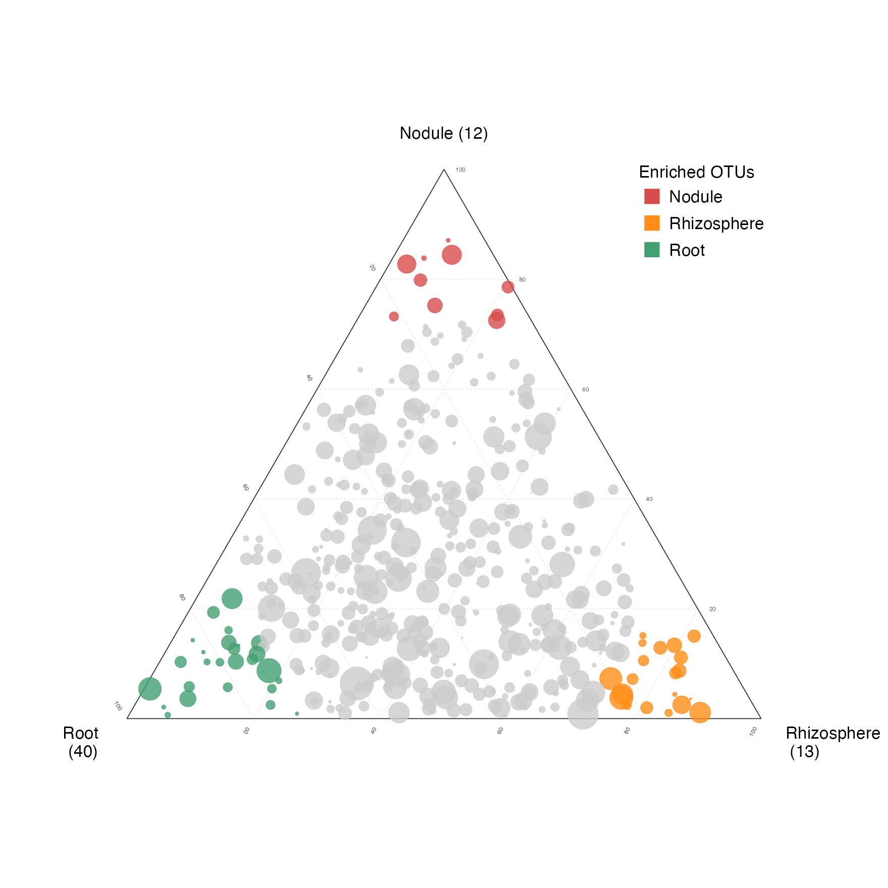

# 组成、桑基与三元图 / Composition and flows

[全部分类 / Categories](../GALLERY.md) · [首页 / Home](../../README.md) · [逐图清单 / Inventory](catalog.csv)

本类 **19 张**；第 **1/3 页**。页码：**1** · [2](composition-2.md) · [3](composition-3.md)

图型与数据来源分别标注；旧版折叠保留。收录不等于原论文数据复现或完整 CP 验收。 Data origin is stated per figure. Historical versions are folded. Inclusion does not certify scientific fidelity.

## BF-0022 · 三元分组图

模拟数据／方法展示；非原论文数据复现。

[原尺寸](../../docs/assets/reproduction-gallery/figure_073_issue065_ternary_groups.png) · [脚本](../../biofigure/examples/reproduction-gallery/generate_064_080_gallery.R) · [记录](catalog.csv)

## BF-0026 · 双层环图

模拟数据／方法展示；非原论文数据复现。

[原尺寸](../../docs/assets/reproduction-gallery/figure_083_issue072_nested_piedonut.png) · [脚本](../../biofigure/examples/reproduction-gallery/generate_064_080_gallery.R) · [记录](catalog.csv)

## BF-0031 · 细胞状态三元图

模拟数据／方法展示；非原论文数据复现。

[原尺寸](../../docs/assets/scidraw-gallery/02_ternary_cell_state.png) · [脚本](../../biofigure/examples/scidraw-gallery/scripts/generate_six_scidraw.R) · [记录](catalog.csv)

## BF-0034 · 弦图与外层注释轨道

模拟数据／方法展示；非原论文数据复现。

[原尺寸](../../docs/assets/scidraw-gallery/05_chord_outer_track.png) · [脚本](../../biofigure/examples/scidraw-gallery/scripts/generate_six_scidraw.R) · [记录](catalog.csv)

## BF-0062 · 基准：多条件环形组成

模拟数据／方法展示；非原论文数据复现。

[原尺寸](../../docs/assets/archive-gallery/benchmark-six/circular_composition.png) · [脚本](../../biofigure/examples/archive-gallery/benchmark-six/scripts/generate_natural_r_benchmarks.R) · [记录](catalog.csv)

## BF-0099 · 分面散点饼图

模拟数据／方法展示；非原论文数据复现。

状态：方法展示／仍待修订，不能视为高保真验收通过。

[原尺寸](../../docs/assets/archive-gallery/scidraw-001-065/26_faceted_scatterpie.png) · [脚本](../../biofigure/examples/archive-gallery/scidraw-001-065/scripts/render_cases_26_35.R) · [方法来源](https://mp.weixin.qq.com/s/tU4NvjPzjzDxUxHjuSAW6Q) · [记录](catalog.csv)

## BF-0109 · 渐变桑基图

模拟数据／方法展示；非原论文数据复现。

状态：方法展示／仍待修订，不能视为高保真验收通过。

[原尺寸](../../docs/assets/archive-gallery/scidraw-001-065/36_gradient_sankey.png) · [脚本](../../biofigure/examples/archive-gallery/scidraw-001-065/scripts/render_cases_36_45.R) · [方法来源](https://mp.weixin.qq.com/s/iDi21LdR2_V3fVRMos0LqQ) · [记录](catalog.csv)

## BF-0117 · OTU 生态位三元图

模拟数据／方法展示；非原论文数据复现。

状态：方法展示／仍待修订，不能视为高保真验收通过。

[原尺寸](../../docs/assets/archive-gallery/scidraw-001-065/44_otu_niche_ternary.png) · [脚本](../../biofigure/examples/archive-gallery/scidraw-001-065/scripts/render_cases_36_45.R) · [方法来源](https://mp.weixin.qq.com/s/r8eg8BJffDzg9FCDmbT6Zg) · [记录](catalog.csv)

页码：**1** · [2](composition-2.md) · [3](composition-3.md)

[全部分类](../GALLERY.md) · [脚本存档说明](../../biofigure/examples/archive-gallery/README.md)
