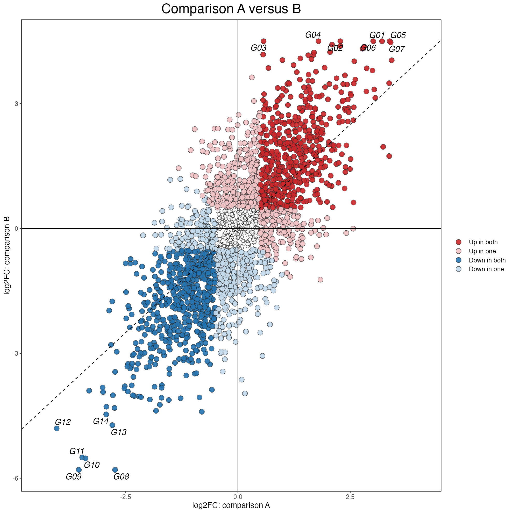
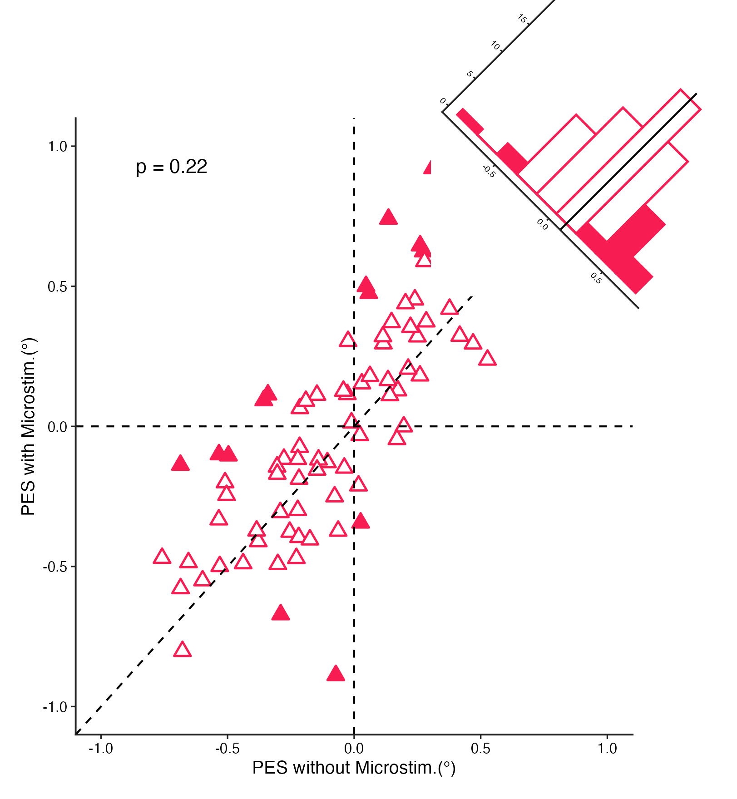
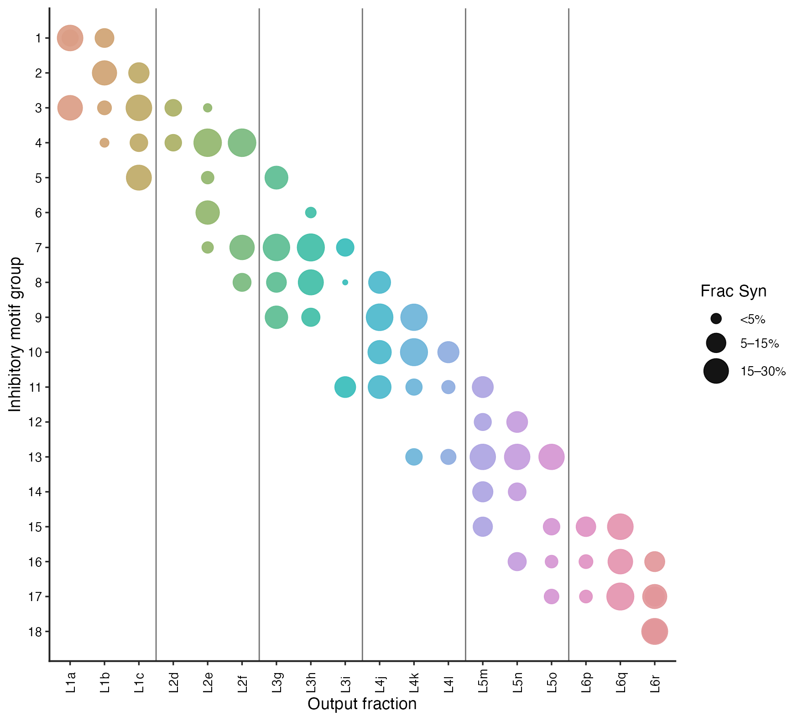
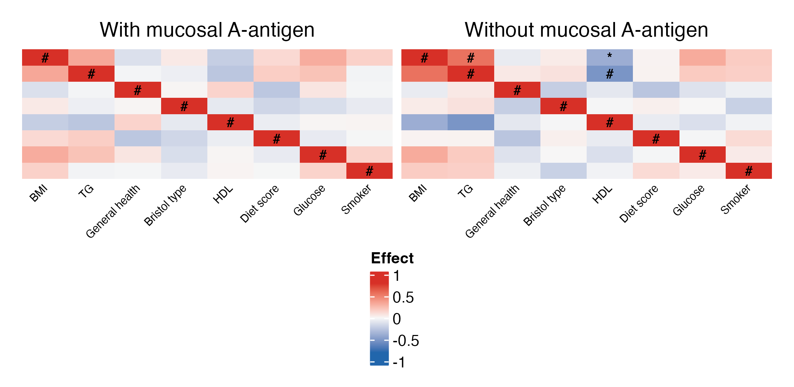
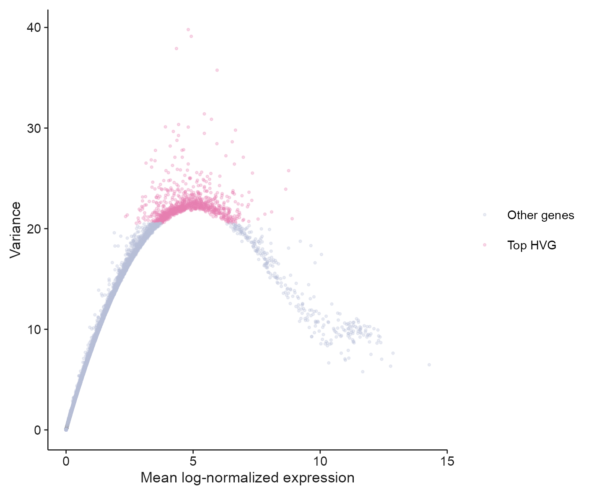

# 相关、散点与气泡矩阵 / Correlations and scatter plots

[全部分类 / Categories](../GALLERY.md) · [首页 / Home](../../README.md) · [逐图清单 / Inventory](catalog.csv)

本类 **20 张**；第 **2/3 页**。页码：[1](correlations.md) · **2** · [3](correlations-3.md)

图型与数据来源分别标注；旧版折叠保留。收录不等于原论文数据复现或完整 CP 验收。 Data origin is stated per figure. Historical versions are folded. Inclusion does not certify scientific fidelity.

## BF-0056 · 密度相关矩阵：彩色版

模拟数据／方法展示；非原论文数据复现。

[原尺寸](../../docs/assets/scidraw-gallery-batch2/19_density_matrix_rainbow.png) · [脚本](../../biofigure/examples/scidraw-gallery/scripts/generate_batch20.R) · [记录](catalog.csv)

## BF-0057 · 密度相关矩阵：红色版

模拟数据／方法展示；非原论文数据复现。

[原尺寸](../../docs/assets/scidraw-gallery-batch2/20_density_matrix_red.png) · [脚本](../../biofigure/examples/scidraw-gallery/scripts/generate_batch20.R) · [记录](catalog.csv)

## BF-0101 · 双效应量散点图

模拟数据／方法展示；非原论文数据复现。

状态：方法展示／仍待修订，不能视为高保真验收通过。

[原尺寸](../../docs/assets/archive-gallery/scidraw-001-065/28_dual_effect_scatter.png) · [脚本](../../biofigure/examples/archive-gallery/scidraw-001-065/scripts/render_cases_26_35.R) · [方法来源](https://mp.weixin.qq.com/s/icWwRHufcX3n6Gz-jpVEhQ) · [记录](catalog.csv)

## BF-0123 · 散点与对角直方图

模拟数据／方法展示；非原论文数据复现。

状态：方法展示／仍待修订，不能视为高保真验收通过。

[原尺寸](../../docs/assets/archive-gallery/scidraw-001-065/50_diagonal_scatter_hist.png) · [脚本](../../biofigure/examples/archive-gallery/scidraw-001-065/scripts/render_cases_46_55.R) · [方法来源](https://mp.weixin.qq.com/s/0qWUE0DhlAJrnXPWZNKldQ) · [记录](catalog.csv)

## BF-0128 · 双三角气泡相关矩阵

模拟数据／方法展示；非原论文数据复现。

状态：方法展示／仍待修订，不能视为高保真验收通过。

[原尺寸](../../docs/assets/archive-gallery/scidraw-001-065/55_dual_triangle_circle_heatmap.png) · [脚本](../../biofigure/examples/archive-gallery/scidraw-001-065/scripts/render_cases_46_55.R) · [方法来源](https://mp.weixin.qq.com/s/KVctDUes-A30fYwss8r1jQ) · [记录](catalog.csv)

## BF-0137 · 分组气泡矩阵

模拟数据／方法展示；非原论文数据复现。

状态：方法展示／仍待修订，不能视为高保真验收通过。

[原尺寸](../../docs/assets/archive-gallery/scidraw-001-065/64_grouped_bubble.png) · [脚本](../../biofigure/examples/archive-gallery/scidraw-001-065/scripts/render_cases_56_65.R) · [方法来源](https://mp.weixin.qq.com/s/qgYSXPXKQgWxvAV9JGCp2A) · [记录](catalog.csv)

## BF-0142 · 顶刊案例004：双组相关热图

模拟数据／方法展示；非原论文数据复现。

状态：方法展示／仍待修订，不能视为高保真验收通过。

[原尺寸](../../docs/assets/archive-gallery/topjournal-001-010/04_dual_correlation_heatmap.png) · [脚本](../../biofigure/examples/archive-gallery/topjournal-001-010/scripts/render_topjournal_001_010.R) · [记录](catalog.csv)

## BF-0150 · PBMC：高变基因均值与方差

公开数据演示：10x PBMC1k、ENCODE K562 或参考组装；不代表完整上游分析。

[原尺寸](../../docs/assets/archive-gallery/public-omics/02_scrna_hvg.png) · [脚本](../../biofigure/examples/archive-gallery/public-omics/scripts/analysis.R) · [记录](catalog.csv)

页码：[1](correlations.md) · **2** · [3](correlations-3.md)

[全部分类](../GALLERY.md) · [脚本存档说明](../../biofigure/examples/archive-gallery/README.md)
