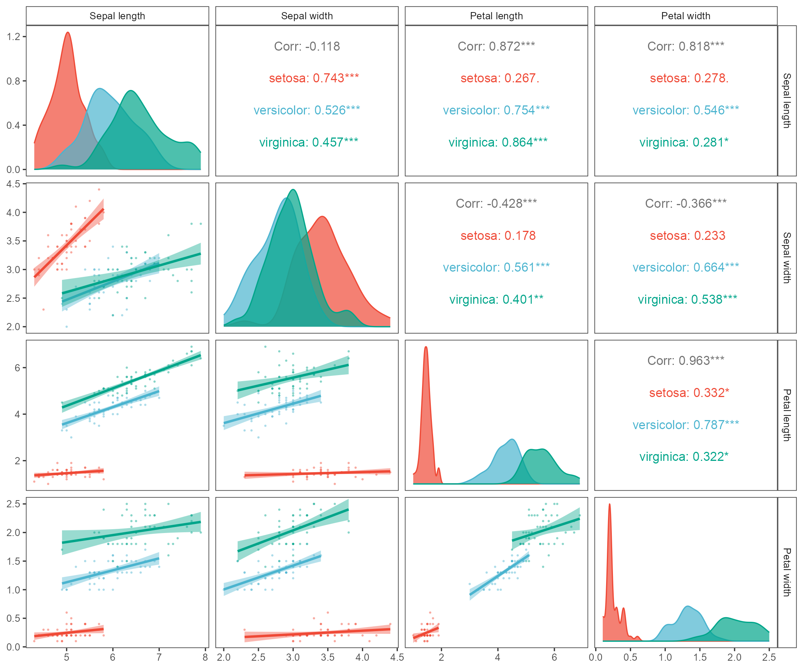
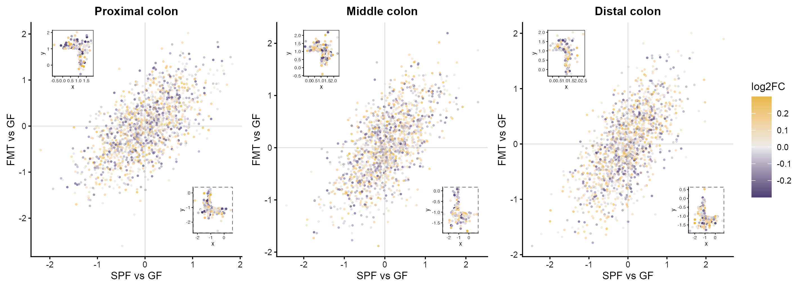
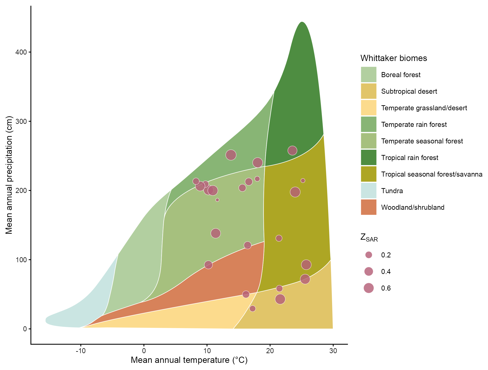
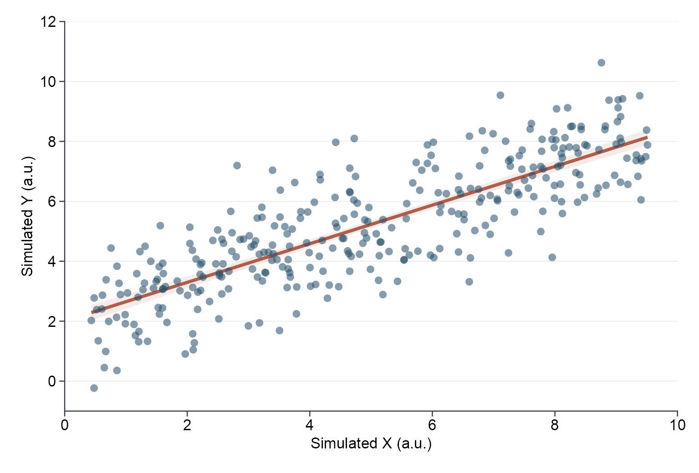

# 相关、散点与气泡矩阵 / Correlations and scatter plots

[全部分类 / Categories](../GALLERY.md) · [首页 / Home](../../README.md) · [逐图清单 / Inventory](catalog.csv)

本类 **20 张**；第 **3/3 页**。页码：[1](correlations.md) · [2](correlations-2.md) · **3**

图型与数据来源分别标注；旧版折叠保留。收录不等于原论文数据复现或完整 CP 验收。 Data origin is stated per figure. Historical versions are folded. Inclusion does not certify scientific fidelity.

## BF-0186 · 成对回归与密度矩阵

模拟数据／方法展示；非原论文数据复现。

[原尺寸](../../docs/assets/archive-gallery/full-reproduction/figure_061_ggally_matrix_code_driven.png) · [脚本](../../biofigure/examples/archive-gallery/full-reproduction/scripts/non_single_cell_055_069.R) · [记录](catalog.csv)

## BF-0204 · 分面散点与局部放大

模拟数据／方法展示；非原论文数据复现。

[原尺寸](../../docs/assets/archive-gallery/full-reproduction/revision_v1_41_inset_scatter.png) · [脚本](../../biofigure/examples/archive-gallery/full-reproduction/scripts/batch41_50_reproduction.R) · [记录](catalog.csv)

## BF-0210 · 温度降水生态区图

模拟数据／方法展示；非原论文数据复现。

[原尺寸](../../docs/assets/archive-gallery/full-reproduction/revision_v1_47_whittaker.png) · [脚本](../../biofigure/examples/archive-gallery/full-reproduction/scripts/batch41_50_reproduction.R) · [记录](catalog.csv)

## BF-0216 · 线性关联散点与置信带

模拟数据／方法展示；非原论文数据复现。

[原尺寸](../../docs/assets/archive-gallery/linear/linear_scatter.png) · [批次脚本](../../biofigure/examples/archive-gallery/linear/scripts) · [记录](catalog.csv)

页码：[1](correlations.md) · [2](correlations-2.md) · **3**

[全部分类](../GALLERY.md) · [脚本存档说明](../../biofigure/examples/archive-gallery/README.md)
