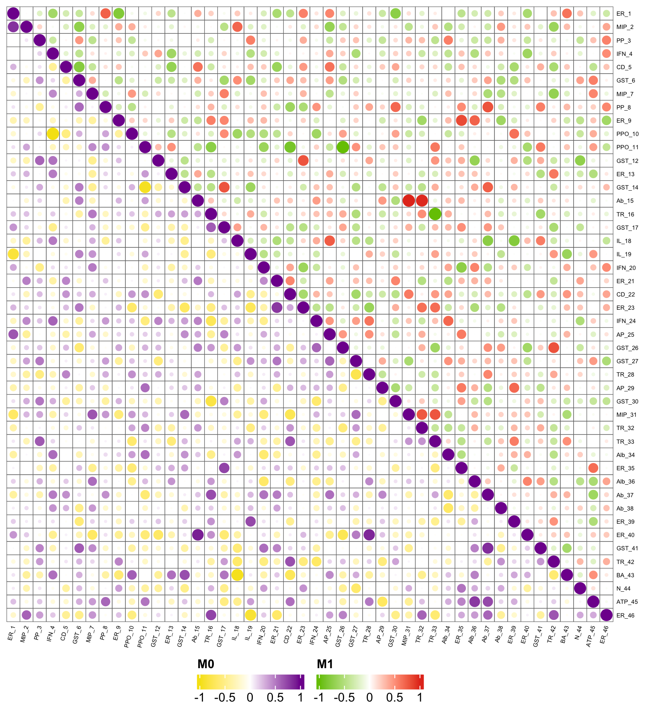

# 相关、散点与气泡矩阵 / Correlations and scatter plots

[全部分类 / Categories](../GALLERY.md) · [首页 / Home](../../README.md) · [逐图清单 / Inventory](catalog.csv)

本类 **6 张代表图**，每个细分图型保留一例。

按结构与用途选取代表图，去除同类配色、数据集及历史变体。数据来源逐图标注；收录不等于完整 CP 验收。 One representative per visual subtype; color-only, dataset-only and historical variants are omitted. Inclusion does not certify scientific fidelity.

## BF-0048 · 拟合、边际分布与残差箱线

图型：拟合与残差组合。模拟数据／方法展示；非原论文数据复现。

[原尺寸](../../docs/assets/scidraw-gallery-batch2/11_fit_marginal_residual_box.png) · [脚本](../../biofigure/examples/scidraw-gallery/scripts/generate_batch20.R) · [记录](catalog.csv)

## BF-0052 · 分面相关气泡矩阵

图型：分面相关气泡。模拟数据／方法展示；非原论文数据复现。

[原尺寸](../../docs/assets/scidraw-gallery-batch2/15_faceted_correlation_bubbles.png) · [脚本](../../biofigure/examples/scidraw-gallery/scripts/generate_batch20.R) · [记录](catalog.csv)

## BF-0056 · 密度相关矩阵：彩色版

图型：成对密度矩阵。模拟数据／方法展示；非原论文数据复现。

[原尺寸](../../docs/assets/scidraw-gallery-batch2/19_density_matrix_rainbow.png) · [脚本](../../biofigure/examples/scidraw-gallery/scripts/generate_batch20.R) · [记录](catalog.csv)

## BF-0128 · 双三角气泡相关矩阵

图型：双组相关矩阵。模拟数据／方法展示；非原论文数据复现。

状态：方法展示／仍待修订，不能视为高保真验收通过。

[原尺寸](../../docs/assets/archive-gallery/scidraw-001-065/55_dual_triangle_circle_heatmap.png) · [脚本](../../biofigure/examples/archive-gallery/scidraw-001-065/scripts/render_cases_46_55.R) · [方法来源](https://mp.weixin.qq.com/s/KVctDUes-A30fYwss8r1jQ) · [记录](catalog.csv)

## BF-0204 · 分面散点与局部放大

图型：局部放大散点。模拟数据／方法展示；非原论文数据复现。

[原尺寸](../../docs/assets/archive-gallery/full-reproduction/revision_v1_41_inset_scatter.png) · [脚本](../../biofigure/examples/archive-gallery/full-reproduction/scripts/batch41_50_reproduction.R) · [记录](catalog.csv)

## BF-0216 · 线性关联散点与置信带

图型：线性散点与置信带。模拟数据／方法展示；非原论文数据复现。

[原尺寸](../../docs/assets/archive-gallery/linear/linear_scatter.png) · [批次脚本](../../biofigure/examples/archive-gallery/linear/scripts) · [记录](catalog.csv)

[全部分类](../GALLERY.md) · [脚本存档说明](../../biofigure/examples/archive-gallery/README.md)
