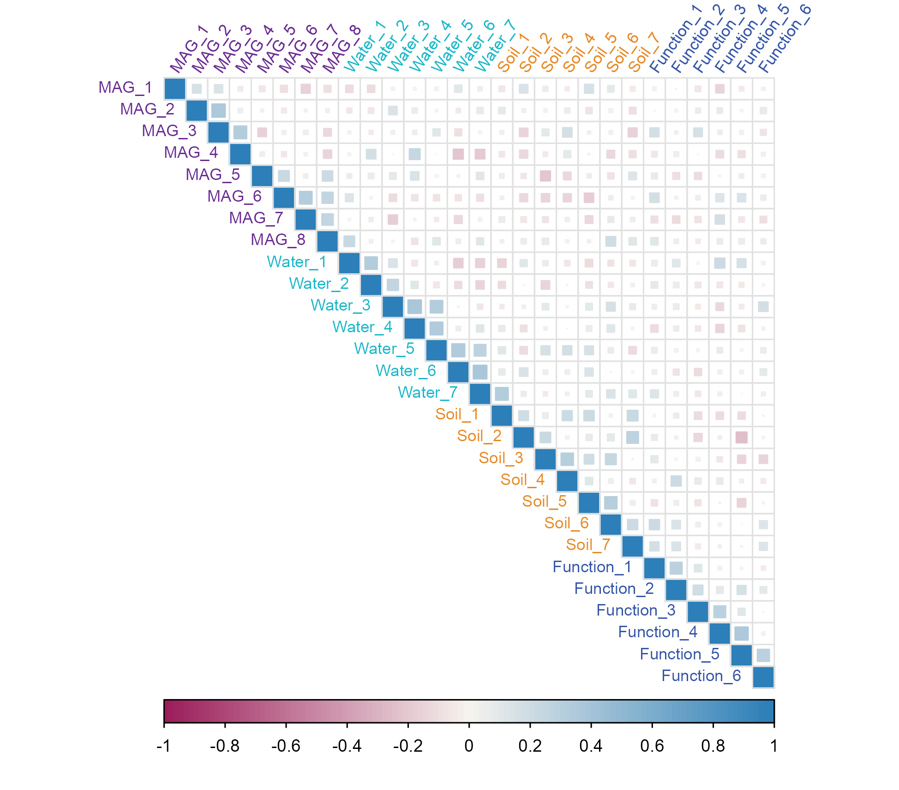
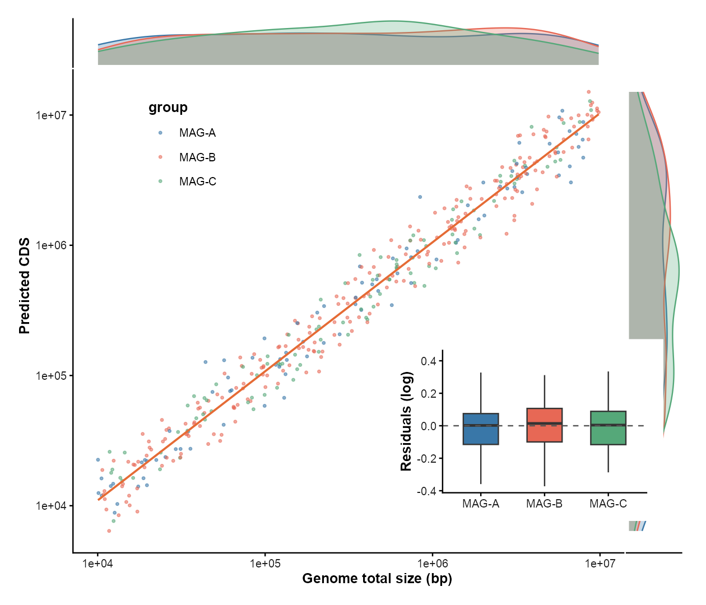
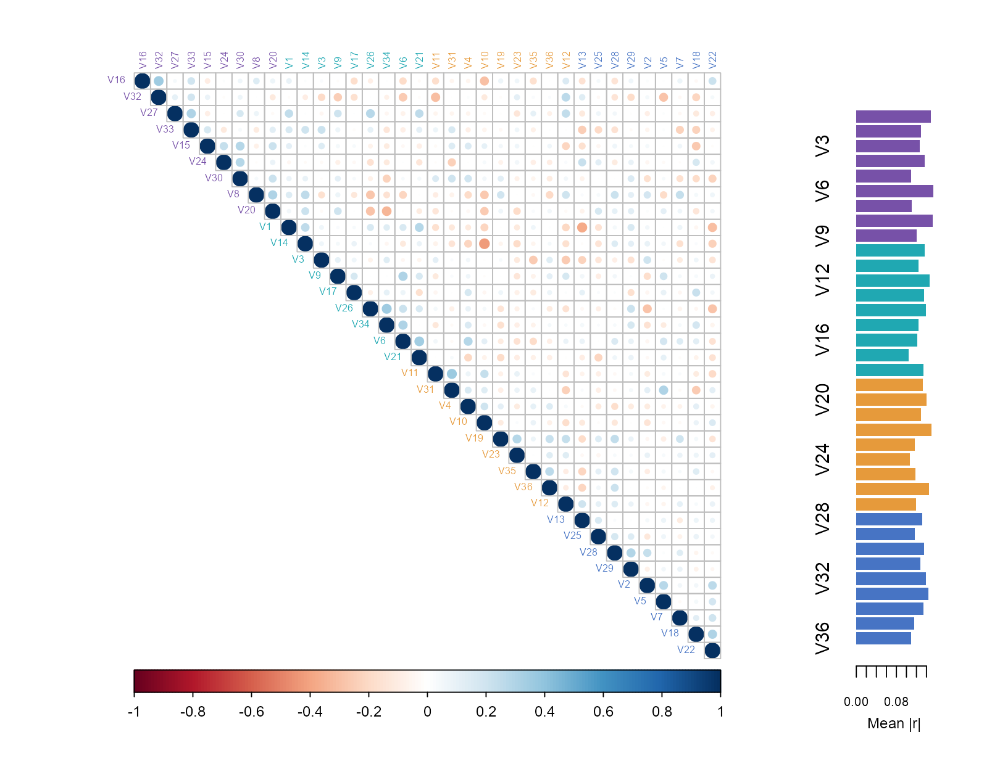
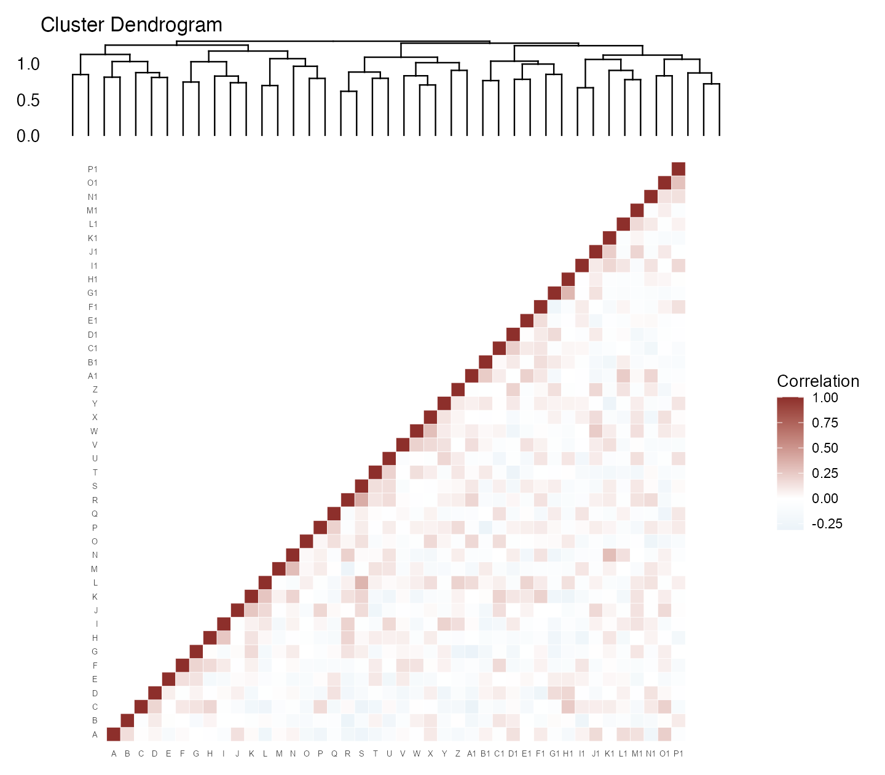
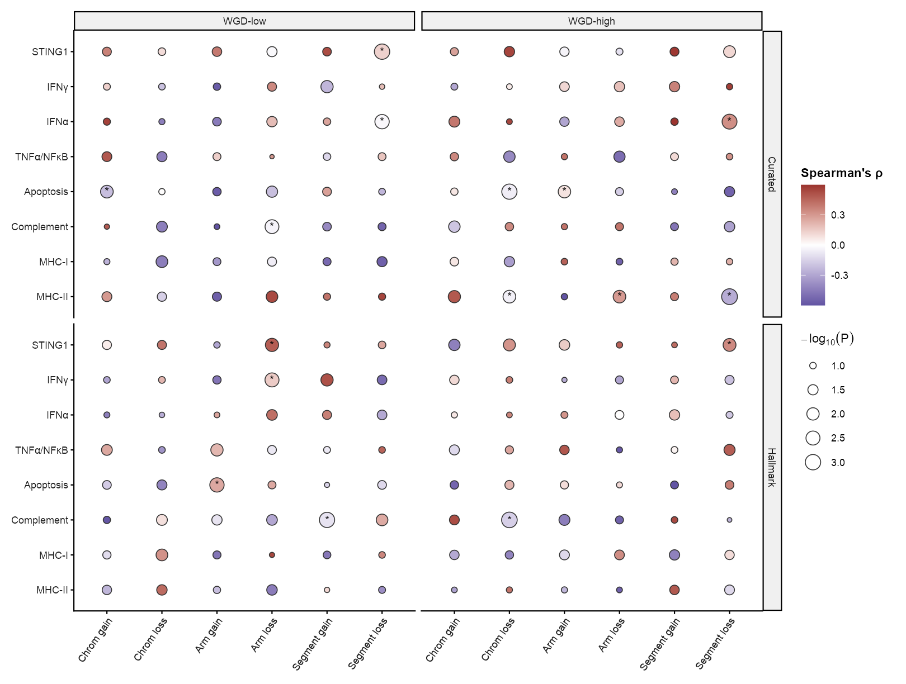
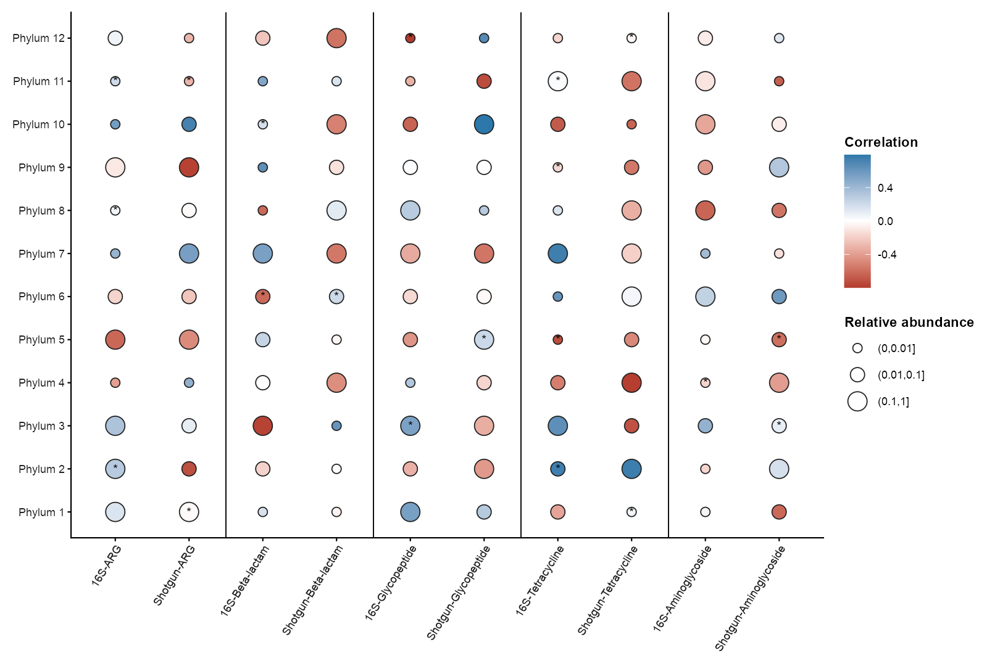
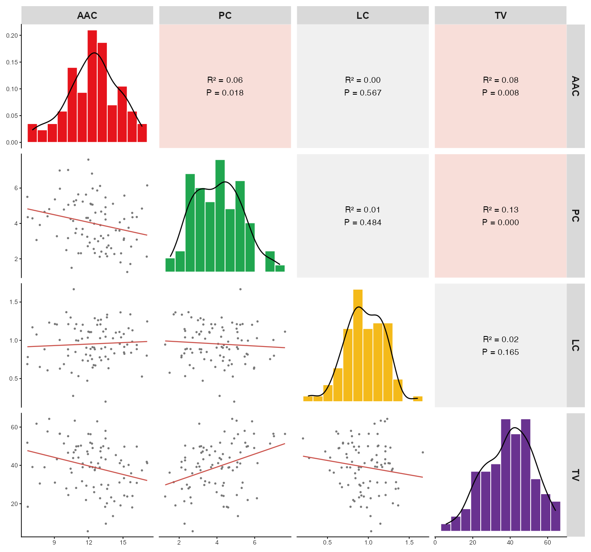
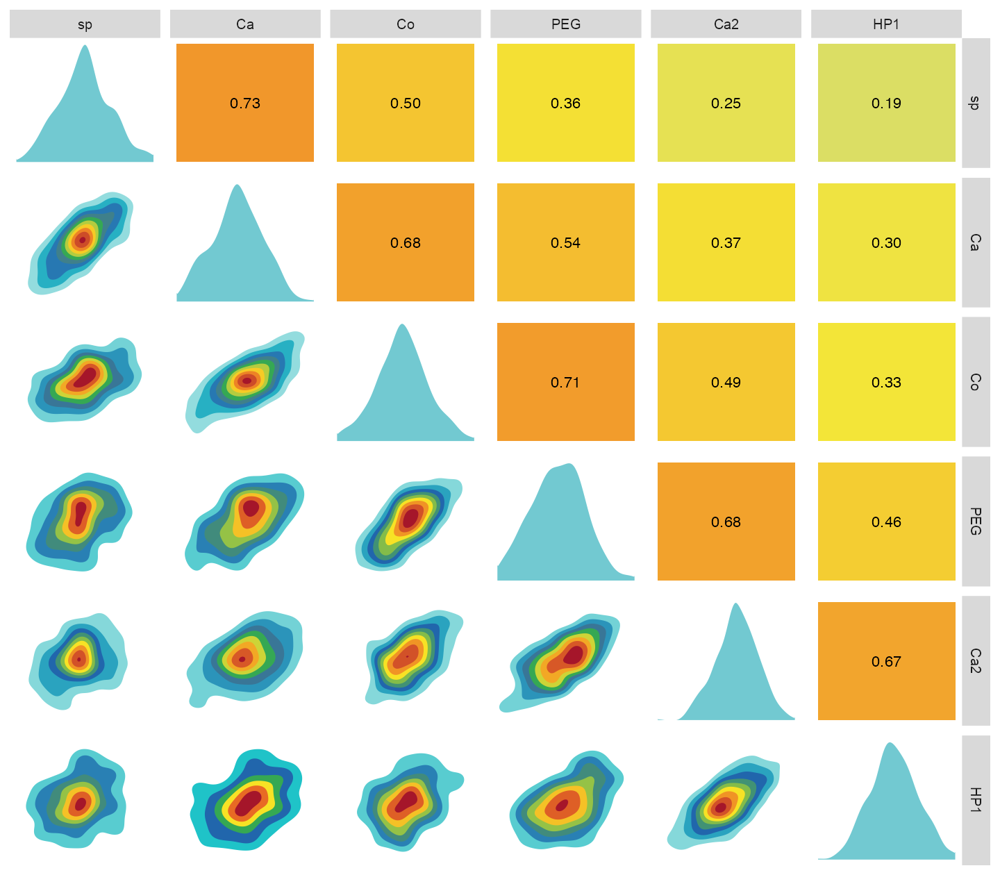
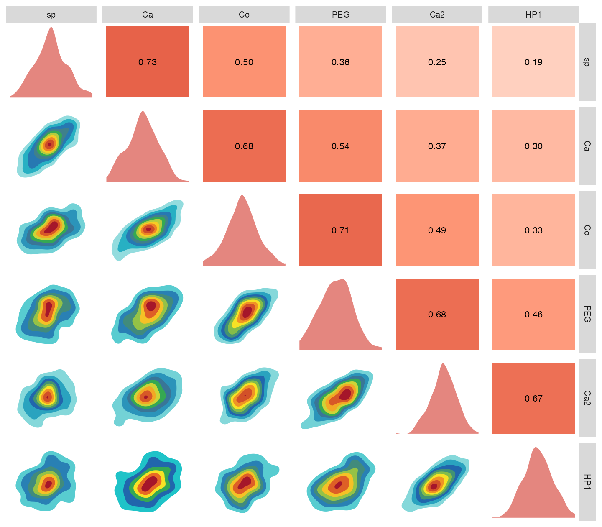

# 相关、回归与气泡矩阵 / Correlations

[全部分类 / All categories](../GALLERY.md) · [首页 / Home](../../README.md)

相关矩阵、边际分布、回归与残差组合。 共 10 张。

全部为模拟数据示例；展示不代表完整验收，不能据此推断真实生物学结论。 Simulated examples only; display does not imply full validation or biological findings.

## 1. 跨组学关联

基础与领域模拟示例。

[原尺寸 / Full size](../assets/gallery/domain-multiomics-association.png) · [生成脚本 / Script](../../biofigure/examples/gallery/generate_domain_gallery.R) · [运行说明 / Instructions](../../biofigure/examples/gallery/README.md) · [分类目录 / Categories](../GALLERY.md)

## 2. 相关热图

SciDraw 方法迁移示例。

[原尺寸 / Full size](../assets/scidraw-gallery/03_correlation_heatmap.png) · [生成脚本 / Script](../../biofigure/examples/scidraw-gallery/scripts/generate_six_scidraw.R) · [运行说明 / Instructions](../../biofigure/examples/scidraw-gallery/README.md) · [分类目录 / Categories](../GALLERY.md)

## 3. 拟合、边际分布与残差箱线

SciDraw 方法迁移示例。

[原尺寸 / Full size](../assets/scidraw-gallery-batch2/11_fit_marginal_residual_box.png) · [生成脚本 / Script](../../biofigure/examples/scidraw-gallery/scripts/generate_batch20.R) · [运行说明 / Instructions](../../biofigure/examples/scidraw-gallery/README.md) · [分类目录 / Categories](../GALLERY.md)

## 4. 相关矩阵与侧边注释

SciDraw 方法迁移示例。

[原尺寸 / Full size](../assets/scidraw-gallery-batch2/12_corrplot_with_sidebars.png) · [生成脚本 / Script](../../biofigure/examples/scidraw-gallery/scripts/generate_batch20.R) · [运行说明 / Instructions](../../biofigure/examples/scidraw-gallery/README.md) · [分类目录 / Categories](../GALLERY.md)

## 5. 聚类上三角相关矩阵

SciDraw 方法迁移示例。

[原尺寸 / Full size](../assets/scidraw-gallery-batch2/13_clustered_upper_triangle.png) · [生成脚本 / Script](../../biofigure/examples/scidraw-gallery/scripts/generate_batch20.R) · [运行说明 / Instructions](../../biofigure/examples/scidraw-gallery/README.md) · [分类目录 / Categories](../GALLERY.md)

## 6. 分面相关气泡矩阵

SciDraw 方法迁移示例。

[原尺寸 / Full size](../assets/scidraw-gallery-batch2/15_faceted_correlation_bubbles.png) · [生成脚本 / Script](../../biofigure/examples/scidraw-gallery/scripts/generate_batch20.R) · [运行说明 / Instructions](../../biofigure/examples/scidraw-gallery/README.md) · [分类目录 / Categories](../GALLERY.md)

## 7. 分组相关气泡矩阵

SciDraw 方法迁移示例。

[原尺寸 / Full size](../assets/scidraw-gallery-batch2/16_grouped_correlation_bubbles.png) · [生成脚本 / Script](../../biofigure/examples/scidraw-gallery/scripts/generate_batch20.R) · [运行说明 / Instructions](../../biofigure/examples/scidraw-gallery/README.md) · [分类目录 / Categories](../GALLERY.md)

## 8. 成对回归矩阵

SciDraw 方法迁移示例。

[原尺寸 / Full size](../assets/scidraw-gallery-batch2/17_ggally_regression_matrix.png) · [生成脚本 / Script](../../biofigure/examples/scidraw-gallery/scripts/generate_batch20.R) · [运行说明 / Instructions](../../biofigure/examples/scidraw-gallery/README.md) · [分类目录 / Categories](../GALLERY.md)

## 9. 密度相关矩阵：彩色版

SciDraw 方法迁移示例。

[原尺寸 / Full size](../assets/scidraw-gallery-batch2/19_density_matrix_rainbow.png) · [生成脚本 / Script](../../biofigure/examples/scidraw-gallery/scripts/generate_batch20.R) · [运行说明 / Instructions](../../biofigure/examples/scidraw-gallery/README.md) · [分类目录 / Categories](../GALLERY.md)

## 10. 密度相关矩阵：红色版

SciDraw 方法迁移示例。

[原尺寸 / Full size](../assets/scidraw-gallery-batch2/20_density_matrix_red.png) · [生成脚本 / Script](../../biofigure/examples/scidraw-gallery/scripts/generate_batch20.R) · [运行说明 / Instructions](../../biofigure/examples/scidraw-gallery/README.md) · [分类目录 / Categories](../GALLERY.md)

来源与边界：[来源声明](../../NOTICE.md) · [设计来源](../DESIGN-SOURCES.md) · [验收规则](../../biofigure/references/benchmark-protocol.md)。
