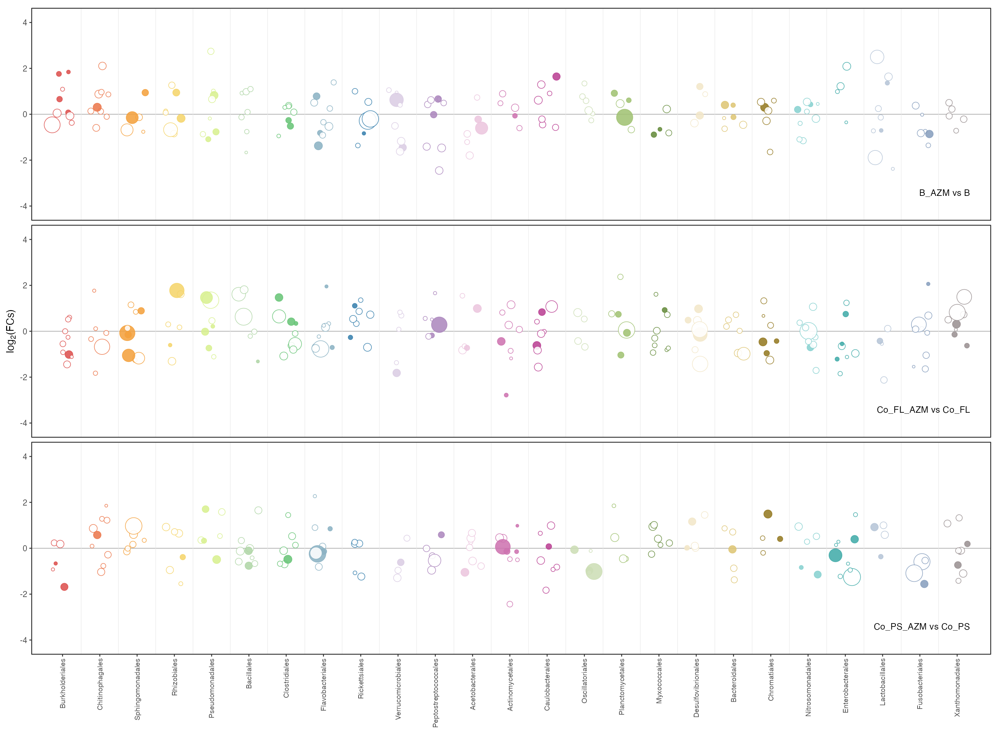
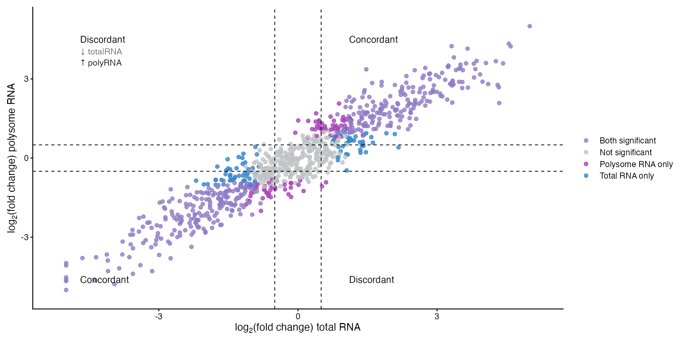
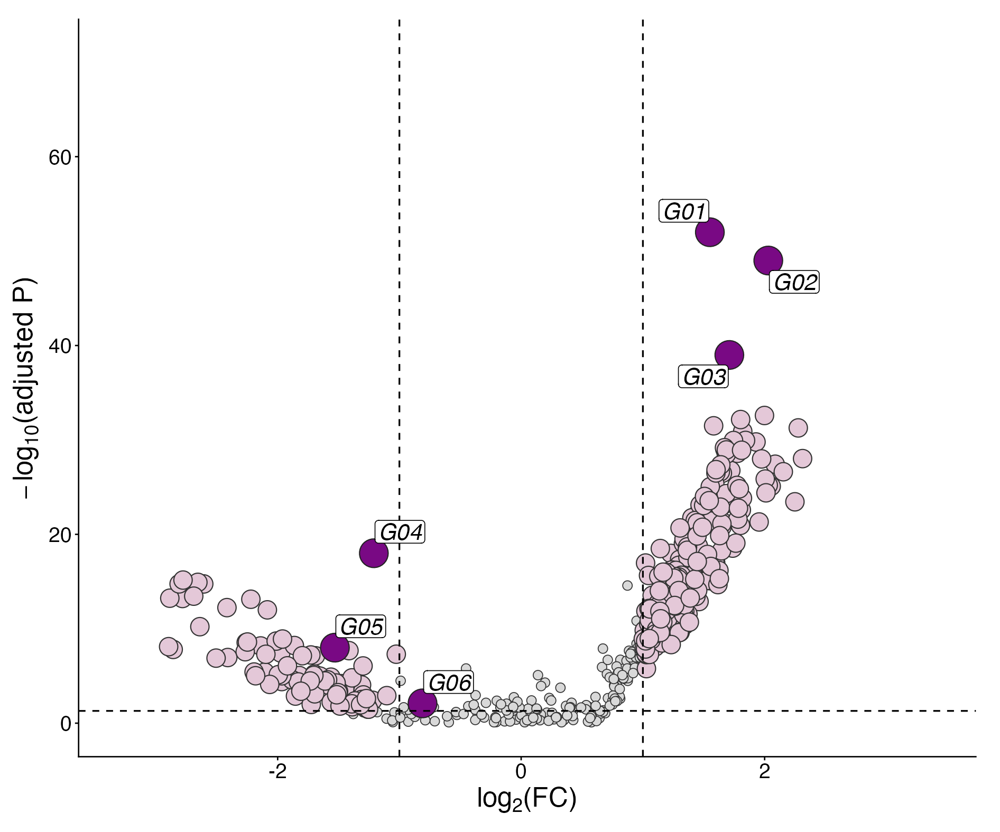
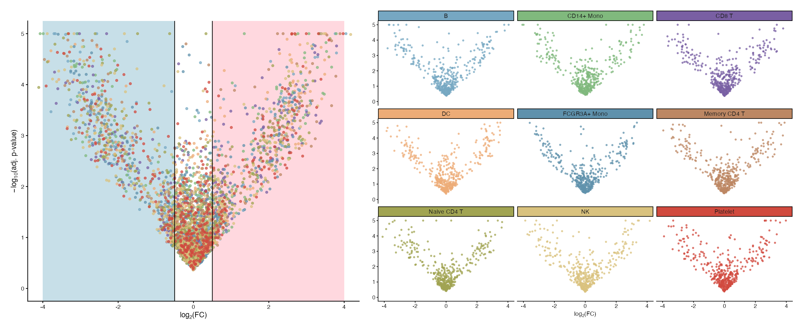
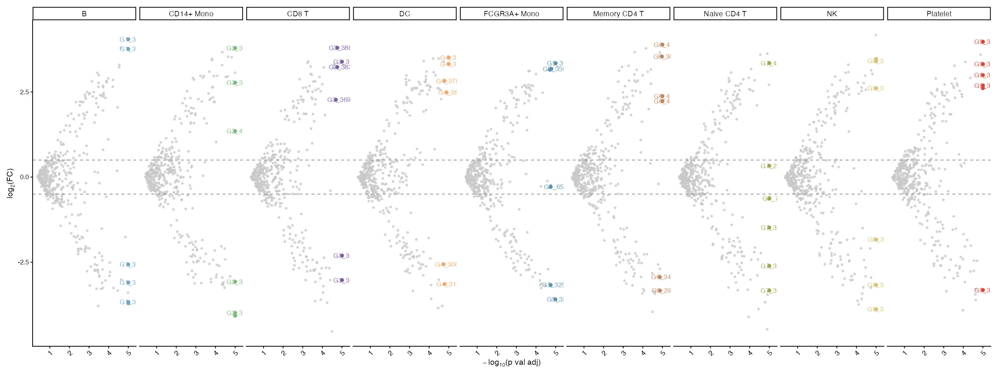
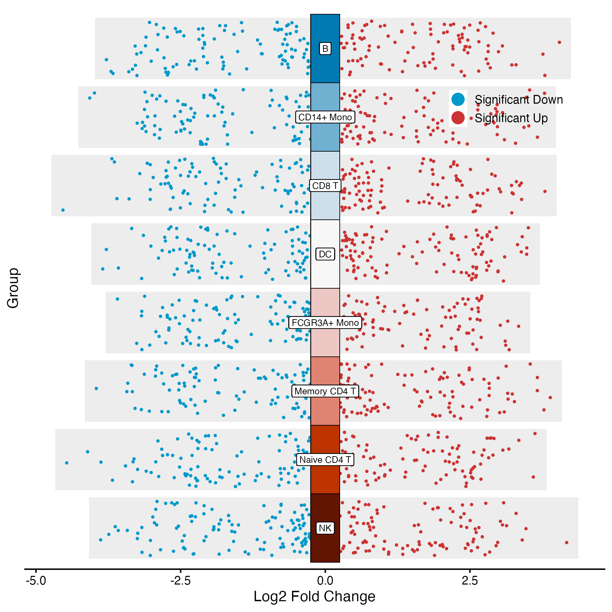
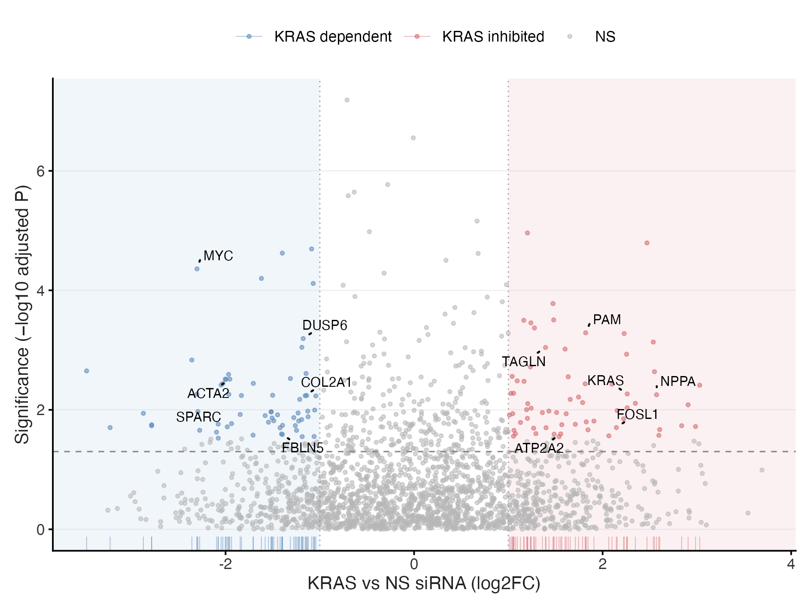
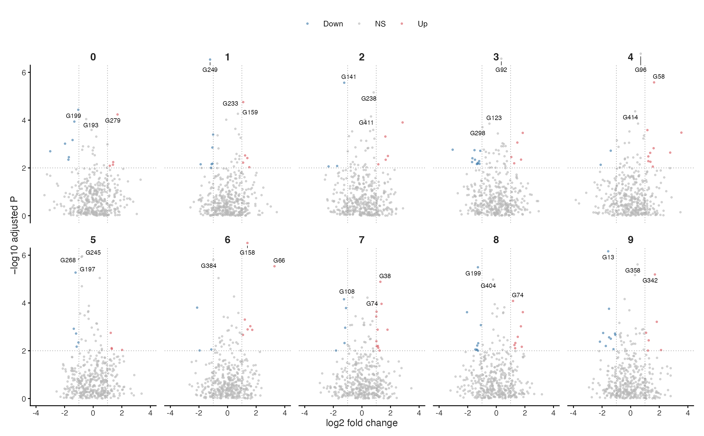

# 差异表达、富集与曼哈顿图 / Differential expression

[全部分类 / Categories](../GALLERY.md) · [首页 / Home](../../README.md) · [逐图清单 / Inventory](catalog.csv)

本类 **19 张**；第 **2/3 页**。页码：[1](differential.md) · **2** · [3](differential-3.md)

图型与数据来源分别标注；旧版折叠保留。收录不等于原论文数据复现或完整 CP 验收。 Data origin is stated per figure. Historical versions are folded. Inclusion does not certify scientific fidelity.

## BF-0098 · OTU 气泡曼哈顿图

模拟数据／方法展示；非原论文数据复现。

状态：方法展示／仍待修订，不能视为高保真验收通过。

[原尺寸](../../docs/assets/archive-gallery/scidraw-001-065/25_otu_bubble_manhattan.png) · [脚本](../../biofigure/examples/archive-gallery/scidraw-001-065/scripts/render_cases_21_25.R) · [方法来源](https://mp.weixin.qq.com/s/QtTyTtYYjik1QGwcGE9F2w) · [记录](catalog.csv)

## BF-0102 · 方向与显著性四象限图

模拟数据／方法展示；非原论文数据复现。

状态：方法展示／仍待修订，不能视为高保真验收通过。

[原尺寸](../../docs/assets/archive-gallery/scidraw-001-065/29_significance_quadrants.png) · [脚本](../../biofigure/examples/archive-gallery/scidraw-001-065/scripts/render_cases_26_35.R) · [方法来源](https://mp.weixin.qq.com/s/1Mv-fsKQnkrbi-YL4-yOMQ) · [记录](catalog.csv)

## BF-0104 · 纵向火山气泡图

模拟数据／方法展示；非原论文数据复现。

状态：方法展示／仍待修订，不能视为高保真验收通过。

[原尺寸](../../docs/assets/archive-gallery/scidraw-001-065/31_vertical_volcano.png) · [脚本](../../biofigure/examples/archive-gallery/scidraw-001-065/scripts/render_cases_26_35.R) · [方法来源](https://mp.weixin.qq.com/s/mDUBhuWkYBN8XwPxJozEhw) · [记录](catalog.csv)

## BF-0111 · 多组织火山图

模拟数据／方法展示；非原论文数据复现。

状态：方法展示／仍待修订，不能视为高保真验收通过。

[原尺寸](../../docs/assets/archive-gallery/scidraw-001-065/38_multi_tissue_volcano.png) · [脚本](../../biofigure/examples/archive-gallery/scidraw-001-065/scripts/render_cases_36_45.R) · [方法来源](https://mp.weixin.qq.com/s/yeMUSZIac-nHXA-WY6P08Q) · [记录](catalog.csv)

## BF-0112 · 多细胞群火山图

模拟数据／方法展示；非原论文数据复现。

状态：方法展示／仍待修订，不能视为高保真验收通过。

[原尺寸](../../docs/assets/archive-gallery/scidraw-001-065/39_multi_cell_volcano.png) · [脚本](../../biofigure/examples/archive-gallery/scidraw-001-065/scripts/render_cases_36_45.R) · [方法来源](https://mp.weixin.qq.com/s/yeMUSZIac-nHXA-WY6P08Q) · [记录](catalog.csv)

## BF-0113 · 多比较 jjVolcano 图

模拟数据／方法展示；非原论文数据复现。

状态：方法展示／仍待修订，不能视为高保真验收通过。

[原尺寸](../../docs/assets/archive-gallery/scidraw-001-065/40_jjvolcano_comparisons.png) · [脚本](../../biofigure/examples/archive-gallery/scidraw-001-065/scripts/render_cases_36_45.R) · [方法来源](https://mp.weixin.qq.com/s/yeMUSZIac-nHXA-WY6P08Q) · [记录](catalog.csv)

## BF-0143 · 顶刊案例005：基因集火山图

模拟数据／方法展示；非原论文数据复现。

状态：方法展示／仍待修订，不能视为高保真验收通过。

[原尺寸](../../docs/assets/archive-gallery/topjournal-001-010/05_gene_set_volcano.png) · [脚本](../../biofigure/examples/archive-gallery/topjournal-001-010/scripts/render_topjournal_001_010.R) · [记录](catalog.csv)

## BF-0148 · 顶刊案例010：多组火山图

模拟数据／方法展示；非原论文数据复现。

状态：方法展示／仍待修订，不能视为高保真验收通过。

[原尺寸](../../docs/assets/archive-gallery/topjournal-001-010/10_multi_group_volcano.png) · [脚本](../../biofigure/examples/archive-gallery/topjournal-001-010/scripts/render_topjournal_001_010.R) · [记录](catalog.csv)

页码：[1](differential.md) · **2** · [3](differential-3.md)

[全部分类](../GALLERY.md) · [脚本存档说明](../../biofigure/examples/archive-gallery/README.md)
