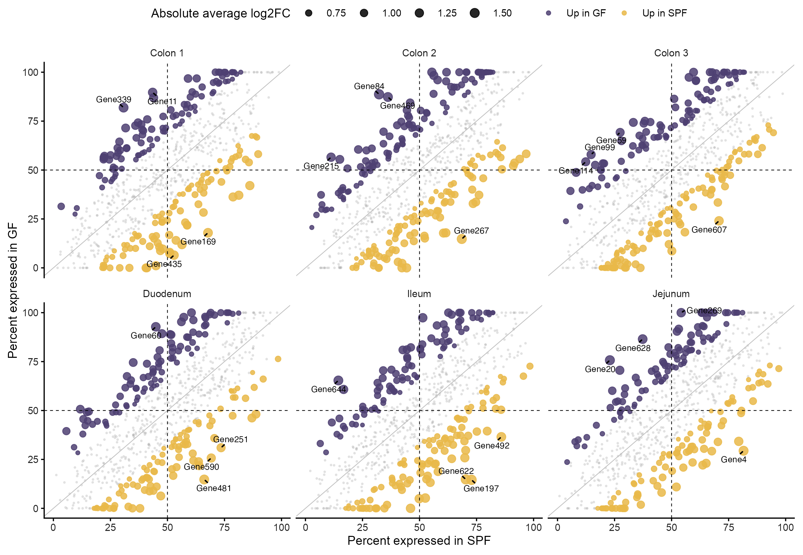
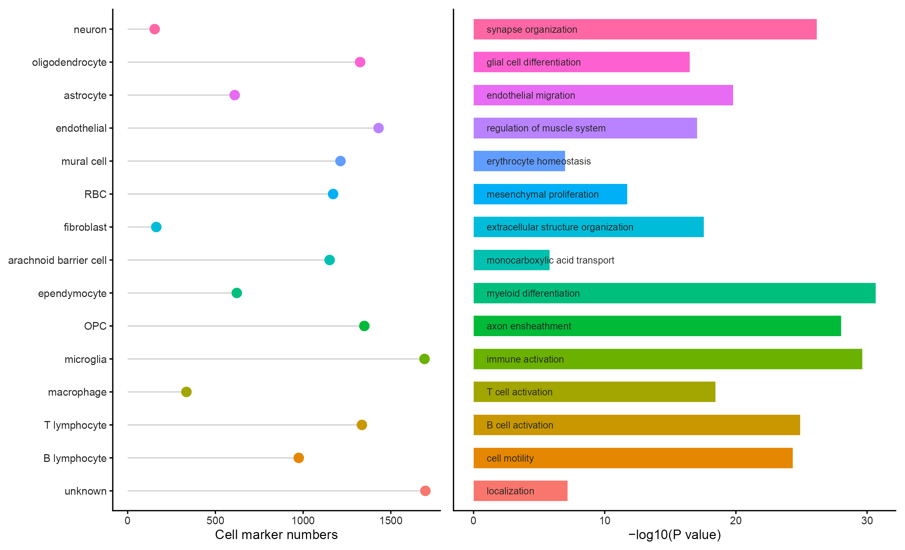
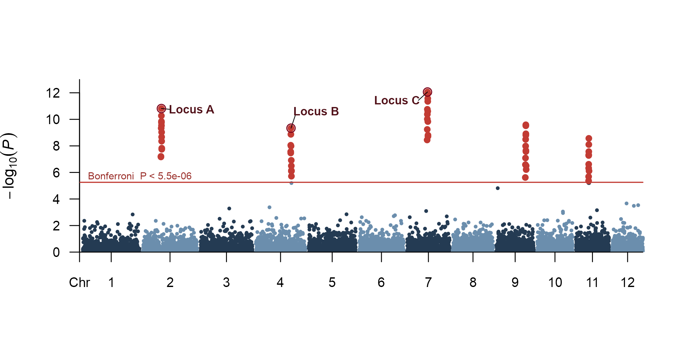

# 差异表达、富集与曼哈顿图 / Differential expression

[全部分类 / Categories](../GALLERY.md) · [首页 / Home](../../README.md) · [逐图清单 / Inventory](catalog.csv)

本类 **19 张**；第 **3/3 页**。页码：[1](differential.md) · [2](differential-2.md) · **3**

图型与数据来源分别标注；旧版折叠保留。收录不等于原论文数据复现或完整 CP 验收。 Data origin is stated per figure. Historical versions are folded. Inclusion does not certify scientific fidelity.

## BF-0205 · 分面基因表达比较

模拟数据／方法展示；非原论文数据复现。

[原尺寸](../../docs/assets/archive-gallery/full-reproduction/revision_v1_42_faceted_gene_scatter.png) · [脚本](../../biofigure/examples/archive-gallery/full-reproduction/scripts/batch41_50_reproduction.R) · [记录](catalog.csv)

## BF-0209 · 细胞比例棒棒糖与 GO 富集

模拟数据／方法展示；非原论文数据复现。

[原尺寸](../../docs/assets/archive-gallery/full-reproduction/revision_v1_46_lollipop_go.png) · [脚本](../../biofigure/examples/archive-gallery/full-reproduction/scripts/batch41_50_reproduction.R) · [记录](catalog.csv)

## BF-0215 · 模拟 GWAS 曼哈顿图

模拟数据／方法展示；非原论文数据复现。

[原尺寸](../../docs/assets/archive-gallery/manhattan/manhattan_simulated.png) · [脚本](../../biofigure/examples/archive-gallery/manhattan/scripts/draw_manhattan.R) · [记录](catalog.csv)

页码：[1](differential.md) · [2](differential-2.md) · **3**

[全部分类](../GALLERY.md) · [脚本存档说明](../../biofigure/examples/archive-gallery/README.md)
