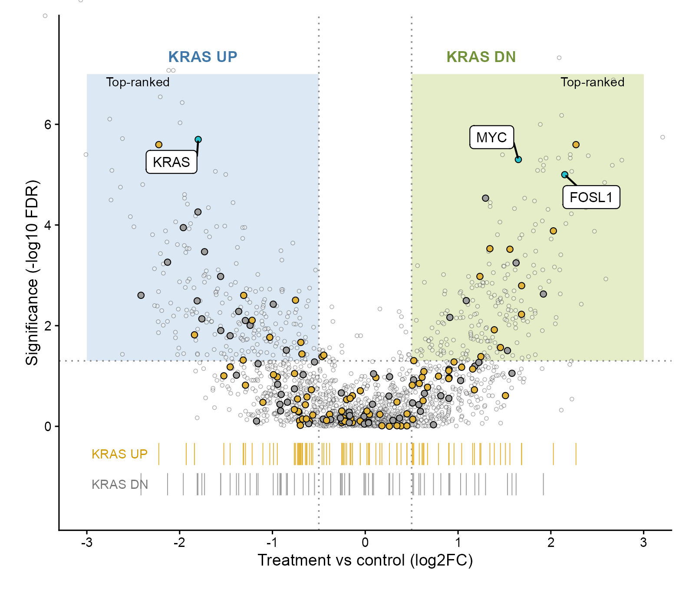
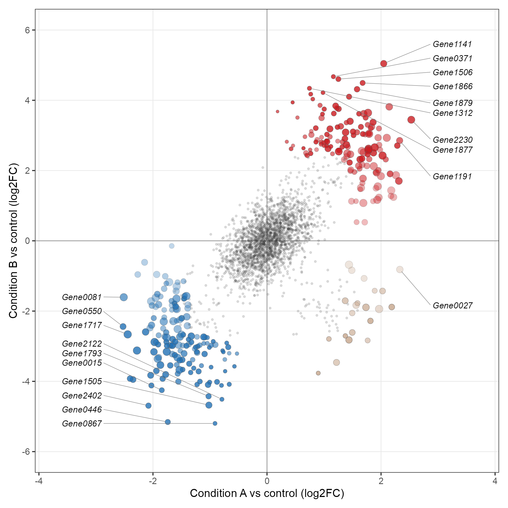
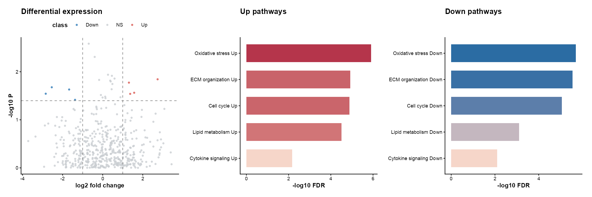
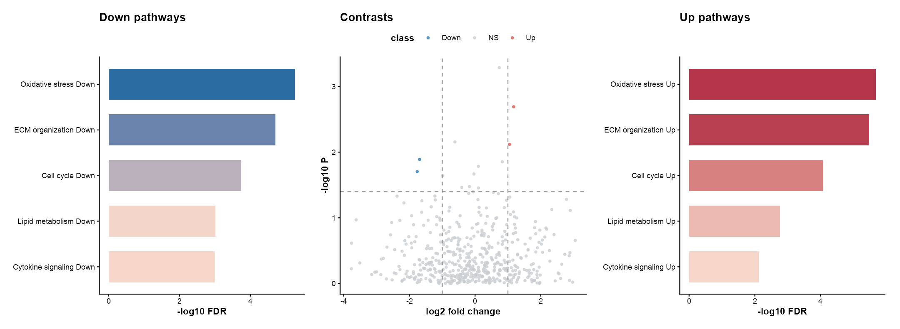
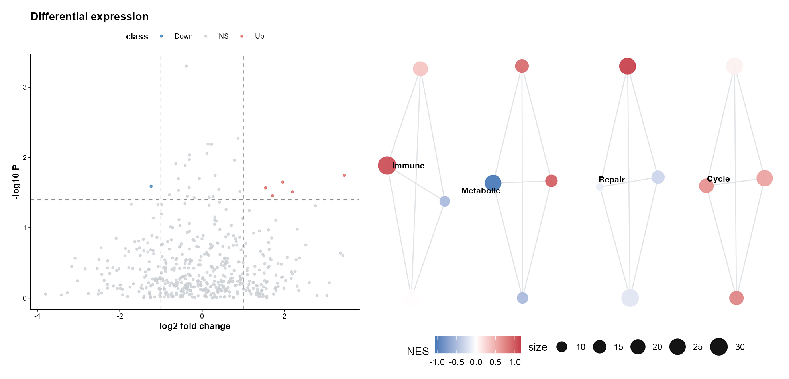
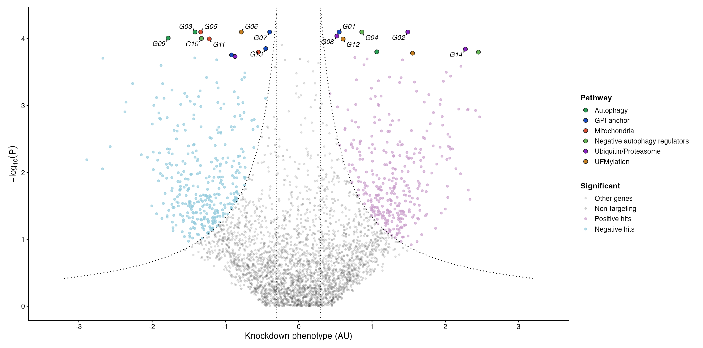
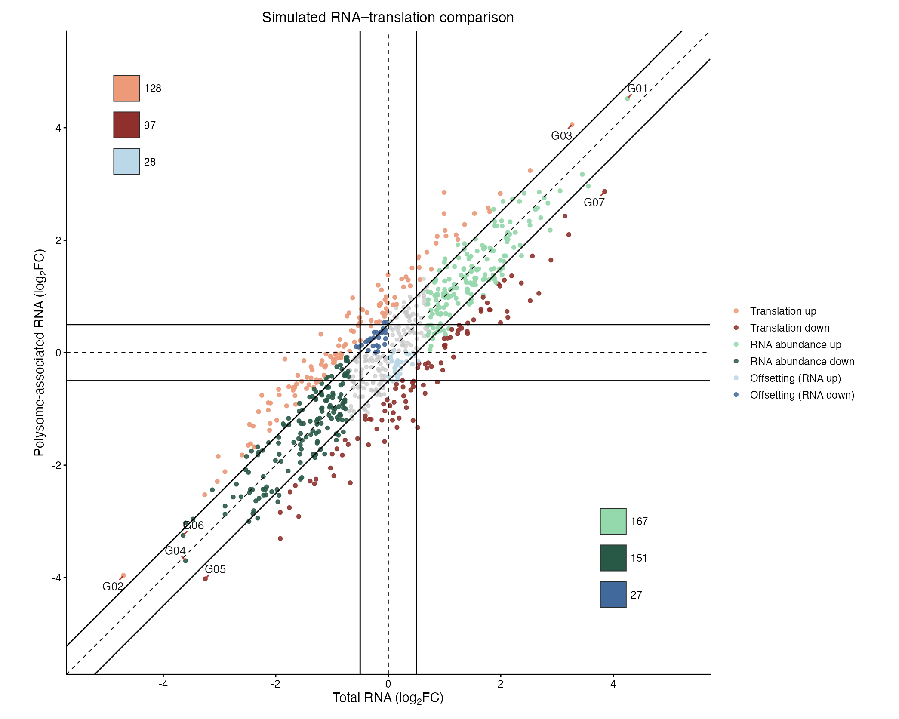

# 差异表达、富集与曼哈顿图 / Differential expression

[全部分类 / Categories](../GALLERY.md) · [首页 / Home](../../README.md) · [逐图清单 / Inventory](catalog.csv)

本类 **19 张**；第 **1/3 页**。页码：**1** · [2](differential-2.md) · [3](differential-3.md)

图型与数据来源分别标注；旧版折叠保留。收录不等于原论文数据复现或完整 CP 验收。 Data origin is stated per figure. Historical versions are folded. Inclusion does not certify scientific fidelity.

## BF-0018 · 火山图

模拟数据／方法展示；非原论文数据复现。

[原尺寸](../../docs/assets/gallery/template-volcano.png) · [脚本](../../biofigure/examples/gallery/generate_core_gallery.R) · [记录](catalog.csv)

## BF-0035 · 火山图与 GSEA 组合

模拟数据／方法展示；非原论文数据复现。

[原尺寸](../../docs/assets/scidraw-gallery/06_volcano_gsea.png) · [脚本](../../biofigure/examples/scidraw-gallery/scripts/generate_six_scidraw.R) · [记录](catalog.csv)

## BF-0070 · 双条件 log2FC 比较

模拟数据／方法展示；非原论文数据复现。

[原尺寸](../../docs/assets/archive-gallery/random-three/logfc.png) · [脚本](../../biofigure/examples/archive-gallery/random-three/scripts/draw_three.R) · [记录](catalog.csv)

## BF-0079 · 火山图与上下调富集条形图

模拟数据／方法展示；非原论文数据复现。

[原尺寸](../../docs/assets/archive-gallery/scidraw-001-065/07_volcano_enrichment_1.png) · [批次脚本](../../biofigure/examples/archive-gallery/scidraw-001-065/scripts) · [方法来源](https://mp.weixin.qq.com/s/9q-SMHq0RHzn81n4KYuhtw) · [记录](catalog.csv)

## BF-0080 · 双侧富集与差异表达组合

模拟数据／方法展示；非原论文数据复现。

[原尺寸](../../docs/assets/archive-gallery/scidraw-001-065/08_volcano_enrichment_2.png) · [批次脚本](../../biofigure/examples/archive-gallery/scidraw-001-065/scripts) · [方法来源](https://mp.weixin.qq.com/s/9q-SMHq0RHzn81n4KYuhtw) · [记录](catalog.csv)

## BF-0081 · 火山图与富集网络

模拟数据／方法展示；非原论文数据复现。

[原尺寸](../../docs/assets/archive-gallery/scidraw-001-065/09_volcano_enrichment_network.png) · [批次脚本](../../biofigure/examples/archive-gallery/scidraw-001-065/scripts) · [方法来源](https://mp.weixin.qq.com/s/9q-SMHq0RHzn81n4KYuhtw) · [记录](catalog.csv)

## BF-0095 · 双曲阈值火山图

模拟数据／方法展示；非原论文数据复现。

状态：方法展示／仍待修订，不能视为高保真验收通过。

[原尺寸](../../docs/assets/archive-gallery/scidraw-001-065/22_hyperbolic_volcano.png) · [脚本](../../biofigure/examples/archive-gallery/scidraw-001-065/scripts/render_cases_21_25.R) · [方法来源](https://mp.weixin.qq.com/s/mDUBhuWkYBN8XwPxJozEhw) · [记录](catalog.csv)

## BF-0096 · RNA 与翻译变化象限图

模拟数据／方法展示；非原论文数据复现。

状态：方法展示／仍待修订，不能视为高保真验收通过。

[原尺寸](../../docs/assets/archive-gallery/scidraw-001-065/23_rna_translation_quadrants.png) · [脚本](../../biofigure/examples/archive-gallery/scidraw-001-065/scripts/render_cases_21_25.R) · [方法来源](https://mp.weixin.qq.com/s/1Mv-fsKQnkrbi-YL4-yOMQ) · [记录](catalog.csv)

页码：**1** · [2](differential-2.md) · [3](differential-3.md)

[全部分类](../GALLERY.md) · [脚本存档说明](../../biofigure/examples/archive-gallery/README.md)
