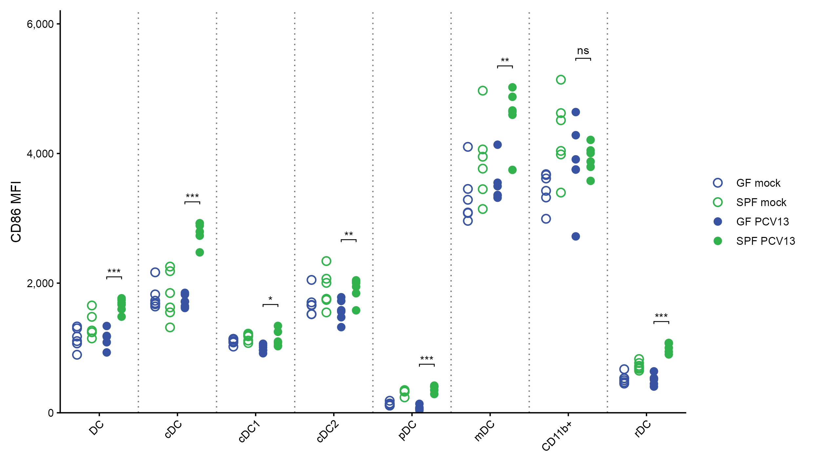
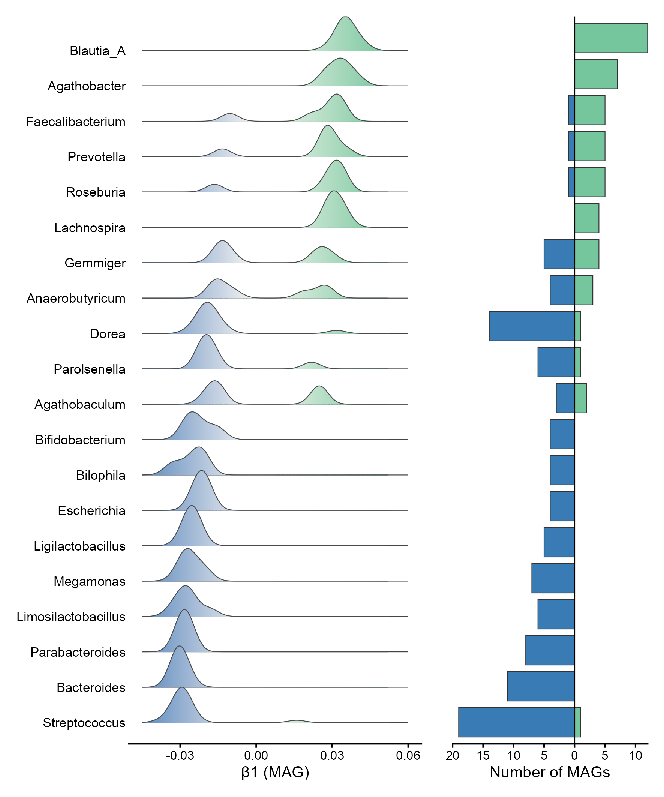
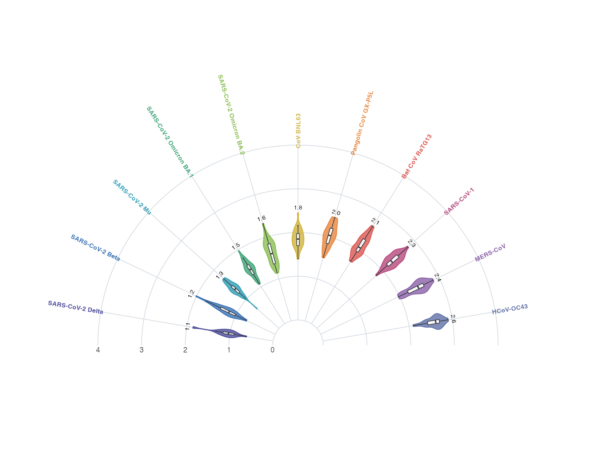
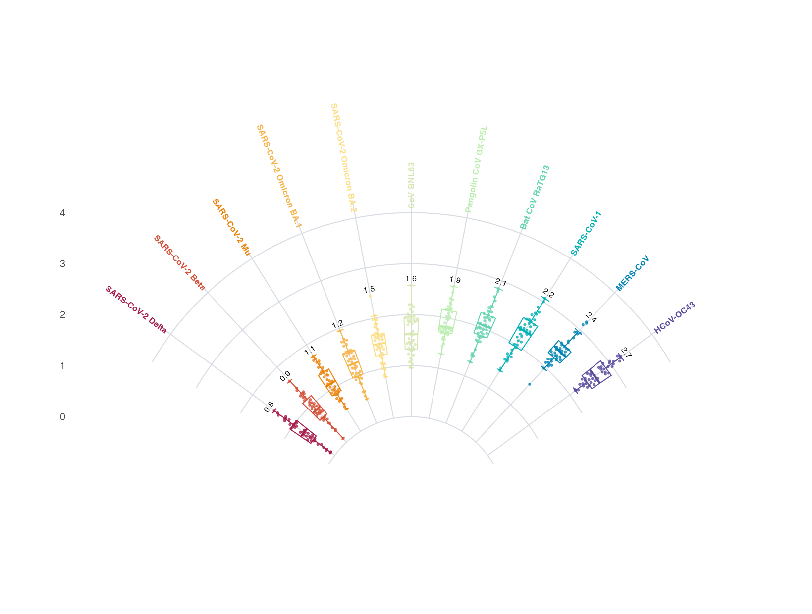
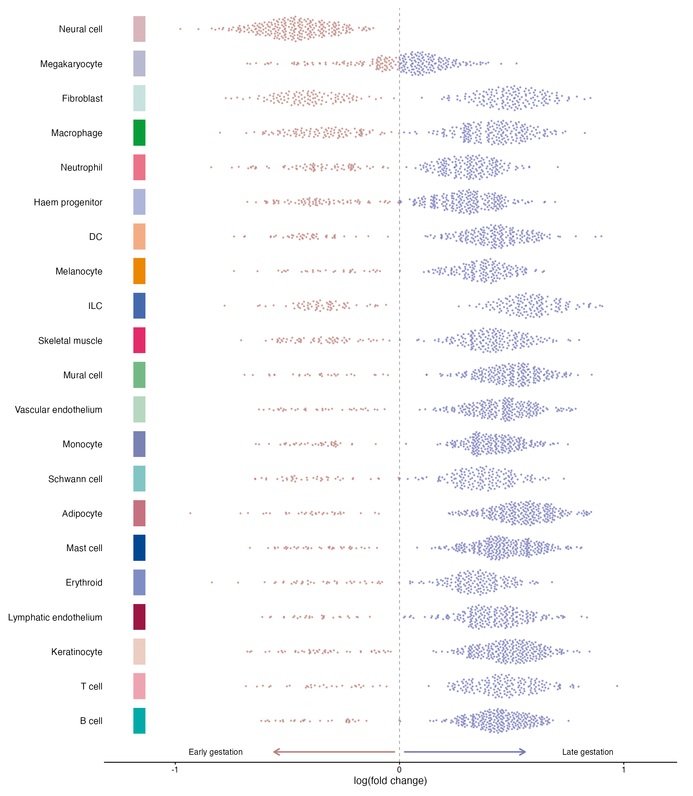
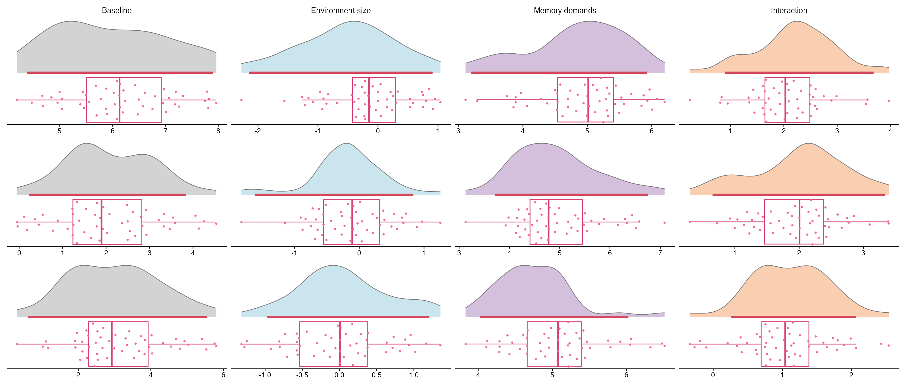
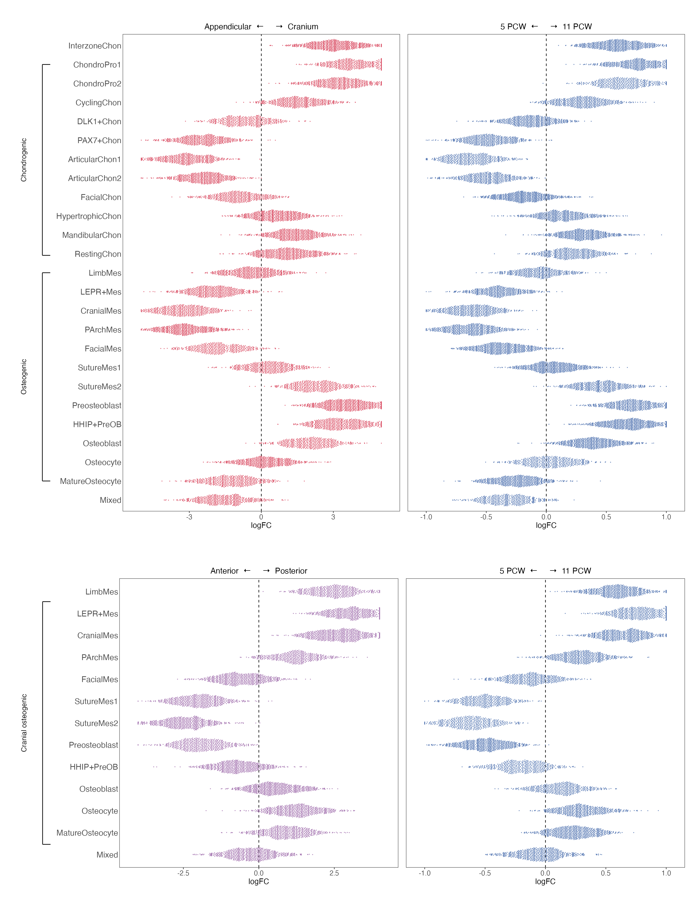
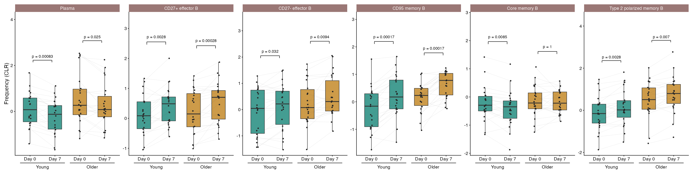

# 分布、箱线与小提琴 / Distributions

[全部分类 / Categories](../GALLERY.md) · [首页 / Home](../../README.md) · [逐图清单 / Inventory](catalog.csv)

本类 **27 张**；第 **2/4 页**。页码：[1](distributions.md) · **2** · [3](distributions-3.md) · [4](distributions-4.md)

图型与数据来源分别标注；旧版折叠保留。收录不等于原论文数据复现或完整 CP 验收。 Data origin is stated per figure. Historical versions are folded. Inclusion does not certify scientific fidelity.

## BF-0069 · 多类别分组散点比较

模拟数据／方法展示；非原论文数据复现。

[原尺寸](../../docs/assets/archive-gallery/random-three/grouped.png) · [脚本](../../biofigure/examples/archive-gallery/random-three/scripts/draw_three.R) · [记录](catalog.csv)

## BF-0072 · 双向山脊：第二次修订版

模拟数据／方法展示；非原论文数据复现。

[原尺寸](../../docs/assets/archive-gallery/ridge-repaired-v2/scidraw_ridge_bipolar.png) · [脚本](../../biofigure/examples/archive-gallery/ridge-repaired-v2/scripts/render.R) · [记录](catalog.csv)

## BF-0084 · 半圆小提琴图

模拟数据／方法展示；非原论文数据复现。

[原尺寸](../../docs/assets/archive-gallery/scidraw-001-065/12_semicircle_violin.png) · [脚本](../../biofigure/examples/archive-gallery/scidraw-001-065/scripts/render_cases_10_14.R) · [方法来源](https://mp.weixin.qq.com/s/cPBBUA1QLryNnMS554uCqw) · [记录](catalog.csv)

## BF-0085 · 扇形箱线图

模拟数据／方法展示；非原论文数据复现。

[原尺寸](../../docs/assets/archive-gallery/scidraw-001-065/13_fan_boxplot.png) · [脚本](../../biofigure/examples/archive-gallery/scidraw-001-065/scripts/render_cases_10_14.R) · [方法来源](https://mp.weixin.qq.com/s/cPBBUA1QLryNnMS554uCqw) · [记录](catalog.csv)

## BF-0097 · 细胞丰度蜂群图

模拟数据／方法展示；非原论文数据复现。

状态：方法展示／仍待修订，不能视为高保真验收通过。

[原尺寸](../../docs/assets/archive-gallery/scidraw-001-065/24_cell_abundance_beeswarm.png) · [脚本](../../biofigure/examples/archive-gallery/scidraw-001-065/scripts/render_cases_21_25.R) · [方法来源](https://mp.weixin.qq.com/s/5tsdXXahgEDeuvKA6C0SBA) · [记录](catalog.csv)

## BF-0100 · 参数恢复分布矩阵

模拟数据／方法展示；非原论文数据复现。

状态：方法展示／仍待修订，不能视为高保真验收通过。

[原尺寸](../../docs/assets/archive-gallery/scidraw-001-065/27_parameter_recovery_matrix.png) · [脚本](../../biofigure/examples/archive-gallery/scidraw-001-065/scripts/render_cases_26_35.R) · [方法来源](https://mp.weixin.qq.com/s/4JTm5XooEv8B4CdQ2lqsGg) · [记录](catalog.csv)

## BF-0103 · 分面细胞效应蜂群图

模拟数据／方法展示；非原论文数据复现。

状态：方法展示／仍待修订，不能视为高保真验收通过。

[原尺寸](../../docs/assets/archive-gallery/scidraw-001-065/30_faceted_cell_beeswarm.png) · [脚本](../../biofigure/examples/archive-gallery/scidraw-001-065/scripts/render_cases_26_35.R) · [方法来源](https://mp.weixin.qq.com/s/5tsdXXahgEDeuvKA6C0SBA) · [记录](catalog.csv)

## BF-0106 · 分面配对箱线图

模拟数据／方法展示；非原论文数据复现。

状态：方法展示／仍待修订，不能视为高保真验收通过。

[原尺寸](../../docs/assets/archive-gallery/scidraw-001-065/33_faceted_paired_boxplot.png) · [脚本](../../biofigure/examples/archive-gallery/scidraw-001-065/scripts/render_cases_26_35.R) · [方法来源](https://mp.weixin.qq.com/s/82Pmi41CjpUtQrm5Rvzezw) · [记录](catalog.csv)

页码：[1](distributions.md) · **2** · [3](distributions-3.md) · [4](distributions-4.md)

[全部分类](../GALLERY.md) · [脚本存档说明](../../biofigure/examples/archive-gallery/README.md)
