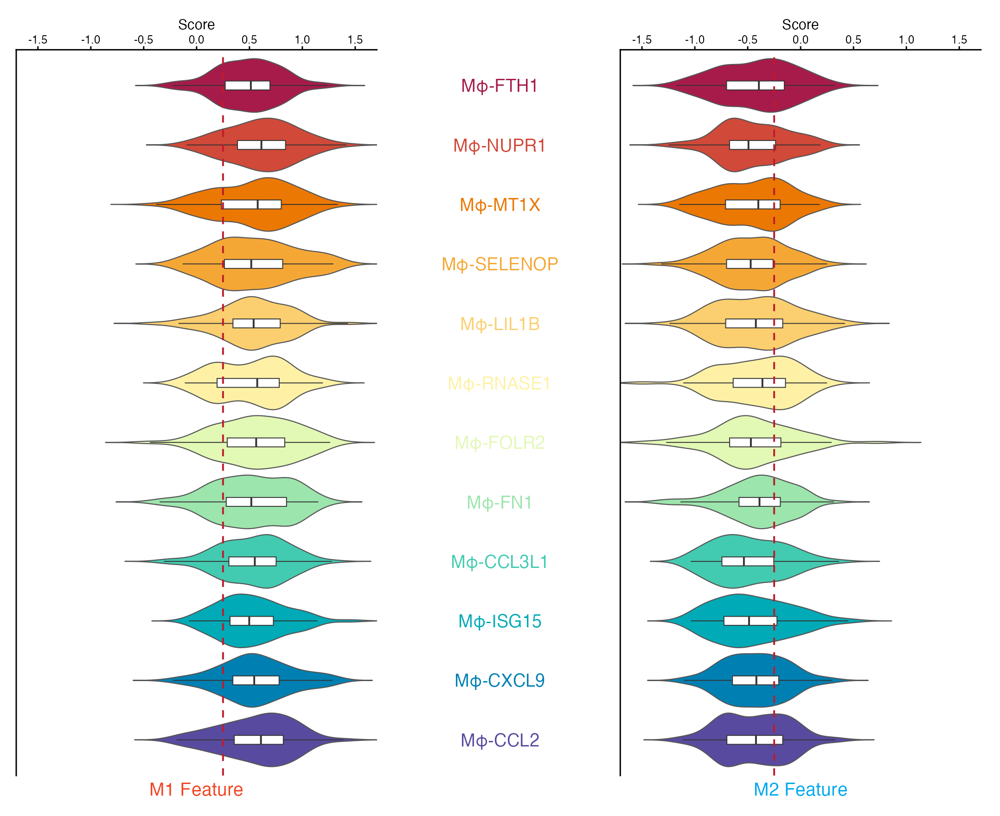
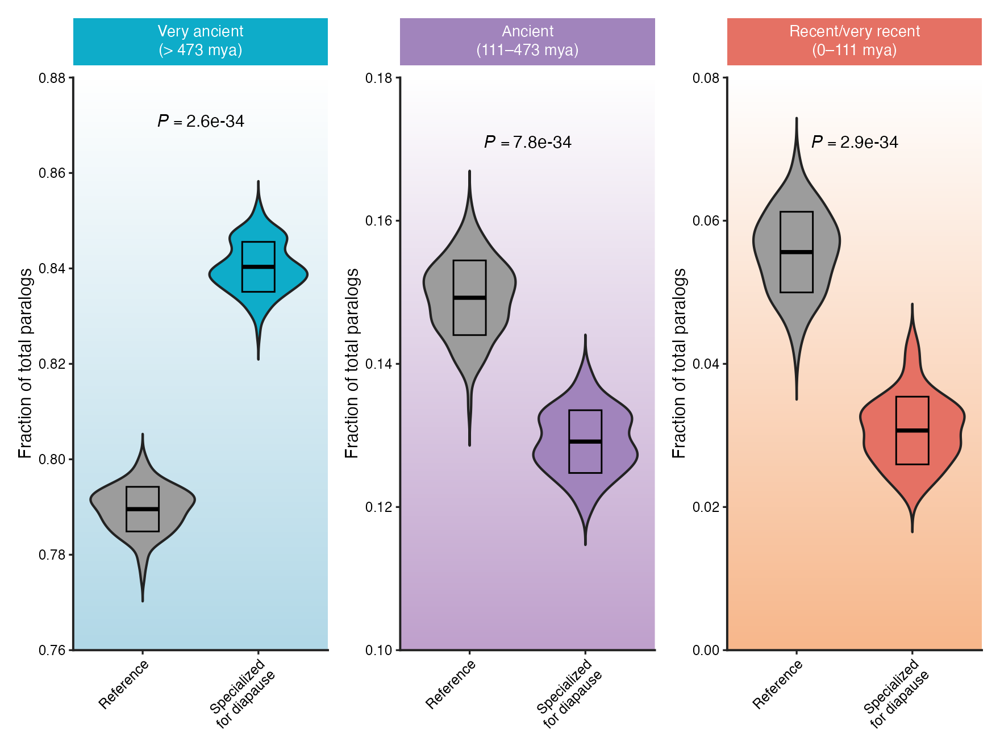
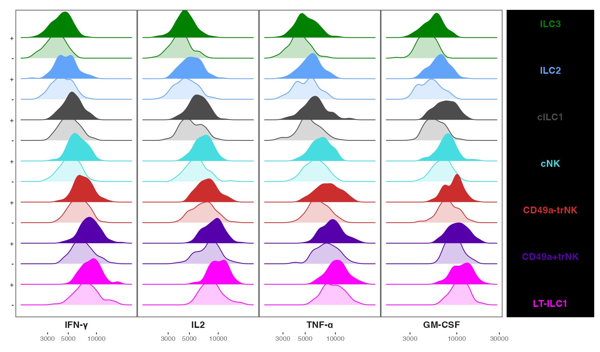
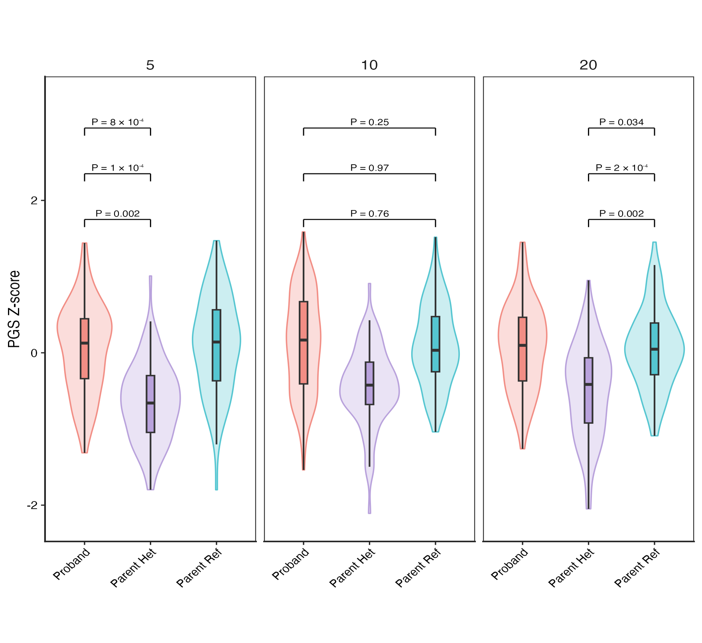
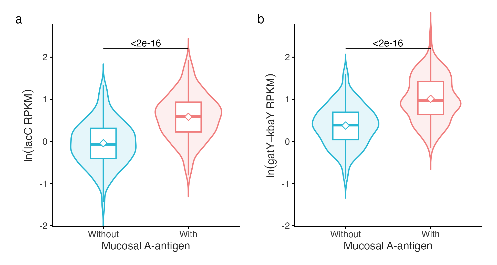
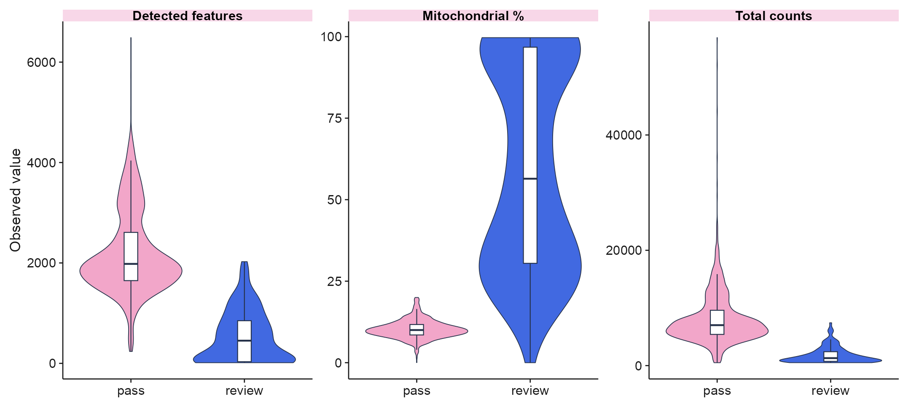
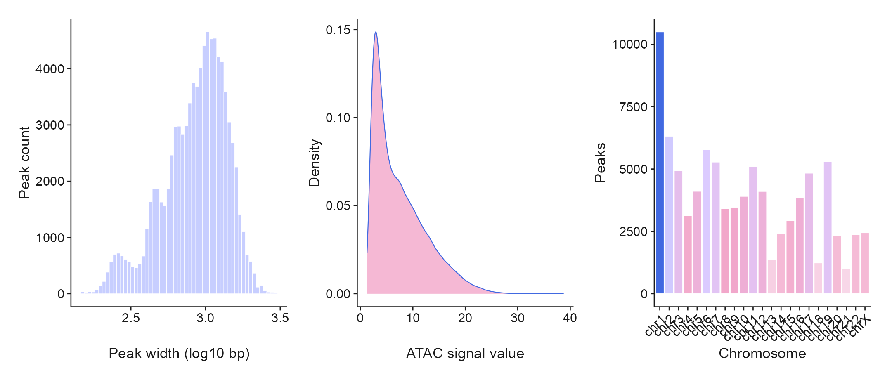
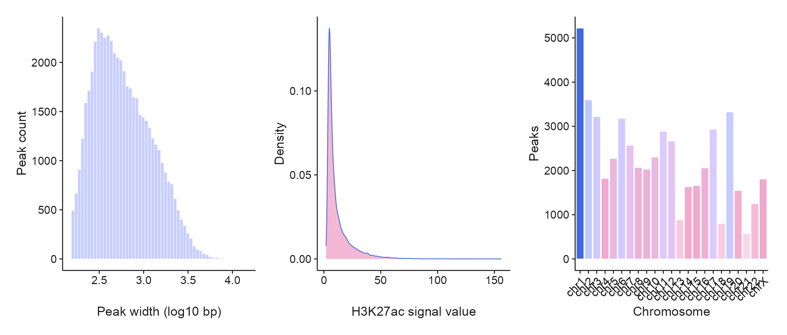

# 分布、箱线与小提琴 / Distributions

[全部分类 / Categories](../GALLERY.md) · [首页 / Home](../../README.md) · [逐图清单 / Inventory](catalog.csv)

本类 **27 张**；第 **3/4 页**。页码：[1](distributions.md) · [2](distributions-2.md) · **3** · [4](distributions-4.md)

图型与数据来源分别标注；旧版折叠保留。收录不等于原论文数据复现或完整 CP 验收。 Data origin is stated per figure. Historical versions are folded. Inclusion does not certify scientific fidelity.

## BF-0118 · 蝴蝶式双向小提琴

模拟数据／方法展示；非原论文数据复现。

状态：方法展示／仍待修订，不能视为高保真验收通过。

[原尺寸](../../docs/assets/archive-gallery/scidraw-001-065/45_butterfly_violin.png) · [脚本](../../biofigure/examples/archive-gallery/scidraw-001-065/scripts/render_cases_36_45.R) · [方法来源](https://mp.weixin.qq.com/s/fbRUFLBirVnyHD32Pvp1jg) · [记录](catalog.csv)

## BF-0119 · 渐变背景小提琴图

模拟数据／方法展示；非原论文数据复现。

状态：方法展示／仍待修订，不能视为高保真验收通过。

[原尺寸](../../docs/assets/archive-gallery/scidraw-001-065/46_gradient_violin.png) · [脚本](../../biofigure/examples/archive-gallery/scidraw-001-065/scripts/render_cases_46_55.R) · [方法来源](https://mp.weixin.qq.com/s/JNQ4iubLlNE8JMDEsdXvzA) · [记录](catalog.csv)

## BF-0120 · 分面山脊分布图

模拟数据／方法展示；非原论文数据复现。

状态：方法展示／仍待修订，不能视为高保真验收通过。

[原尺寸](../../docs/assets/archive-gallery/scidraw-001-065/47_faceted_ridgeline.png) · [脚本](../../biofigure/examples/archive-gallery/scidraw-001-065/scripts/render_cases_46_55.R) · [方法来源](https://mp.weixin.qq.com/s/ztzBYFm_jJUqYuXMD5AnQA) · [记录](catalog.csv)

## BF-0136 · 多组分面小提琴图

模拟数据／方法展示；非原论文数据复现。

状态：方法展示／仍待修订，不能视为高保真验收通过。

[原尺寸](../../docs/assets/archive-gallery/scidraw-001-065/63_faceted_violin.png) · [脚本](../../biofigure/examples/archive-gallery/scidraw-001-065/scripts/render_cases_56_65.R) · [方法来源](https://mp.weixin.qq.com/s/Rr5VIMvWEnOCSabPP32gWw) · [记录](catalog.csv)

## BF-0141 · 顶刊案例003：分组小提琴与统计标注

模拟数据／方法展示；非原论文数据复现。

状态：方法展示／仍待修订，不能视为高保真验收通过。

[原尺寸](../../docs/assets/archive-gallery/topjournal-001-010/03_grouped_violin_statistics.png) · [脚本](../../biofigure/examples/archive-gallery/topjournal-001-010/scripts/render_topjournal_001_010.R) · [记录](catalog.csv)

## BF-0149 · PBMC：单细胞质控分布

公开数据演示：10x PBMC1k、ENCODE K562 或参考组装；不代表完整上游分析。

[原尺寸](../../docs/assets/archive-gallery/public-omics/01_scrna_qc.png) · [脚本](../../biofigure/examples/archive-gallery/public-omics/scripts/analysis.R) · [记录](catalog.csv)

## BF-0154 · ATAC：峰宽与信号分布

公开数据演示：10x PBMC1k、ENCODE K562 或参考组装；不代表完整上游分析。

[原尺寸](../../docs/assets/archive-gallery/public-omics/06_atac_peak_landscape.png) · [脚本](../../biofigure/examples/archive-gallery/public-omics/scripts/analysis.R) · [记录](catalog.csv)

## BF-0157 · ChIP：峰宽与信号分布

公开数据演示：10x PBMC1k、ENCODE K562 或参考组装；不代表完整上游分析。

[原尺寸](../../docs/assets/archive-gallery/public-omics/09_chip_peak_landscape.png) · [脚本](../../biofigure/examples/archive-gallery/public-omics/scripts/analysis.R) · [记录](catalog.csv)

页码：[1](distributions.md) · [2](distributions-2.md) · **3** · [4](distributions-4.md)

[全部分类](../GALLERY.md) · [脚本存档说明](../../biofigure/examples/archive-gallery/README.md)
