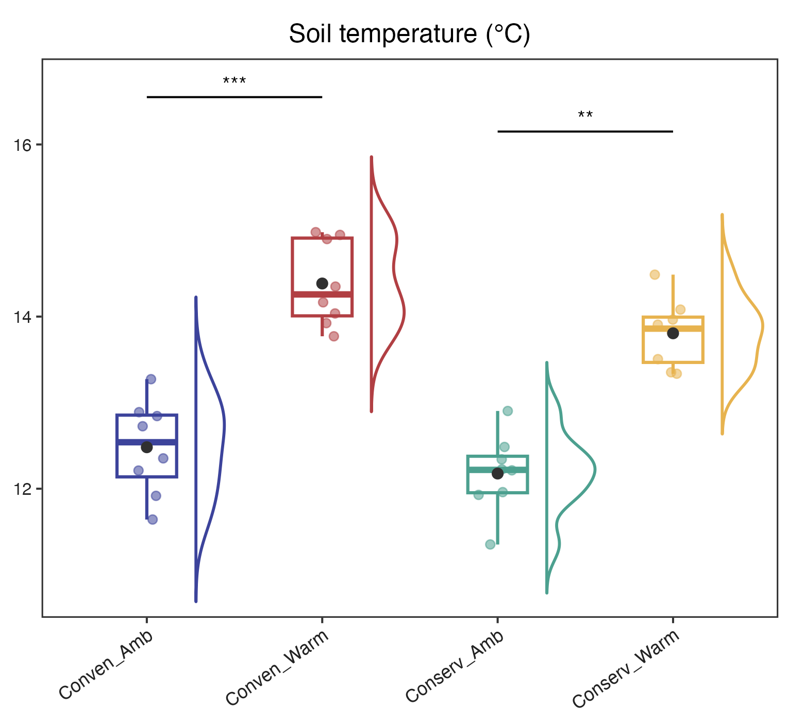
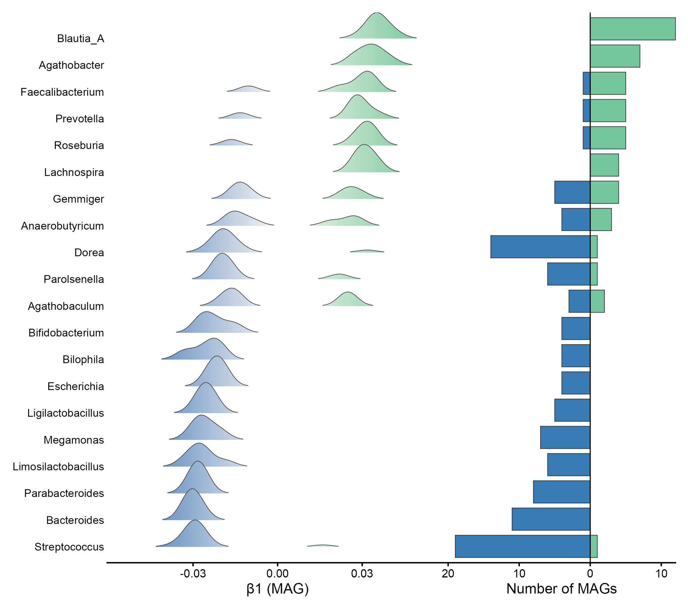
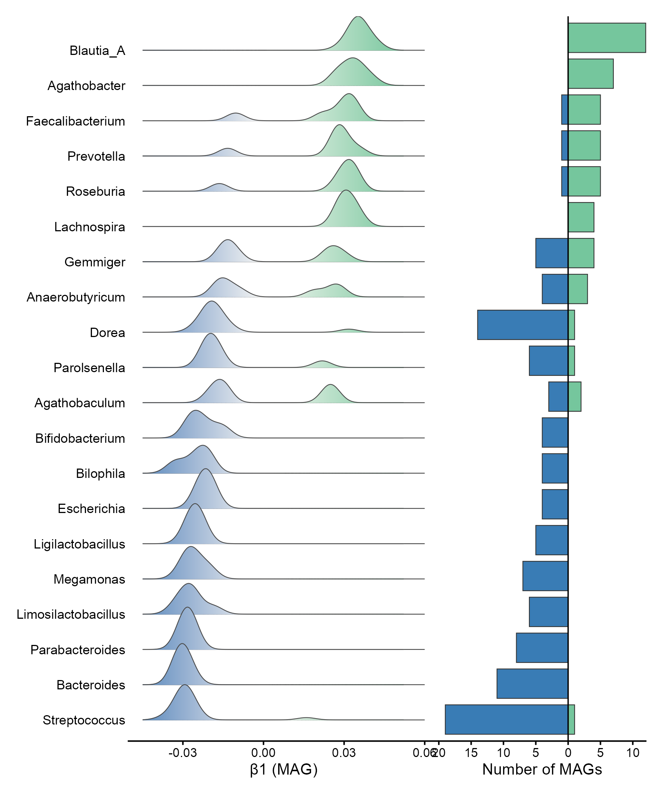

# 分布、箱线与小提琴 / Distributions

[全部分类 / Categories](../GALLERY.md) · [首页 / Home](../../README.md) · [逐图清单 / Inventory](catalog.csv)

本类 **27 张**；第 **4/4 页**。页码：[1](distributions.md) · [2](distributions-2.md) · [3](distributions-3.md) · **4**

图型与数据来源分别标注；旧版折叠保留。收录不等于原论文数据复现或完整 CP 验收。 Data origin is stated per figure. Historical versions are folded. Inclusion does not certify scientific fidelity.

## BF-0180 · 分组半小提琴与箱线

模拟数据／方法展示；非原论文数据复现。

[原尺寸](../../docs/assets/archive-gallery/topjournal-early/issue076_raincloud.png) · [脚本](../../biofigure/examples/archive-gallery/topjournal-early/scripts/issue076_raincloud_reproduction.R) · [记录](catalog.csv)

BF-0037 · 双向山脊分布（历史存档，点击展开）

## BF-0037 · 双向山脊分布

双向山脊的历史版本；当前修订版见 BF-0072。

[查看当前修订版 BF-0072](distributions-2.md#bf-0072)

[原尺寸](../../docs/assets/scidraw-gallery/scidraw_ridge_bipolar.png) · [脚本](../../biofigure/examples/scidraw-gallery/scripts/scidraw_ridge_bipolar_reproduction.R) · [记录](catalog.csv)

BF-0071 · 双向山脊：中间修订版（历史存档，点击展开）

## BF-0071 · 双向山脊：中间修订版

双向山脊的历史版本；当前修订版见 BF-0072。

[查看当前修订版 BF-0072](distributions-2.md#bf-0072)

[原尺寸](../../docs/assets/archive-gallery/ridge-repaired/scidraw_ridge_bipolar.png) · [脚本](../../biofigure/examples/archive-gallery/ridge-repaired/scripts/render.R) · [记录](catalog.csv)

页码：[1](distributions.md) · [2](distributions-2.md) · [3](distributions-3.md) · **4**

[全部分类](../GALLERY.md) · [脚本存档说明](../../biofigure/examples/archive-gallery/README.md)
