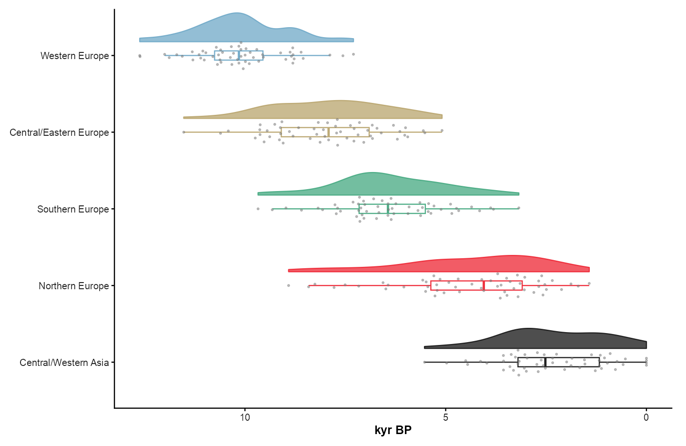
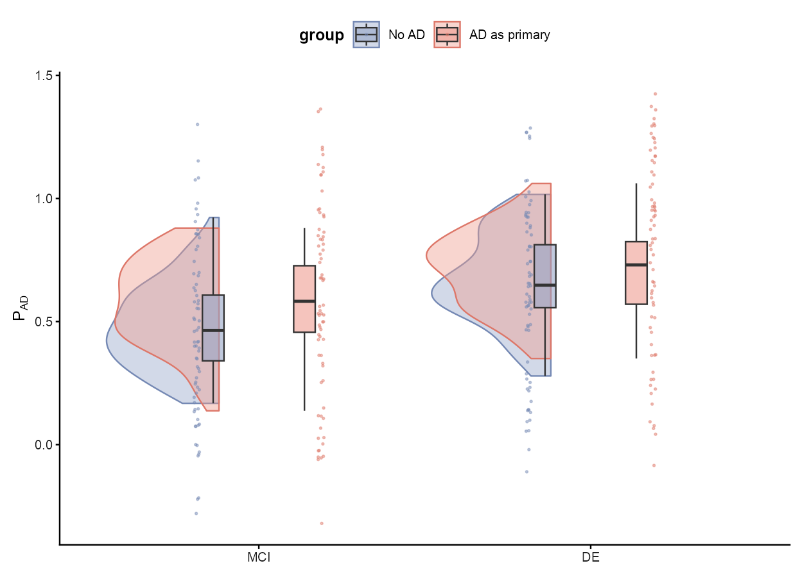

# 分布、箱线与小提琴 / Distributions

[全部分类 / Categories](../GALLERY.md) · [首页 / Home](../../README.md) · [逐图清单 / Inventory](catalog.csv)

本类 **5 张代表图**，每个细分图型保留一例。

按结构与用途选取代表图，去除同类配色、数据集及历史变体。数据来源逐图标注；收录不等于完整 CP 验收。 One representative per visual subtype; color-only, dataset-only and historical variants are omitted. Inclusion does not certify scientific fidelity.

## BF-0044 · 小提琴、箱线与蜂群点

图型：小提琴与蜂群。模拟数据／方法展示；非原论文数据复现。

[原尺寸](../../docs/assets/scidraw-gallery-batch2/07_violin_box_beeswarm.png) · [脚本](../../biofigure/examples/scidraw-gallery/scripts/generate_batch20.R) · [记录](catalog.csv)

## BF-0046 · 分组云雨图

图型：云雨图。模拟数据／方法展示；非原论文数据复现。

[原尺寸](../../docs/assets/scidraw-gallery-batch2/09_grouped_raincloud_gghalves.png) · [脚本](../../biofigure/examples/scidraw-gallery/scripts/generate_batch20.R) · [记录](catalog.csv)

## BF-0072 · 双向山脊分布

图型：山脊分布。模拟数据／方法展示；非原论文数据复现。

[原尺寸](../../docs/assets/archive-gallery/ridge-repaired-v2/scidraw_ridge_bipolar.png) · [脚本](../../biofigure/examples/archive-gallery/ridge-repaired-v2/scripts/render.R) · [记录](catalog.csv)

## BF-0084 · 半圆小提琴图

图型：径向小提琴。模拟数据／方法展示；非原论文数据复现。

[原尺寸](../../docs/assets/archive-gallery/scidraw-001-065/12_semicircle_violin.png) · [脚本](../../biofigure/examples/archive-gallery/scidraw-001-065/scripts/render_cases_10_14.R) · [方法来源](https://mp.weixin.qq.com/s/cPBBUA1QLryNnMS554uCqw) · [记录](catalog.csv)

## BF-0106 · 分面配对箱线图

图型：配对箱线。模拟数据／方法展示；非原论文数据复现。

状态：方法展示／仍待修订，不能视为高保真验收通过。

[原尺寸](../../docs/assets/archive-gallery/scidraw-001-065/33_faceted_paired_boxplot.png) · [脚本](../../biofigure/examples/archive-gallery/scidraw-001-065/scripts/render_cases_26_35.R) · [方法来源](https://mp.weixin.qq.com/s/82Pmi41CjpUtQrm5Rvzezw) · [记录](catalog.csv)

[全部分类](../GALLERY.md) · [脚本存档说明](../../biofigure/examples/archive-gallery/README.md)
