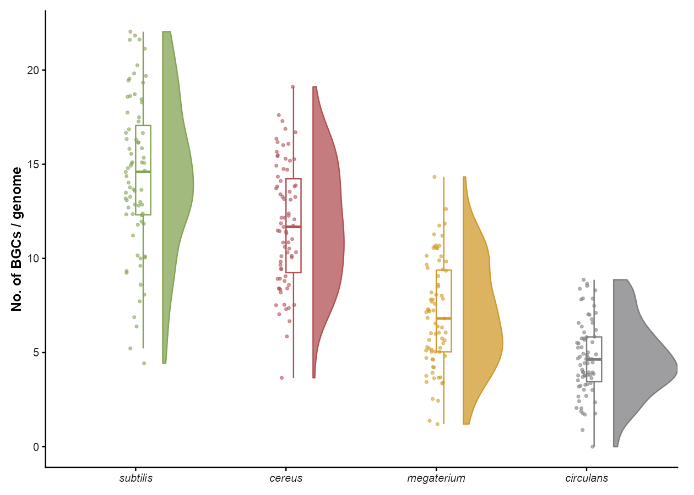
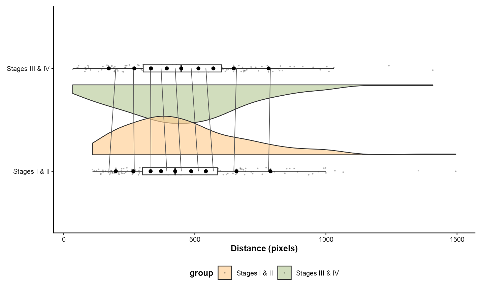
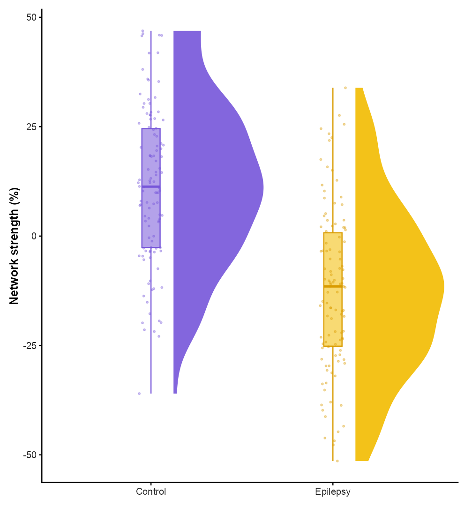
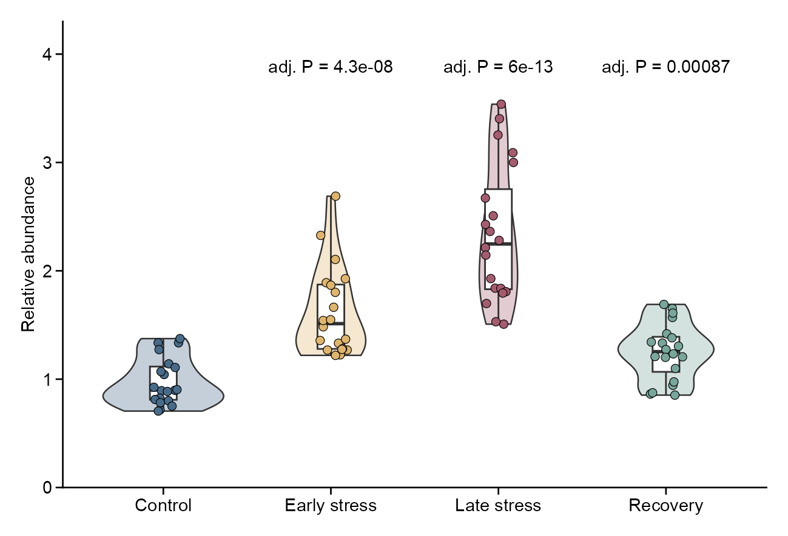

# 分布、箱线与小提琴 / Distributions

[全部分类 / Categories](../GALLERY.md) · [首页 / Home](../../README.md) · [逐图清单 / Inventory](catalog.csv)

本类 **27 张**；第 **1/4 页**。页码：**1** · [2](distributions-2.md) · [3](distributions-3.md) · [4](distributions-4.md)

图型与数据来源分别标注；旧版折叠保留。收录不等于原论文数据复现或完整 CP 验收。 Data origin is stated per figure. Historical versions are folded. Inclusion does not certify scientific fidelity.

## BF-0016 · 云雨图

模拟数据／方法展示；非原论文数据复现。

[原尺寸](../../docs/assets/gallery/template-raincloud.png) · [脚本](../../biofigure/examples/gallery/generate_advanced_gallery.R) · [记录](catalog.csv)

## BF-0028 · 山脊与条码组合

模拟数据／方法展示；非原论文数据复现。

[原尺寸](../../docs/assets/reproduction-gallery/figure_088_issue077_ridgeline_barcode.png) · [脚本](../../biofigure/examples/reproduction-gallery/generate_064_080_gallery.R) · [记录](catalog.csv)

## BF-0043 · 半小提琴、箱线与原始点

模拟数据／方法展示；非原论文数据复现。

[原尺寸](../../docs/assets/scidraw-gallery-batch2/06_half_violin_box_points.png) · [脚本](../../biofigure/examples/scidraw-gallery/scripts/generate_batch20.R) · [记录](catalog.csv)

## BF-0044 · 小提琴、箱线与蜂群点

模拟数据／方法展示；非原论文数据复现。

[原尺寸](../../docs/assets/scidraw-gallery-batch2/07_violin_box_beeswarm.png) · [脚本](../../biofigure/examples/scidraw-gallery/scripts/generate_batch20.R) · [记录](catalog.csv)

## BF-0045 · 分位数云雨图

模拟数据／方法展示；非原论文数据复现。

[原尺寸](../../docs/assets/scidraw-gallery-batch2/08_quantile_raincloud_gghalves.png) · [脚本](../../biofigure/examples/scidraw-gallery/scripts/generate_batch20.R) · [记录](catalog.csv)

## BF-0046 · 分组云雨图

模拟数据／方法展示；非原论文数据复现。

[原尺寸](../../docs/assets/scidraw-gallery-batch2/09_grouped_raincloud_gghalves.png) · [脚本](../../biofigure/examples/scidraw-gallery/scripts/generate_batch20.R) · [记录](catalog.csv)

## BF-0047 · 雨滴分布图

模拟数据／方法展示；非原论文数据复现。

[原尺寸](../../docs/assets/scidraw-gallery-batch2/10_raindrop_ggdist.png) · [脚本](../../biofigure/examples/scidraw-gallery/scripts/generate_batch20.R) · [记录](catalog.csv)

## BF-0058 · 分组分布与原始观测点

模拟数据／方法展示；非原论文数据复现。

[原尺寸](../../docs/assets/archive-gallery/maintenance-examples/distribution.png) · [脚本](../../biofigure/examples/archive-gallery/maintenance-examples/scripts/render_checks.R) · [记录](catalog.csv)

页码：**1** · [2](distributions-2.md) · [3](distributions-3.md) · [4](distributions-4.md)

[全部分类](../GALLERY.md) · [脚本存档说明](../../biofigure/examples/archive-gallery/README.md)
