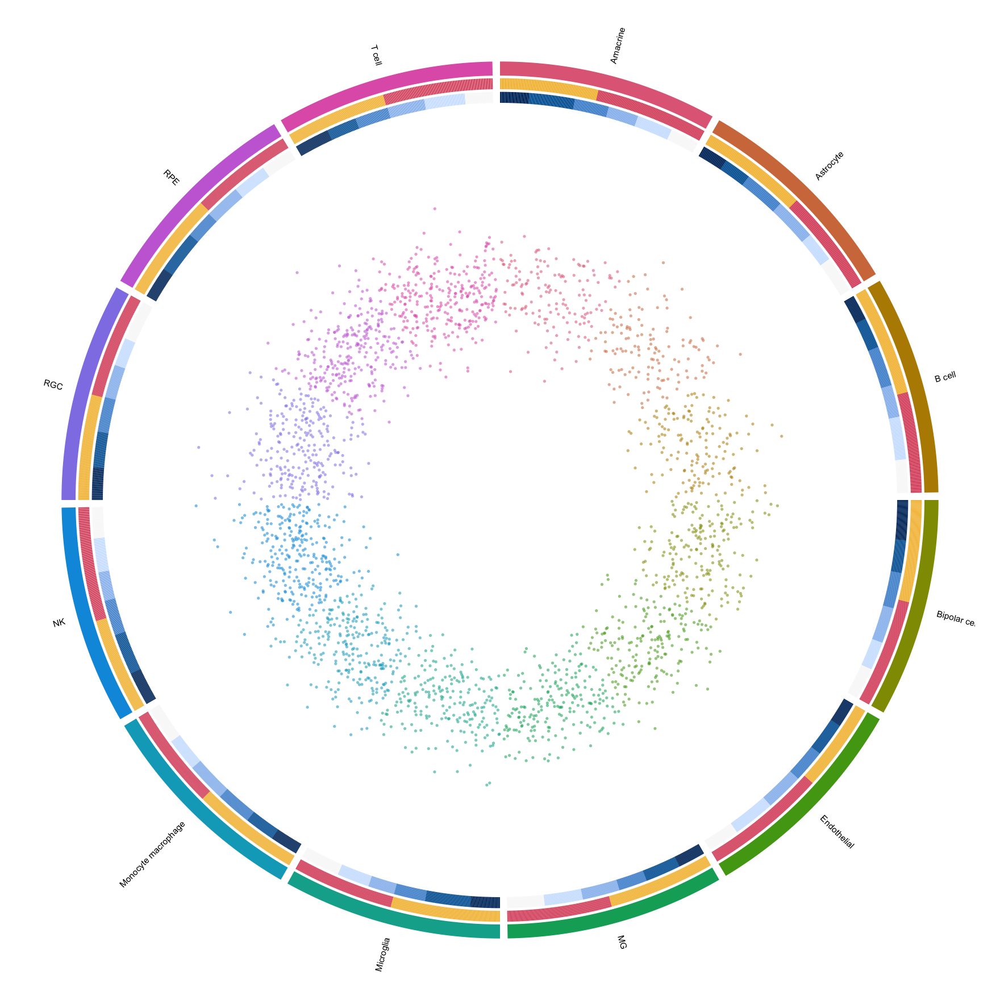
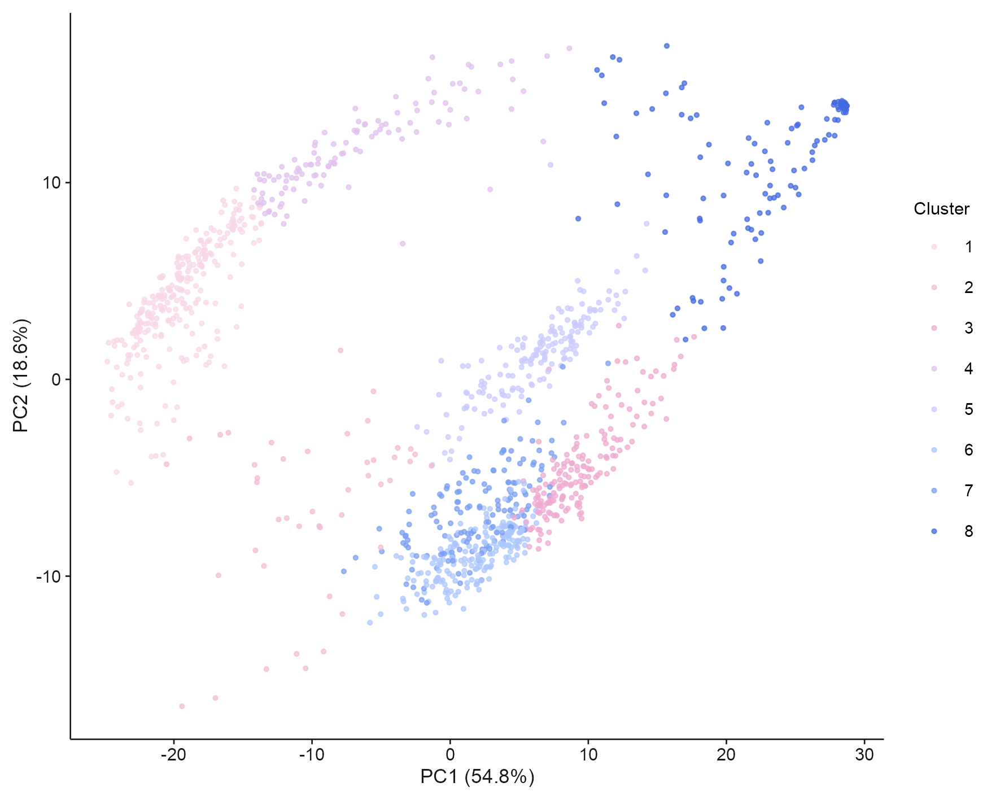
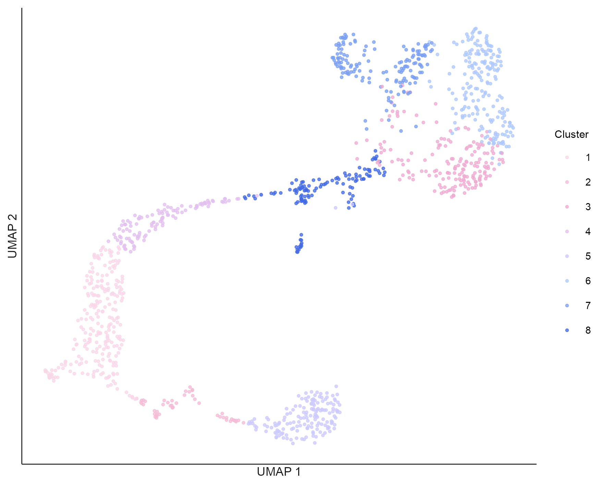
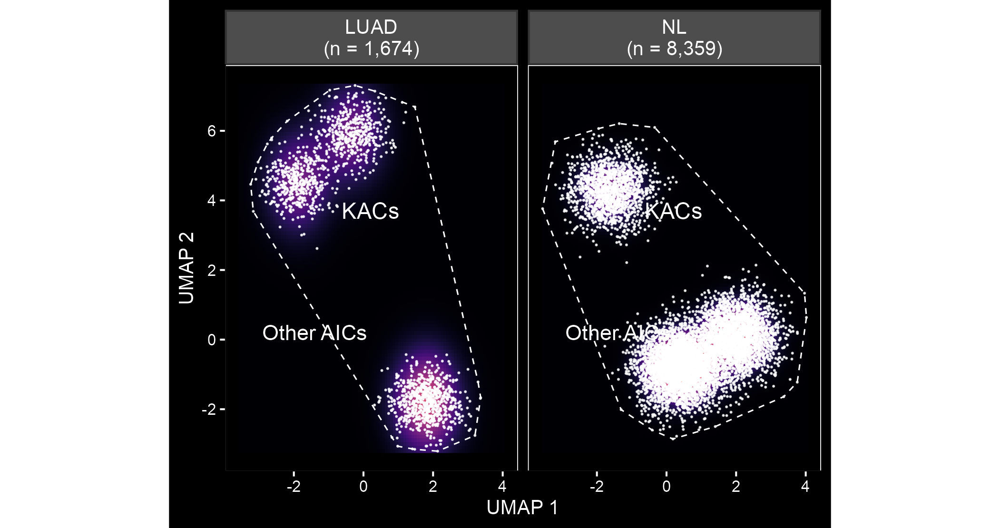

# 降维、单细胞与空间 / Embeddings and spatial plots

[全部分类 / Categories](../GALLERY.md) · [首页 / Home](../../README.md) · [逐图清单 / Inventory](catalog.csv)

本类 **12 张**；第 **2/2 页**。页码：[1](embeddings.md) · **2**

图型与数据来源分别标注；旧版折叠保留。收录不等于原论文数据复现或完整 CP 验收。 Data origin is stated per figure. Historical versions are folded. Inclusion does not certify scientific fidelity.

## BF-0114 · 环形 UMAP 与元数据轨道

模拟数据／方法展示；非原论文数据复现。

状态：方法展示／仍待修订，不能视为高保真验收通过。

[原尺寸](../../docs/assets/archive-gallery/scidraw-001-065/41_circular_umap_metadata.png) · [脚本](../../biofigure/examples/archive-gallery/scidraw-001-065/scripts/render_cases_36_45.R) · [方法来源](https://mp.weixin.qq.com/s/jq4mmMURtIK6R4Twm8CXXA) · [记录](catalog.csv)

## BF-0151 · PBMC：PCA

公开数据演示：10x PBMC1k、ENCODE K562 或参考组装；不代表完整上游分析。

[原尺寸](../../docs/assets/archive-gallery/public-omics/03_scrna_pca.png) · [脚本](../../biofigure/examples/archive-gallery/public-omics/scripts/analysis.R) · [记录](catalog.csv)

## BF-0152 · PBMC：UMAP

公开数据演示：10x PBMC1k、ENCODE K562 或参考组装；不代表完整上游分析。

[原尺寸](../../docs/assets/archive-gallery/public-omics/04_scrna_umap.png) · [脚本](../../biofigure/examples/archive-gallery/public-omics/scripts/analysis.R) · [记录](catalog.csv)

## BF-0183 · 星云密度嵌入示意

模拟数据／方法展示；非原论文数据复现。

[原尺寸](../../docs/assets/archive-gallery/full-reproduction/figure_058_galaxy_density_code_driven.png) · [脚本](../../biofigure/examples/archive-gallery/full-reproduction/scripts/non_single_cell_055_069.R) · [记录](catalog.csv)

页码：[1](embeddings.md) · **2**

[全部分类](../GALLERY.md) · [脚本存档说明](../../biofigure/examples/archive-gallery/README.md)
