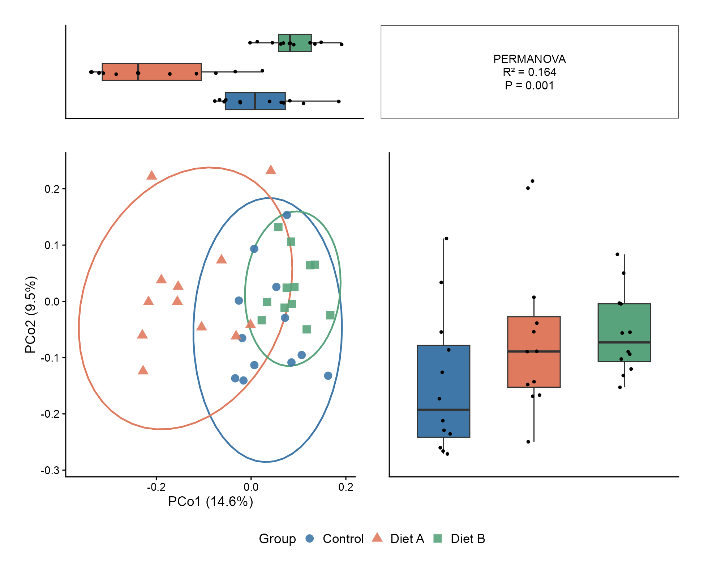
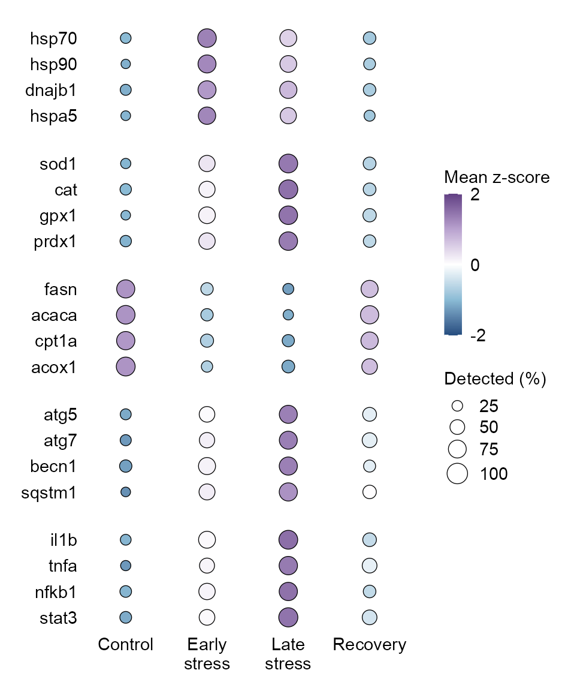
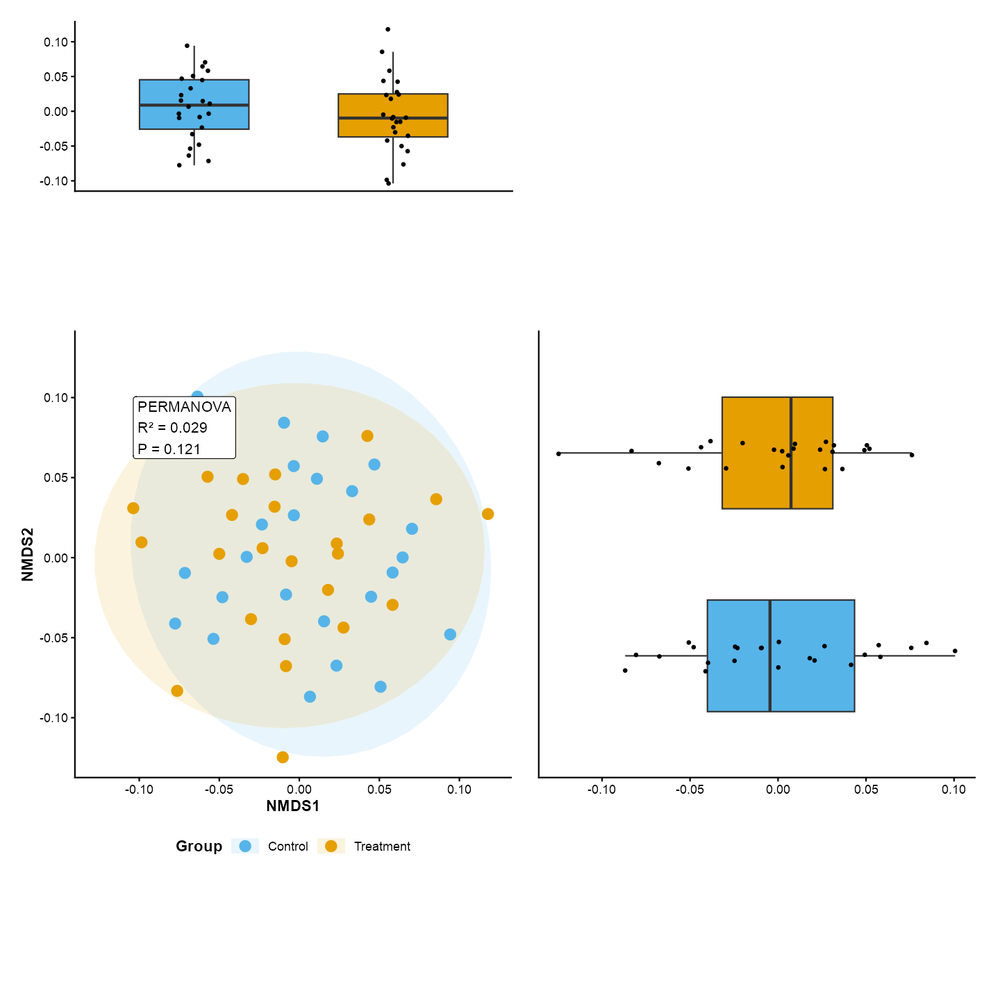
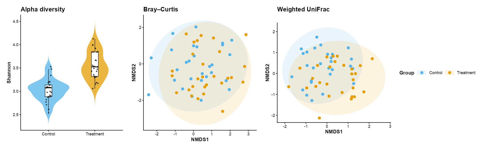

# 降维、单细胞与空间 / Embeddings and spatial plots

[全部分类 / Categories](../GALLERY.md) · [首页 / Home](../../README.md) · [逐图清单 / Inventory](catalog.csv)

本类 **12 张**；第 **1/2 页**。页码：**1** · [2](embeddings-2.md)

图型与数据来源分别标注；旧版折叠保留。收录不等于原论文数据复现或完整 CP 验收。 Data origin is stated per figure. Historical versions are folded. Inclusion does not certify scientific fidelity.

## BF-0005 · 代谢组 PCA

模拟数据／方法展示；非原论文数据复现。

[原尺寸](../../docs/assets/gallery/domain-metabolomics-pca.png) · [脚本](../../biofigure/examples/gallery/generate_domain_gallery.R) · [记录](catalog.csv)

## BF-0009 · 单细胞 UMAP 布局示意

模拟数据／方法展示；非原论文数据复现。

[原尺寸](../../docs/assets/gallery/domain-single-cell-umap.png) · [脚本](../../biofigure/examples/gallery/generate_domain_gallery.R) · [记录](catalog.csv)

## BF-0010 · 空间表达

模拟数据／方法展示；非原论文数据复现。

[原尺寸](../../docs/assets/gallery/domain-spatial-expression.png) · [脚本](../../biofigure/examples/gallery/generate_domain_gallery.R) · [记录](catalog.csv)

## BF-0017 · 单细胞标记基因气泡图

模拟数据／方法展示；非原论文数据复现。

[原尺寸](../../docs/assets/gallery/template-single-cell-dotplot.png) · [脚本](../../biofigure/examples/gallery/generate_core_gallery.R) · [记录](catalog.csv)

## BF-0030 · PCoA 与边际分布

模拟数据／方法展示；非原论文数据复现。

[原尺寸](../../docs/assets/scidraw-gallery/01_pcoa_marginal.png) · [脚本](../../biofigure/examples/scidraw-gallery/scripts/generate_six_scidraw.R) · [记录](catalog.csv)

## BF-0059 · 分组表达与检测比例气泡图

模拟数据／方法展示；非原论文数据复现。

[原尺寸](../../docs/assets/archive-gallery/maintenance-examples/dotplot.png) · [脚本](../../biofigure/examples/archive-gallery/maintenance-examples/scripts/render_checks.R) · [记录](catalog.csv)

## BF-0073 · NMDS 与边缘箱线图

模拟数据／方法展示；非原论文数据复现。

[原尺寸](../../docs/assets/archive-gallery/scidraw-001-065/01_nmds_marginal_box.png) · [批次脚本](../../biofigure/examples/archive-gallery/scidraw-001-065/scripts) · [方法来源](https://mp.weixin.qq.com/s/deuYTanHaDr6D8y3lKjW-Q) · [记录](catalog.csv)

## BF-0074 · 小提琴与双 NMDS 组合

模拟数据／方法展示；非原论文数据复现。

[原尺寸](../../docs/assets/archive-gallery/scidraw-001-065/02_violin_nmds.png) · [批次脚本](../../biofigure/examples/archive-gallery/scidraw-001-065/scripts) · [方法来源](https://mp.weixin.qq.com/s/i-DyiZ1EQaWwX-xp0k8FzA) · [记录](catalog.csv)

页码：**1** · [2](embeddings-2.md)

[全部分类](../GALLERY.md) · [脚本存档说明](../../biofigure/examples/archive-gallery/README.md)
