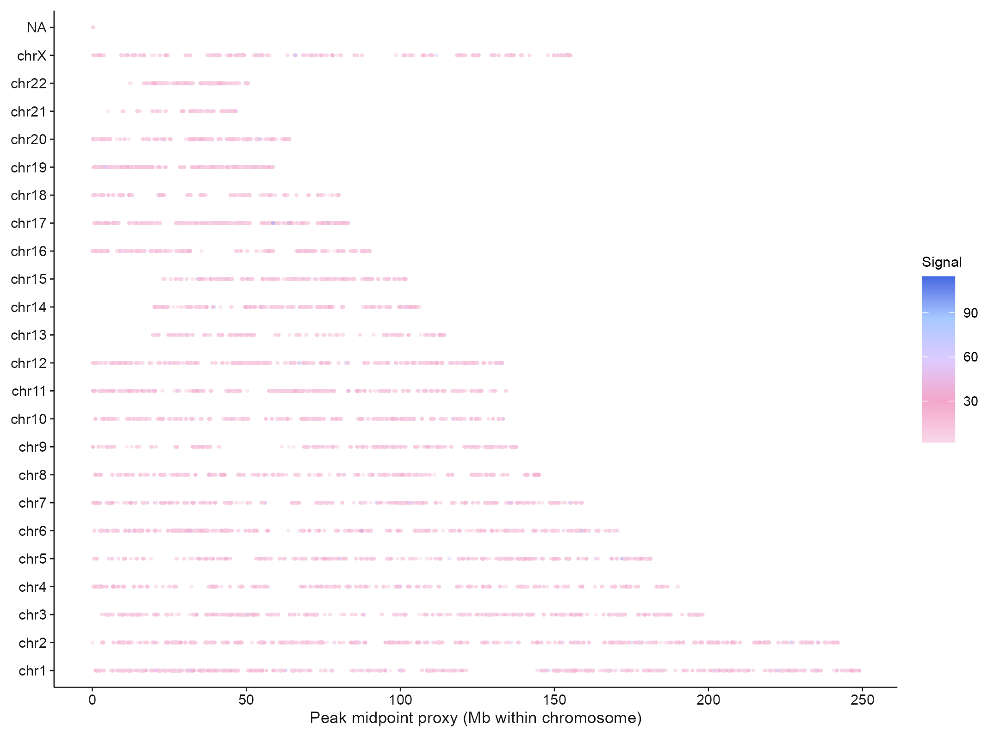
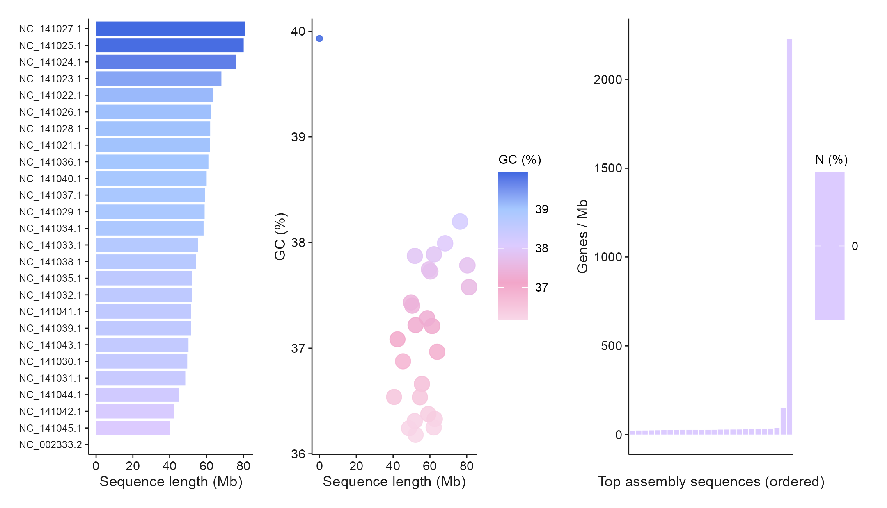
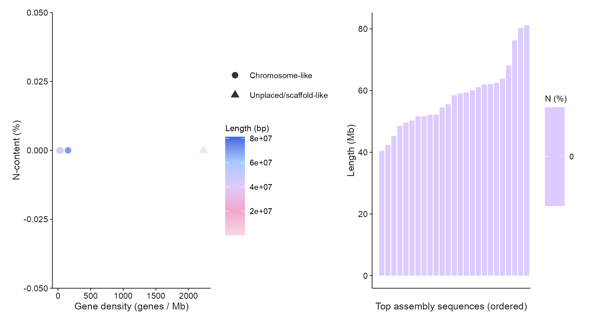
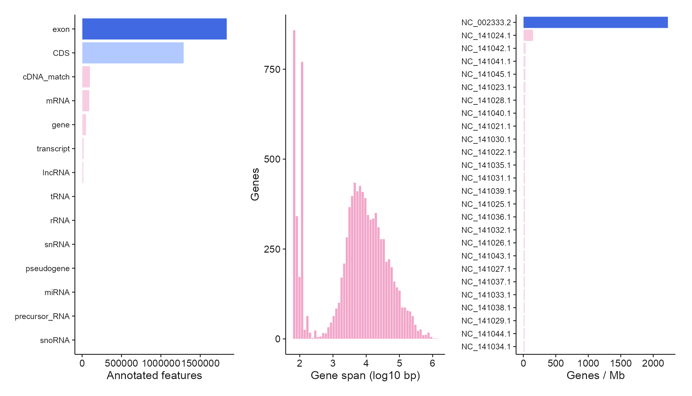
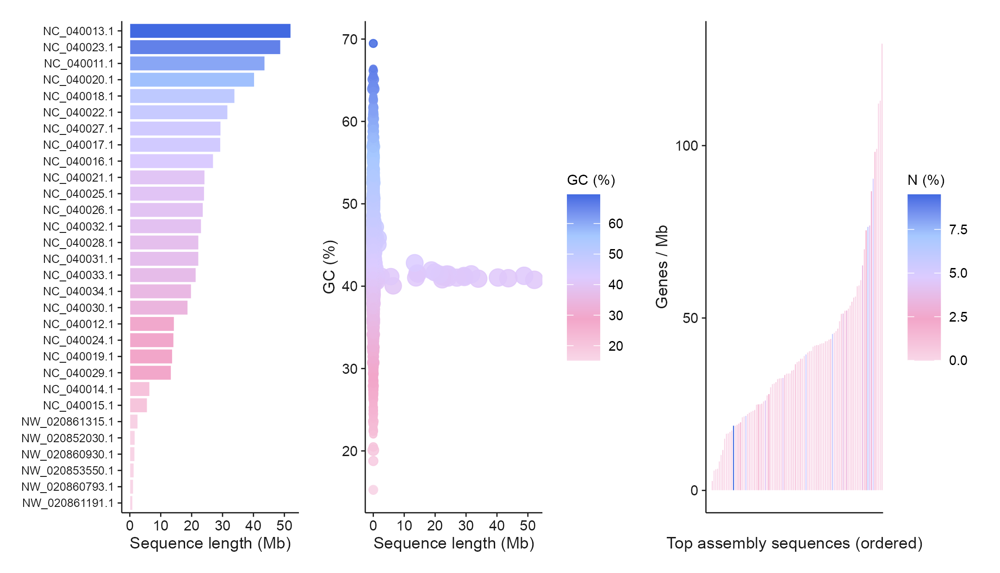
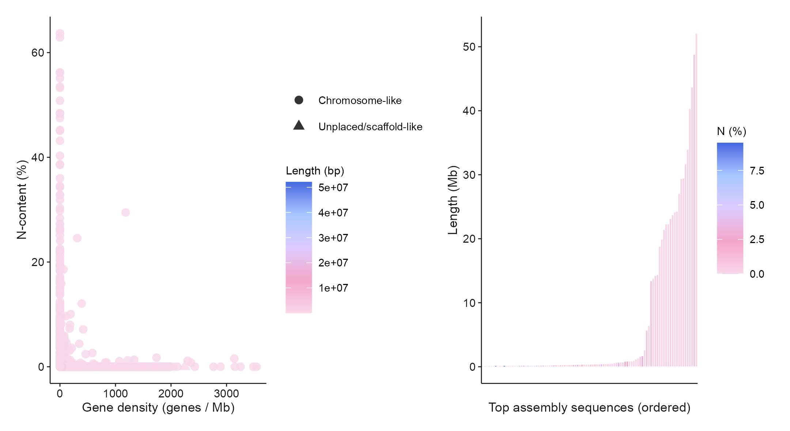
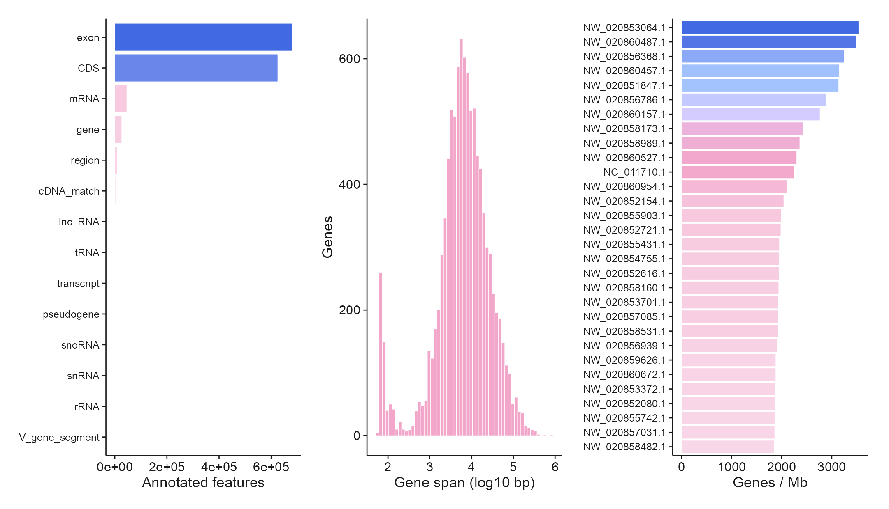

# 基因组、染色体与系统树 / Genomes and phylogeny

[全部分类 / Categories](../GALLERY.md) · [首页 / Home](../../README.md) · [逐图清单 / Inventory](catalog.csv)

本类 **25 张**；第 **2/4 页**。页码：[1](genomes.md) · **2** · [3](genomes-3.md) · [4](genomes-4.md)

图型与数据来源分别标注；旧版折叠保留。收录不等于原论文数据复现或完整 CP 验收。 Data origin is stated per figure. Historical versions are folded. Inclusion does not certify scientific fidelity.

## BF-0156 · ATAC：染色体峰位置

公开数据演示：10x PBMC1k、ENCODE K562 或参考组装；不代表完整上游分析。

[原尺寸](../../docs/assets/archive-gallery/public-omics/08_atac_chromosome_peak_map.png) · [脚本](../../biofigure/examples/archive-gallery/public-omics/scripts/analysis.R) · [记录](catalog.csv)

## BF-0159 · ChIP：染色体峰位置

公开数据演示：10x PBMC1k、ENCODE K562 或参考组装；不代表完整上游分析。

[原尺寸](../../docs/assets/archive-gallery/public-omics/11_chip_chromosome_peak_map.png) · [脚本](../../biofigure/examples/archive-gallery/public-omics/scripts/analysis.R) · [记录](catalog.csv)

## BF-0160 · 斑马鱼：组装长度与 GC

公开数据演示：10x PBMC1k、ENCODE K562 或参考组装；不代表完整上游分析。

[原尺寸](../../docs/assets/archive-gallery/public-omics/12_zebrafish_assembly.png) · [脚本](../../biofigure/examples/archive-gallery/public-omics/scripts/analysis.R) · [记录](catalog.csv)

## BF-0161 · 斑马鱼：组装结构代理指标

公开参考组装的结构代理指标；未进行 SV calling，不能解读为已验证结构变异。

[原尺寸](../../docs/assets/archive-gallery/public-omics/12_zebrafish_assembly_structural_signatures_SV_proxy.png) · [脚本](../../biofigure/examples/archive-gallery/public-omics/scripts/analysis.R) · [记录](catalog.csv)

## BF-0162 · 斑马鱼：注释组成与基因分布

公开数据演示：10x PBMC1k、ENCODE K562 或参考组装；不代表完整上游分析。

[原尺寸](../../docs/assets/archive-gallery/public-omics/12_zebrafish_gff_features.png) · [脚本](../../biofigure/examples/archive-gallery/public-omics/scripts/analysis.R) · [记录](catalog.csv)

## BF-0163 · 大黄鱼：组装长度与 GC

公开数据演示：10x PBMC1k、ENCODE K562 或参考组装；不代表完整上游分析。

[原尺寸](../../docs/assets/archive-gallery/public-omics/15_croaker_assembly.png) · [脚本](../../biofigure/examples/archive-gallery/public-omics/scripts/analysis.R) · [记录](catalog.csv)

## BF-0164 · 大黄鱼：组装结构代理指标

公开参考组装的结构代理指标；未进行 SV calling，不能解读为已验证结构变异。

[原尺寸](../../docs/assets/archive-gallery/public-omics/15_croaker_assembly_structural_signatures_SV_proxy.png) · [脚本](../../biofigure/examples/archive-gallery/public-omics/scripts/analysis.R) · [记录](catalog.csv)

## BF-0165 · 大黄鱼：注释组成与基因分布

公开数据演示：10x PBMC1k、ENCODE K562 或参考组装；不代表完整上游分析。

[原尺寸](../../docs/assets/archive-gallery/public-omics/15_croaker_gff_features.png) · [脚本](../../biofigure/examples/archive-gallery/public-omics/scripts/analysis.R) · [记录](catalog.csv)

页码：[1](genomes.md) · **2** · [3](genomes-3.md) · [4](genomes-4.md)

[全部分类](../GALLERY.md) · [脚本存档说明](../../biofigure/examples/archive-gallery/README.md)
