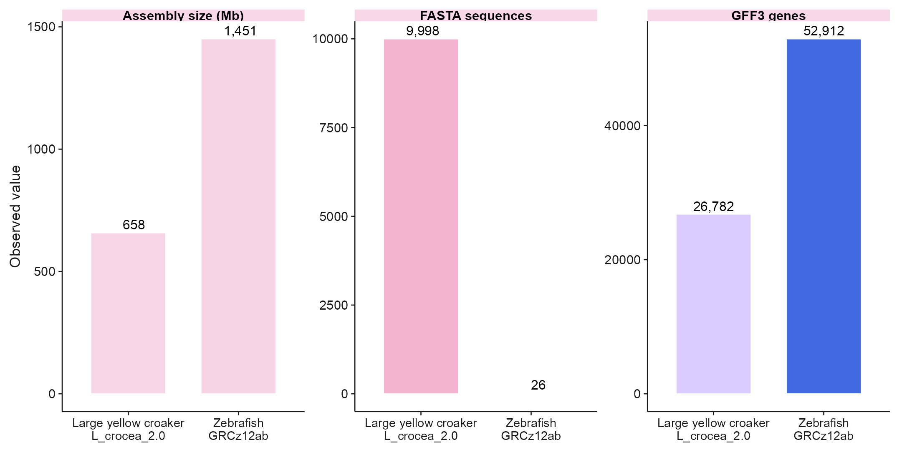
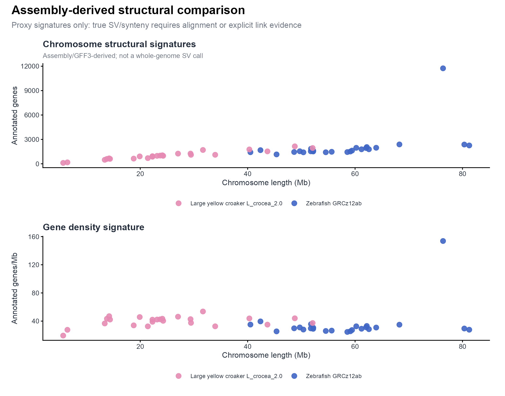
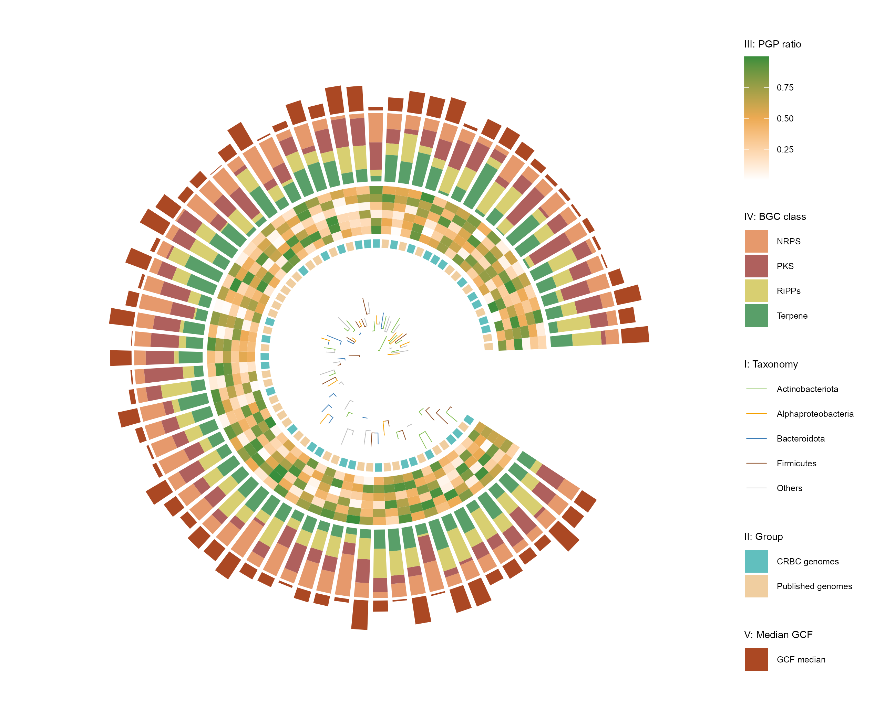
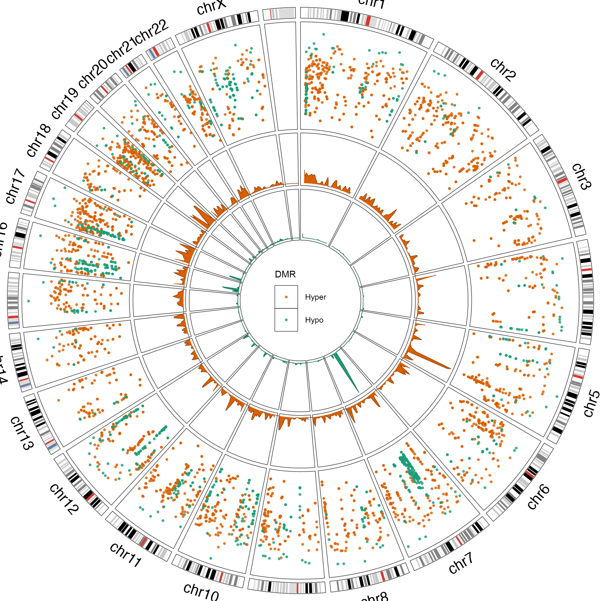
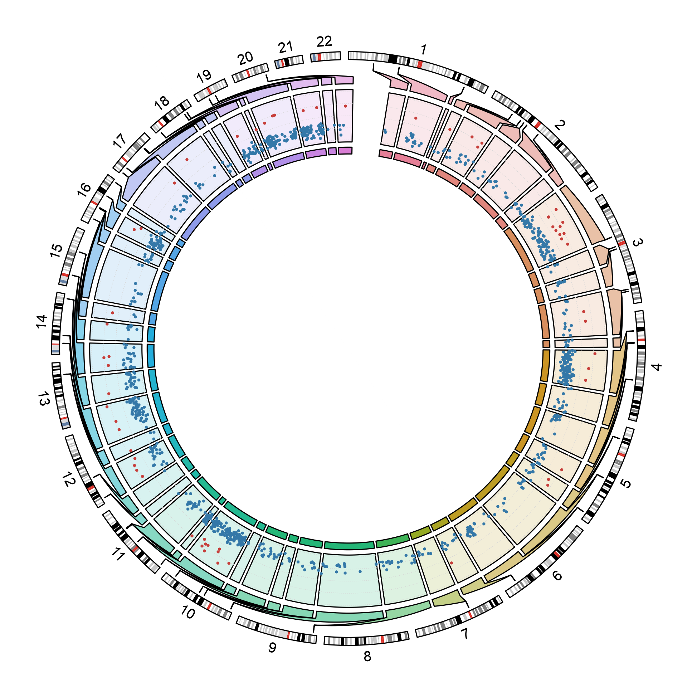

# 基因组、染色体与系统树 / Genomes and phylogeny

[全部分类 / Categories](../GALLERY.md) · [首页 / Home](../../README.md) · [逐图清单 / Inventory](catalog.csv)

本类 **25 张**；第 **3/4 页**。页码：[1](genomes.md) · [2](genomes-2.md) · **3** · [4](genomes-4.md)

图型与数据来源分别标注；旧版折叠保留。收录不等于原论文数据复现或完整 CP 验收。 Data origin is stated per figure. Historical versions are folded. Inclusion does not certify scientific fidelity.

## BF-0166 · 双物种组装摘要

公开数据演示：10x PBMC1k、ENCODE K562 或参考组装；不代表完整上游分析。

[原尺寸](../../docs/assets/archive-gallery/public-omics/18_comparative_assembly_summary.png) · [脚本](../../biofigure/examples/archive-gallery/public-omics/scripts/analysis.R) · [记录](catalog.csv)

## BF-0167 · 双物种组装与注释概览

斑马鱼与大黄鱼公开参考组装／注释示例；无全基因组比对或 SV calling。

[原尺寸](../../docs/assets/archive-gallery/comparative-genomics/01_assembly_annotation_overview.png) · [脚本](../../biofigure/examples/archive-gallery/comparative-genomics/scripts/analysis.R) · [记录](catalog.csv)

## BF-0168 · 染色体基因密度

斑马鱼与大黄鱼公开参考组装／注释示例；无全基因组比对或 SV calling。

[原尺寸](../../docs/assets/archive-gallery/comparative-genomics/02_chromosome_gene_density.png) · [脚本](../../biofigure/examples/archive-gallery/comparative-genomics/scripts/analysis.R) · [记录](catalog.csv)

## BF-0170 · 代表性基因结构示意

斑马鱼与大黄鱼公开参考组装／注释示例；无全基因组比对或 SV calling。

[原尺寸](../../docs/assets/archive-gallery/comparative-genomics/04_representative_gene_models.png) · [脚本](../../biofigure/examples/archive-gallery/comparative-genomics/scripts/analysis.R) · [记录](catalog.csv)

## BF-0171 · 双物种组装结构代理比较

斑马鱼与大黄鱼公开参考组装／注释示例；无全基因组比对或 SV calling。

[原尺寸](../../docs/assets/archive-gallery/comparative-genomics/05_assembly_structural_signatures_proxy.png) · [脚本](../../biofigure/examples/archive-gallery/comparative-genomics/scripts/analysis.R) · [记录](catalog.csv)

## BF-0191 · 系统树与外部多轨图

模拟数据／方法展示；非原论文数据复现。

[原尺寸](../../docs/assets/archive-gallery/full-reproduction/figure_069_ggtreeextra_code_driven.png) · [脚本](../../biofigure/examples/archive-gallery/full-reproduction/scripts/non_single_cell_055_069.R) · [记录](catalog.csv)

## BF-0192 · ggalign 基因组 DMR 轨道

circlize 软件包维护的 DMR／区段示例；不是用户实验数据。

[原尺寸](../../docs/assets/archive-gallery/full-reproduction/figure_071_issue064_ggalign_dmr.png) · [脚本](../../biofigure/examples/archive-gallery/full-reproduction/scripts/code_driven_071_087.R) · [记录](catalog.csv)

## BF-0193 · circlize 嵌套 DMR 轨道

circlize 软件包维护的 DMR／区段示例；不是用户实验数据。

[原尺寸](../../docs/assets/archive-gallery/full-reproduction/figure_072_issue064_circlize_nested_dmr.png) · [脚本](../../biofigure/examples/archive-gallery/full-reproduction/scripts/code_driven_071_087.R) · [记录](catalog.csv)

页码：[1](genomes.md) · [2](genomes-2.md) · **3** · [4](genomes-4.md)

[全部分类](../GALLERY.md) · [脚本存档说明](../../biofigure/examples/archive-gallery/README.md)
