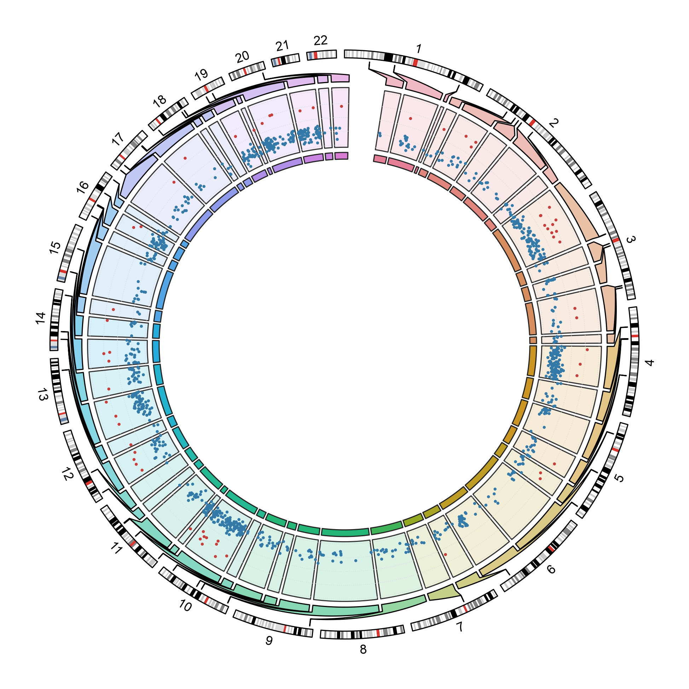

# 基因组、染色体与系统树 / Genomes and phylogeny

[全部分类 / Categories](../GALLERY.md) · [首页 / Home](../../README.md) · [逐图清单 / Inventory](catalog.csv)

本类 **25 张**；第 **4/4 页**。页码：[1](genomes.md) · [2](genomes-2.md) · [3](genomes-3.md) · **4**

图型与数据来源分别标注；旧版折叠保留。收录不等于原论文数据复现或完整 CP 验收。 Data origin is stated per figure. Historical versions are folded. Inclusion does not certify scientific fidelity.

## BF-0214 · hg19 软件包示例：嵌套染色体

circlize 软件包维护的 DMR／区段示例；不是用户实验数据。

[原尺寸](../../docs/assets/archive-gallery/genome-hg19/genome_distribution_circos.png) · [脚本](../../biofigure/examples/archive-gallery/genome-hg19/scripts/plot_genome_distribution.R) · [记录](catalog.csv)

页码：[1](genomes.md) · [2](genomes-2.md) · [3](genomes-3.md) · **4**

[全部分类](../GALLERY.md) · [脚本存档说明](../../biofigure/examples/archive-gallery/README.md)
