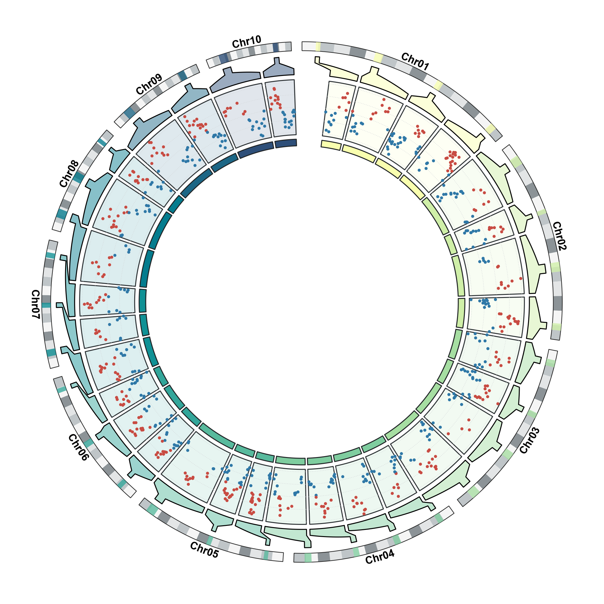
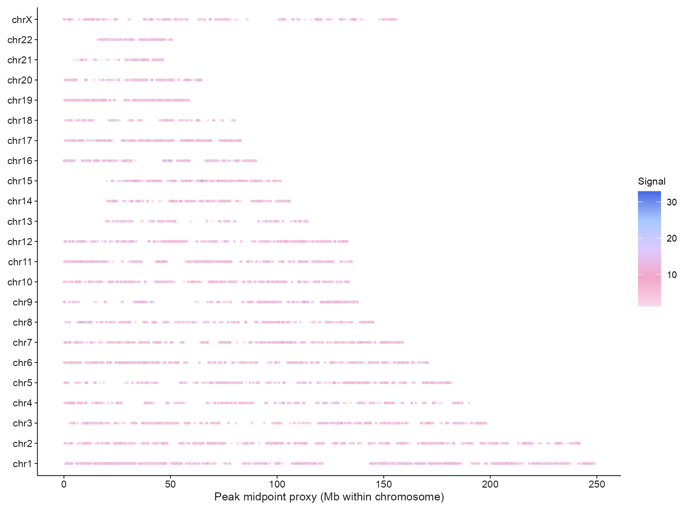
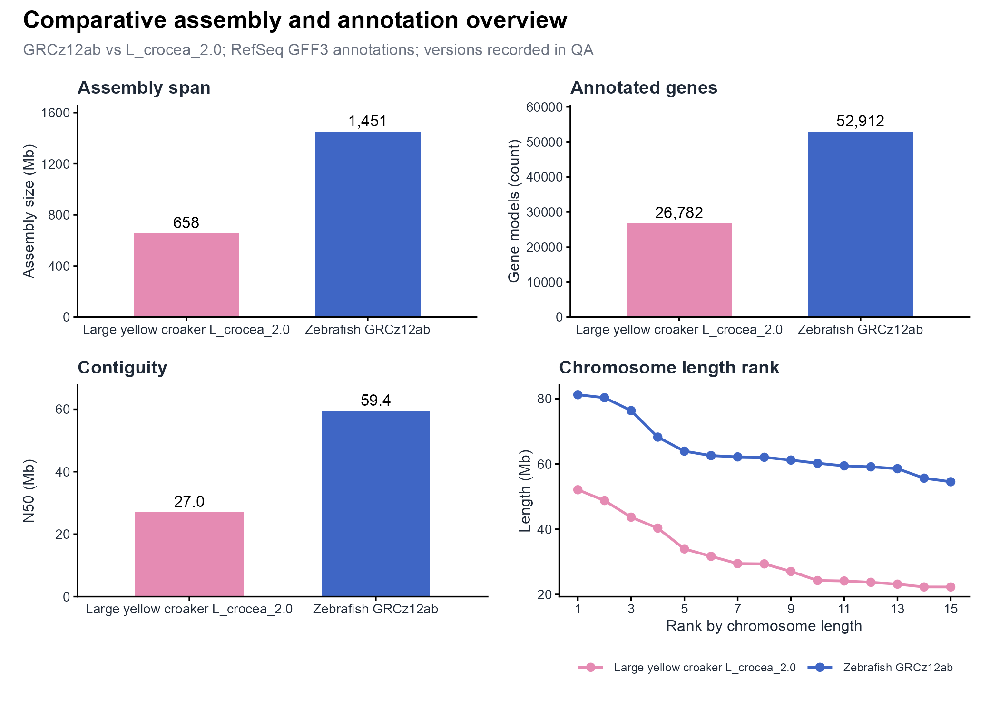
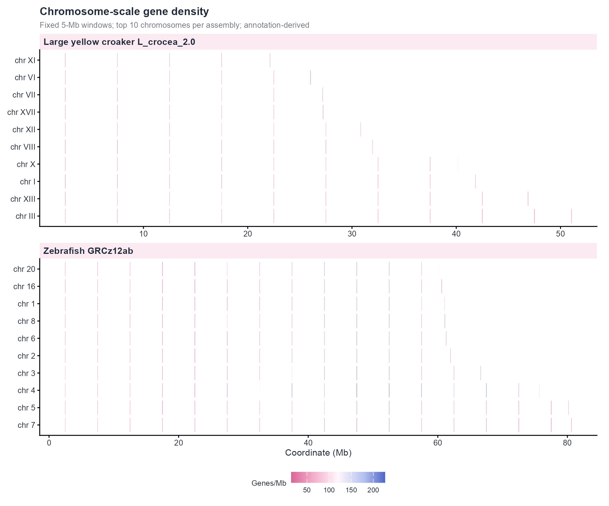
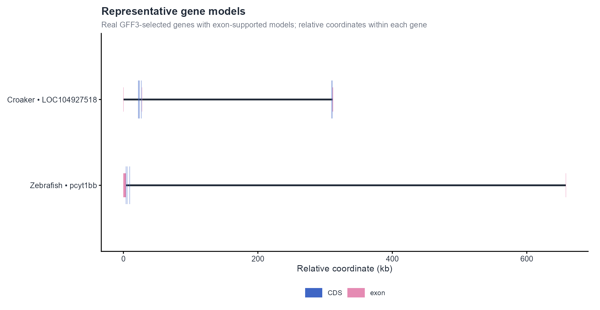

# 基因组、染色体与系统树 / Genomes and phylogeny

[全部分类 / Categories](../GALLERY.md) · [首页 / Home](../../README.md) · [逐图清单 / Inventory](catalog.csv)

本类 **7 张代表图**，每个细分图型保留一例。

按结构与用途选取代表图，去除同类配色、数据集及历史变体。数据来源逐图标注；收录不等于完整 CP 验收。 One representative per visual subtype; color-only, dataset-only and historical variants are omitted. Inclusion does not certify scientific fidelity.

## BF-0012 · 共线性示意

图型：共线性。模拟数据／方法展示；非原论文数据复现。

[原尺寸](../../docs/assets/gallery/domain-synteny.png) · [脚本](../../biofigure/examples/gallery/generate_domain_gallery.R) · [记录](catalog.csv)

## BF-0014 · 系统树与多轨注释

图型：系统树与注释。模拟数据／方法展示；非原论文数据复现。

[原尺寸](../../docs/assets/gallery/template-phylogeny-tracks.png) · [脚本](../../biofigure/examples/gallery/generate_advanced_gallery.R) · [记录](catalog.csv)

## BF-0019 · 嵌套染色体与区间分布

图型：嵌套染色体。模拟数据／方法展示；非原论文数据复现。

[原尺寸](../../docs/assets/genome-gallery/chromosome-distribution.png) · [脚本](../../biofigure/examples/genome-gallery/draw.R) · [记录](catalog.csv)

## BF-0156 · ATAC：染色体峰位置

图型：染色体峰位置。公开数据演示：10x PBMC1k、ENCODE K562 或参考组装；不代表完整上游分析。

[原尺寸](../../docs/assets/archive-gallery/public-omics/08_atac_chromosome_peak_map.png) · [脚本](../../biofigure/examples/archive-gallery/public-omics/scripts/analysis.R) · [记录](catalog.csv)

## BF-0167 · 双物种组装与注释概览

图型：组装注释概览。斑马鱼与大黄鱼公开参考组装／注释示例；无全基因组比对或 SV calling。

[原尺寸](../../docs/assets/archive-gallery/comparative-genomics/01_assembly_annotation_overview.png) · [脚本](../../biofigure/examples/archive-gallery/comparative-genomics/scripts/analysis.R) · [记录](catalog.csv)

## BF-0168 · 染色体基因密度

图型：基因密度。斑马鱼与大黄鱼公开参考组装／注释示例；无全基因组比对或 SV calling。

[原尺寸](../../docs/assets/archive-gallery/comparative-genomics/02_chromosome_gene_density.png) · [脚本](../../biofigure/examples/archive-gallery/comparative-genomics/scripts/analysis.R) · [记录](catalog.csv)

## BF-0170 · 代表性基因结构示意

图型：基因结构。斑马鱼与大黄鱼公开参考组装／注释示例；无全基因组比对或 SV calling。

[原尺寸](../../docs/assets/archive-gallery/comparative-genomics/04_representative_gene_models.png) · [脚本](../../biofigure/examples/archive-gallery/comparative-genomics/scripts/analysis.R) · [记录](catalog.csv)

[全部分类](../GALLERY.md) · [脚本存档说明](../../biofigure/examples/archive-gallery/README.md)
