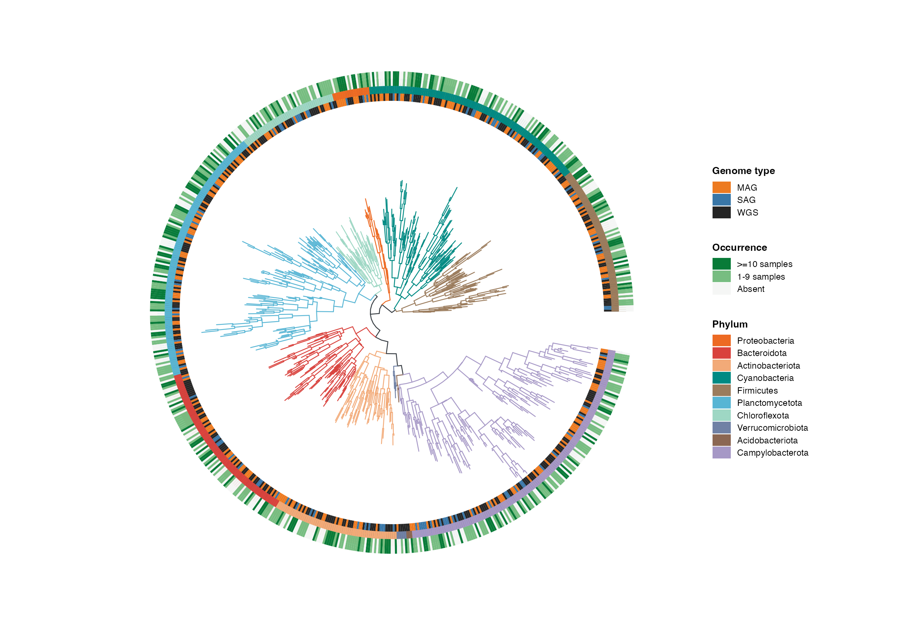
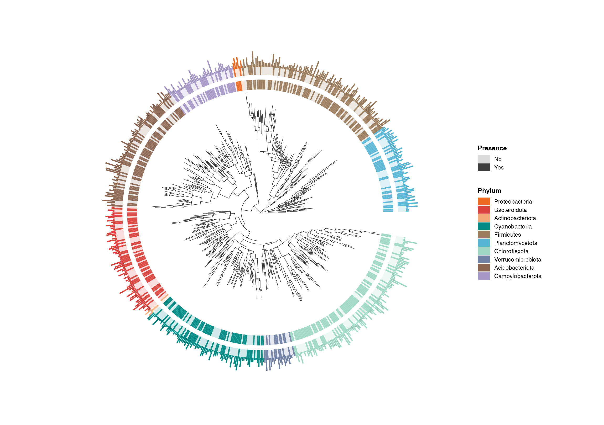
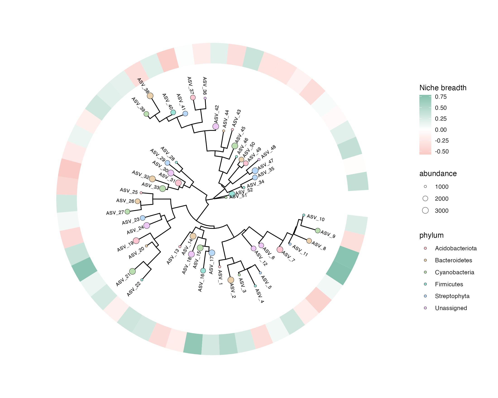
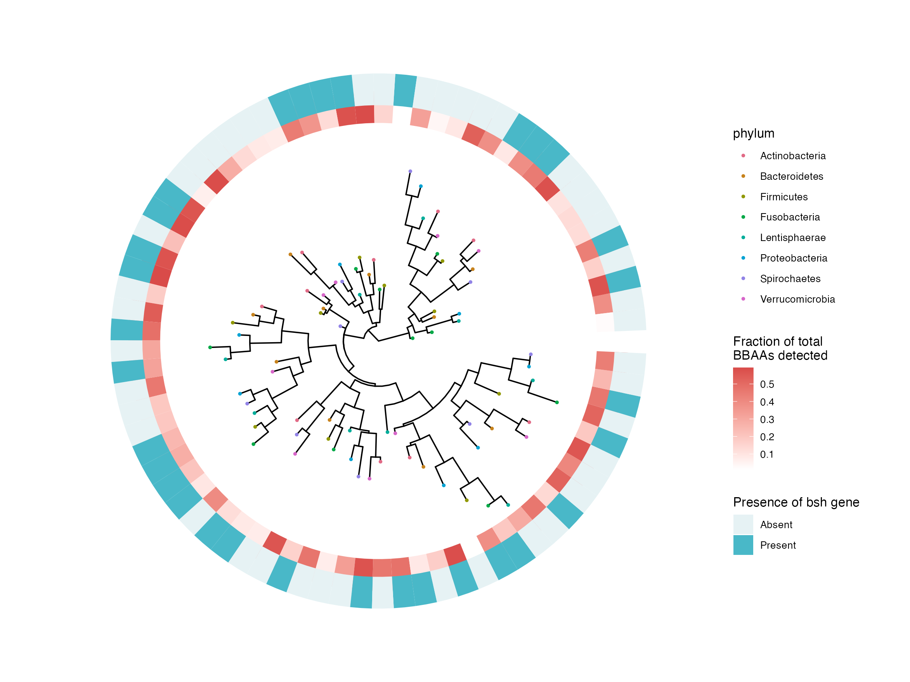

# 基因组、染色体与系统树 / Genomes and phylogeny

[全部分类 / Categories](../GALLERY.md) · [首页 / Home](../../README.md) · [逐图清单 / Inventory](catalog.csv)

本类 **25 张**；第 **1/4 页**。页码：**1** · [2](genomes-2.md) · [3](genomes-3.md) · [4](genomes-4.md)

图型与数据来源分别标注；旧版折叠保留。收录不等于原论文数据复现或完整 CP 验收。 Data origin is stated per figure. Historical versions are folded. Inclusion does not certify scientific fidelity.

## BF-0011 · 结构变异 Circos 示意

模拟数据／方法展示；非原论文数据复现。

[原尺寸](../../docs/assets/gallery/domain-structural-variation.png) · [脚本](../../biofigure/examples/gallery/generate_domain_gallery.R) · [记录](catalog.csv)

## BF-0012 · 共线性示意

模拟数据／方法展示；非原论文数据复现。

[原尺寸](../../docs/assets/gallery/domain-synteny.png) · [脚本](../../biofigure/examples/gallery/generate_domain_gallery.R) · [记录](catalog.csv)

## BF-0014 · 系统树与多轨注释

模拟数据／方法展示；非原论文数据复现。

[原尺寸](../../docs/assets/gallery/template-phylogeny-tracks.png) · [脚本](../../biofigure/examples/gallery/generate_advanced_gallery.R) · [记录](catalog.csv)

## BF-0019 · 嵌套染色体与区间分布

模拟数据／方法展示；非原论文数据复现。

[原尺寸](../../docs/assets/genome-gallery/chromosome-distribution.png) · [脚本](../../biofigure/examples/genome-gallery/draw.R) · [记录](catalog.csv)

## BF-0092 · 系统树与三层热图

模拟数据／方法展示；非原论文数据复现。

状态：方法展示／仍待修订，不能视为高保真验收通过。

[原尺寸](../../docs/assets/archive-gallery/scidraw-001-065/19_phylogeny_three_heatmaps.png) · [脚本](../../biofigure/examples/archive-gallery/scidraw-001-065/scripts/render_cases_19_20.R) · [方法来源](https://mp.weixin.qq.com/s/cRhAFPWWalGdtNhRMKDHJg) · [记录](catalog.csv)

## BF-0093 · 系统树、热图与柱形轨道

模拟数据／方法展示；非原论文数据复现。

状态：方法展示／仍待修订，不能视为高保真验收通过。

[原尺寸](../../docs/assets/archive-gallery/scidraw-001-065/20_phylogeny_heatmap_bar.png) · [脚本](../../biofigure/examples/archive-gallery/scidraw-001-065/scripts/render_cases_19_20.R) · [方法来源](https://mp.weixin.qq.com/s/cRhAFPWWalGdtNhRMKDHJg) · [记录](catalog.csv)

## BF-0115 · 高亮系统树与注释热图

模拟数据／方法展示；非原论文数据复现。

状态：方法展示／仍待修订，不能视为高保真验收通过。

[原尺寸](../../docs/assets/archive-gallery/scidraw-001-065/42_phylogeny_highlight_heatmap.png) · [脚本](../../biofigure/examples/archive-gallery/scidraw-001-065/scripts/render_cases_36_45.R) · [方法来源](https://mp.weixin.qq.com/s/cRhAFPWWalGdtNhRMKDHJg) · [记录](catalog.csv)

## BF-0116 · 系统树与双层热图

模拟数据／方法展示；非原论文数据复现。

状态：方法展示／仍待修订，不能视为高保真验收通过。

[原尺寸](../../docs/assets/archive-gallery/scidraw-001-065/43_phylogeny_two_heatmaps.png) · [脚本](../../biofigure/examples/archive-gallery/scidraw-001-065/scripts/render_cases_36_45.R) · [方法来源](https://mp.weixin.qq.com/s/cRhAFPWWalGdtNhRMKDHJg) · [记录](catalog.csv)

页码：**1** · [2](genomes-2.md) · [3](genomes-3.md) · [4](genomes-4.md)

[全部分类](../GALLERY.md) · [脚本存档说明](../../biofigure/examples/archive-gallery/README.md)
