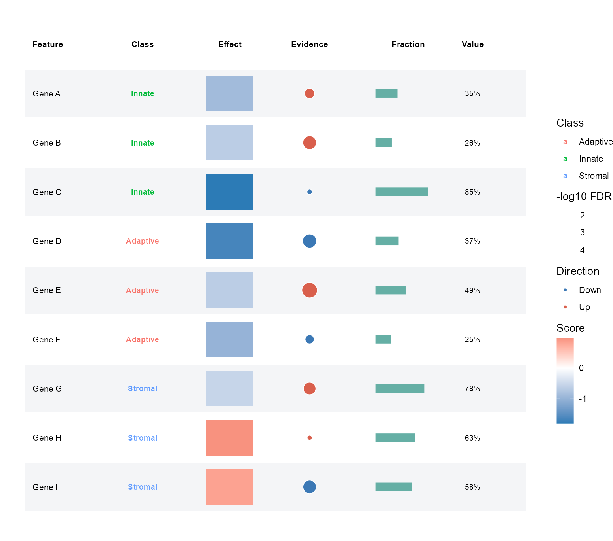
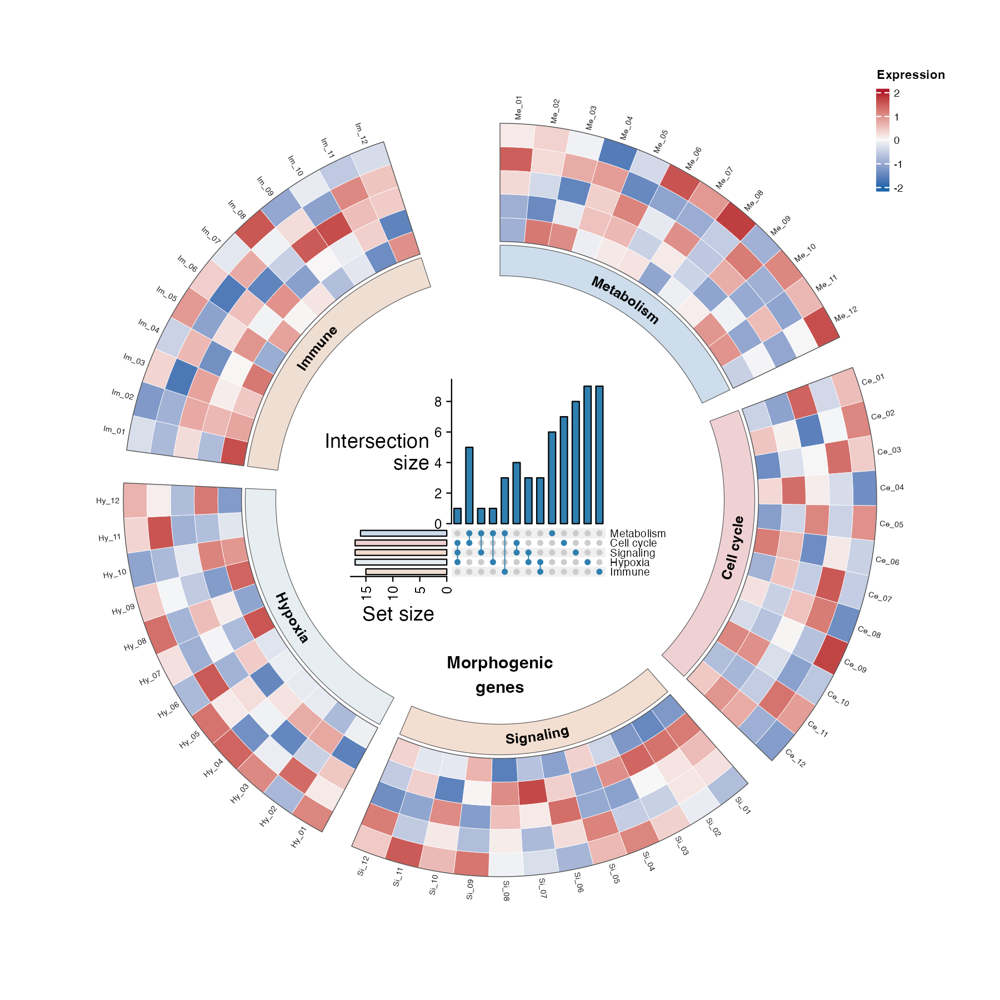
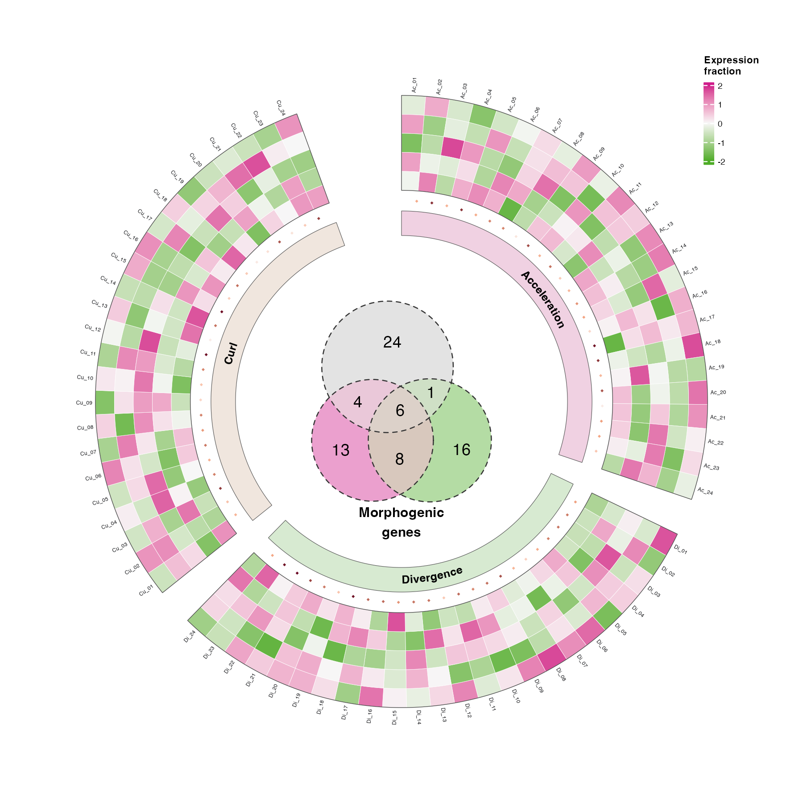
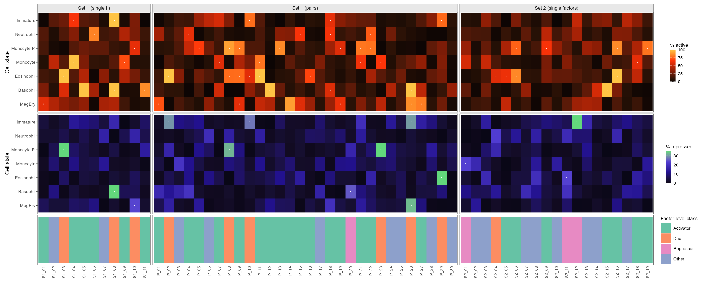
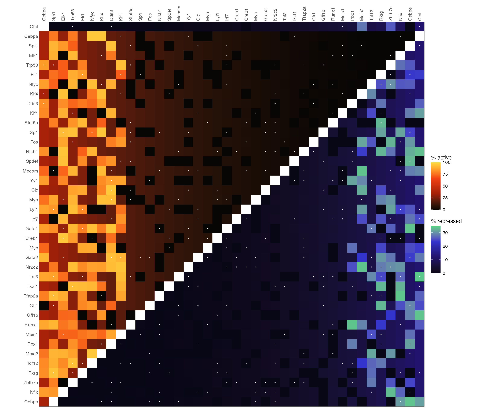
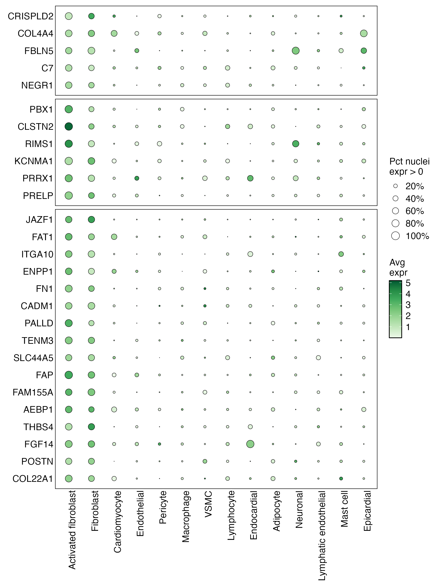
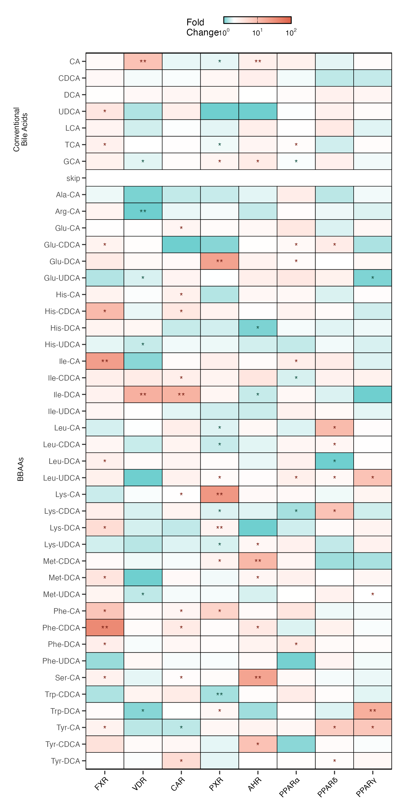
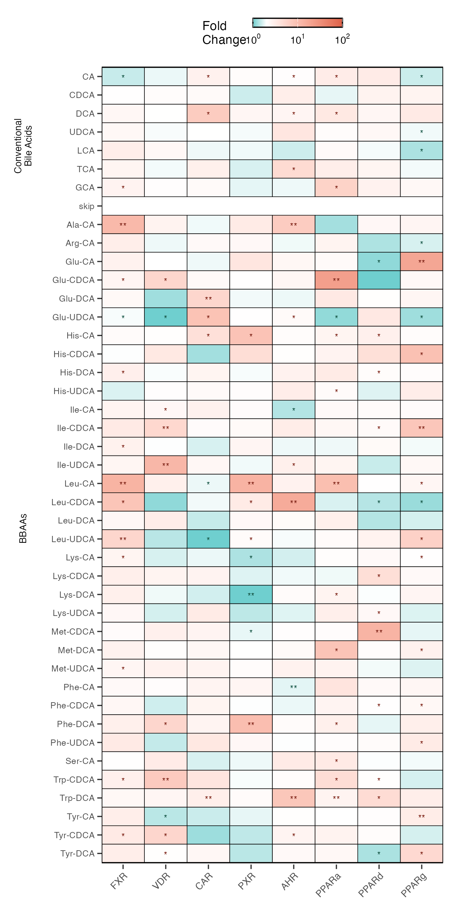

# 热图与矩阵注释 / Heatmaps

[全部分类 / Categories](../GALLERY.md) · [首页 / Home](../../README.md) · [逐图清单 / Inventory](catalog.csv)

本类 **25 张**；第 **2/4 页**。页码：[1](heatmaps.md) · **2** · [3](heatmaps-3.md) · [4](heatmaps-4.md)

图型与数据来源分别标注；旧版折叠保留。收录不等于原论文数据复现或完整 CP 验收。 Data origin is stated per figure. Historical versions are folded. Inclusion does not certify scientific fidelity.

## BF-0078 · 数值表与热图组合

模拟数据／方法展示；非原论文数据复现。

[原尺寸](../../docs/assets/archive-gallery/scidraw-001-065/06_table_heatmap.png) · [批次脚本](../../biofigure/examples/archive-gallery/scidraw-001-065/scripts) · [方法来源](https://mp.weixin.qq.com/s/0lwFmwrD7e5Pu8_fCUGv9Q) · [记录](catalog.csv)

## BF-0082 · 环形热图与 UpSet

模拟数据／方法展示；非原论文数据复现。

[原尺寸](../../docs/assets/archive-gallery/scidraw-001-065/10_circular_heatmap_upset.png) · [批次脚本](../../biofigure/examples/archive-gallery/scidraw-001-065/scripts) · [方法来源](https://mp.weixin.qq.com/s/LuFxqYKavB5VvL3K_fDGVA) · [记录](catalog.csv)

## BF-0083 · 环形热图与集合交叠

模拟数据／方法展示；非原论文数据复现。

[原尺寸](../../docs/assets/archive-gallery/scidraw-001-065/11_circular_heatmap_venn.png) · [批次脚本](../../biofigure/examples/archive-gallery/scidraw-001-065/scripts) · [方法来源](https://mp.weixin.qq.com/s/5MuPle8NnqdNaBJj0lSW8Q) · [记录](catalog.csv)

## BF-0094 · 双矩阵分面热图

模拟数据／方法展示；非原论文数据复现。

状态：方法展示／仍待修订，不能视为高保真验收通过。

[原尺寸](../../docs/assets/archive-gallery/scidraw-001-065/21_faceted_dual_heatmap.png) · [脚本](../../biofigure/examples/archive-gallery/scidraw-001-065/scripts/render_cases_21_25.R) · [方法来源](https://mp.weixin.qq.com/s/7vEXy51vXTHczgRcNg6o7g) · [记录](catalog.csv)

## BF-0105 · 对称双组热图

模拟数据／方法展示；非原论文数据复现。

状态：方法展示／仍待修订，不能视为高保真验收通过。

[原尺寸](../../docs/assets/archive-gallery/scidraw-001-065/32_symmetric_dual_heatmap.png) · [脚本](../../biofigure/examples/archive-gallery/scidraw-001-065/scripts/render_cases_26_35.R) · [方法来源](https://mp.weixin.qq.com/s/7vEXy51vXTHczgRcNg6o7g) · [记录](catalog.csv)

## BF-0107 · 带空白分隔行的气泡热图

模拟数据／方法展示；非原论文数据复现。

状态：方法展示／仍待修订，不能视为高保真验收通过。

[原尺寸](../../docs/assets/archive-gallery/scidraw-001-065/34_bubble_heatmap_blank_rows.png) · [脚本](../../biofigure/examples/archive-gallery/scidraw-001-065/scripts/render_cases_26_35.R) · [方法来源](https://mp.weixin.qq.com/s/5Fj1f0NeOxTM1_6IHHF2KA) · [记录](catalog.csv)

## BF-0108 · 分面显著性热图

模拟数据／方法展示；非原论文数据复现。

状态：方法展示／仍待修订，不能视为高保真验收通过。

[原尺寸](../../docs/assets/archive-gallery/scidraw-001-065/35_faceted_significance_heatmap.png) · [脚本](../../biofigure/examples/archive-gallery/scidraw-001-065/scripts/render_cases_26_35.R) · [方法来源](https://mp.weixin.qq.com/s/McDhZRHN4YzB8T5xvV-eKQ) · [记录](catalog.csv)

## BF-0110 · 显著性符号与空行注释热图

模拟数据／方法展示；非原论文数据复现。

状态：方法展示／仍待修订，不能视为高保真验收通过。

[原尺寸](../../docs/assets/archive-gallery/scidraw-001-065/37_heatmap_significance_blankrow.png) · [脚本](../../biofigure/examples/archive-gallery/scidraw-001-065/scripts/render_cases_36_45.R) · [方法来源](https://mp.weixin.qq.com/s/McDhZRHN4YzB8T5xvV-eKQ) · [记录](catalog.csv)

页码：[1](heatmaps.md) · **2** · [3](heatmaps-3.md) · [4](heatmaps-4.md)

[全部分类](../GALLERY.md) · [脚本存档说明](../../biofigure/examples/archive-gallery/README.md)
