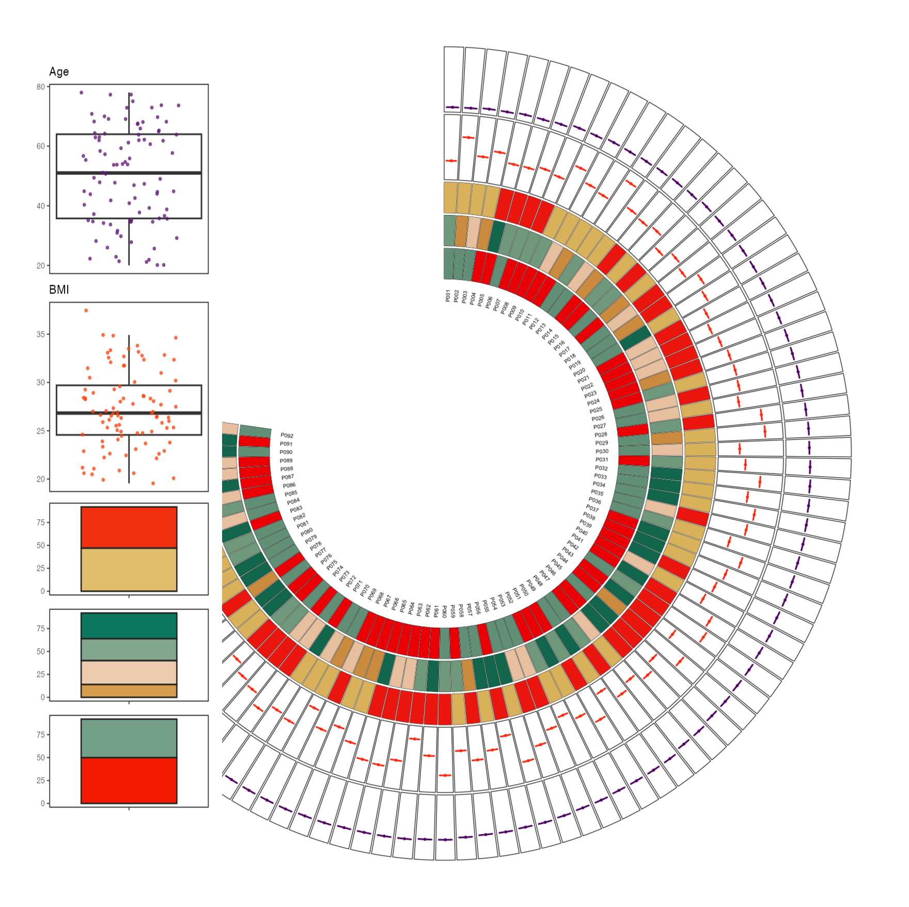
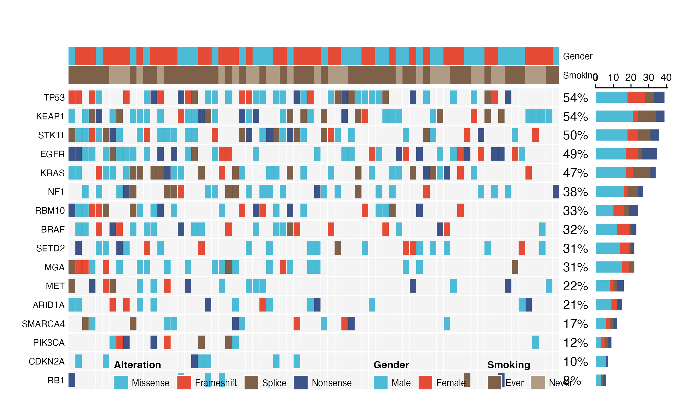
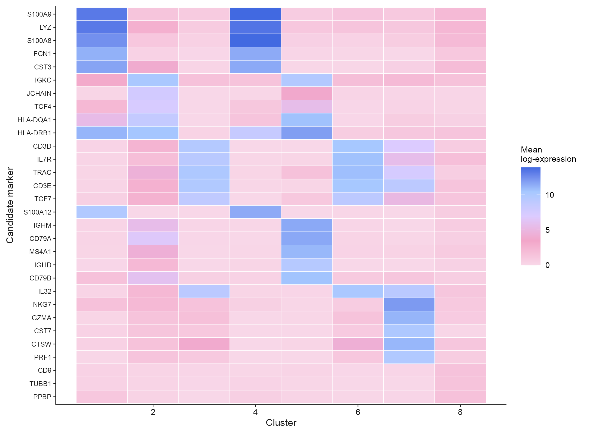
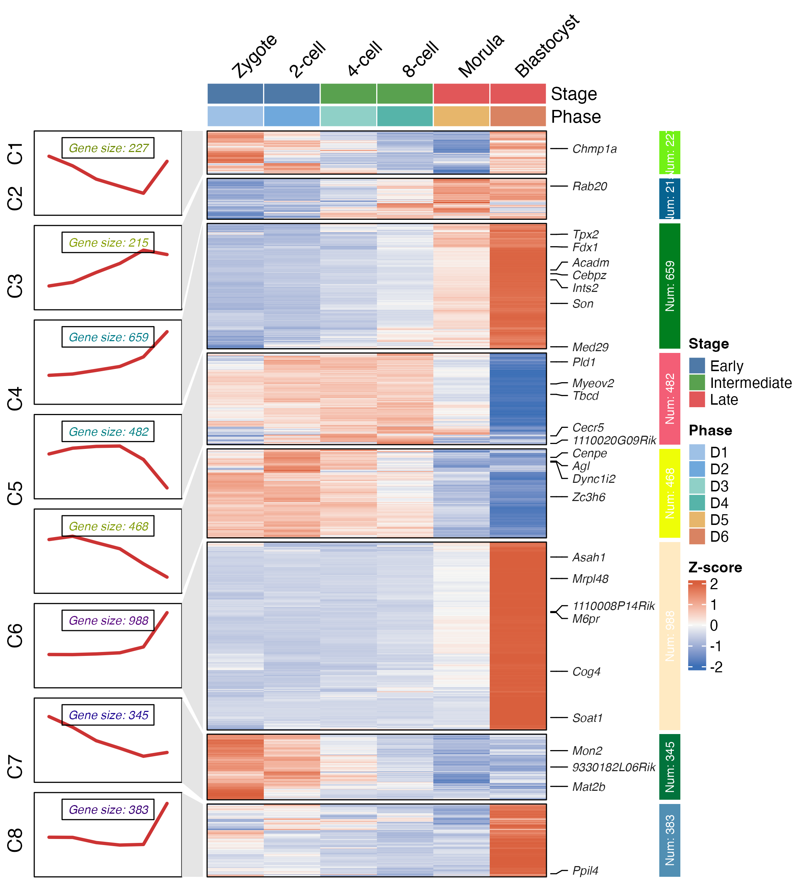
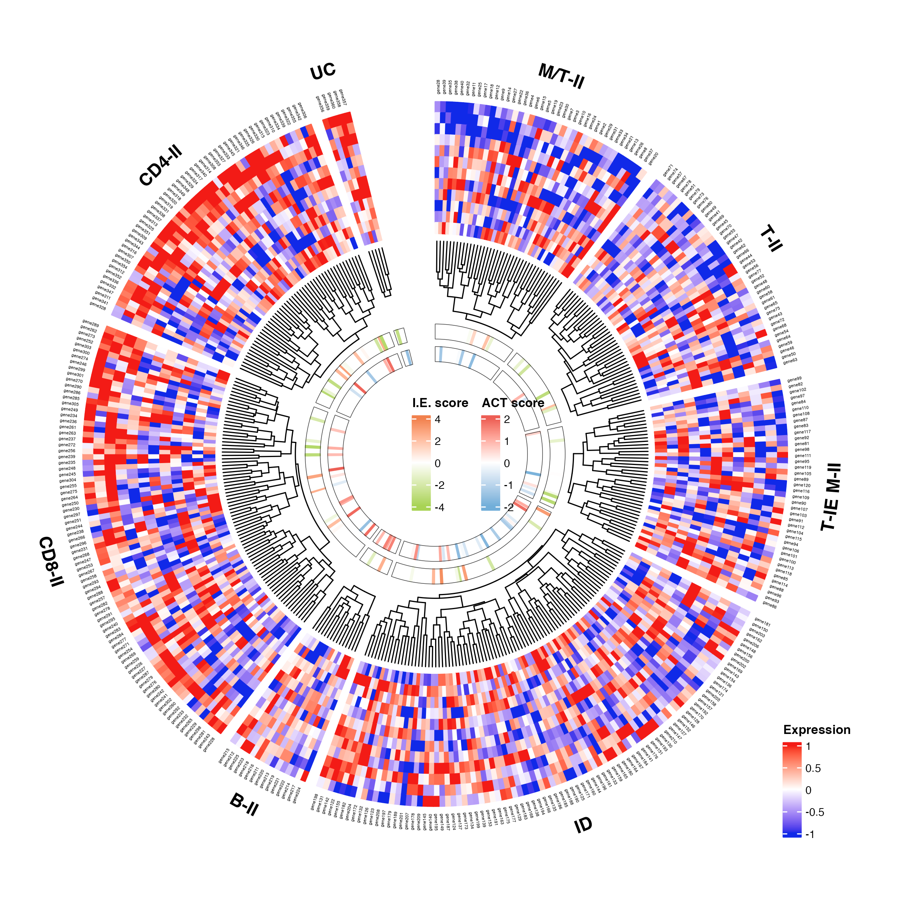
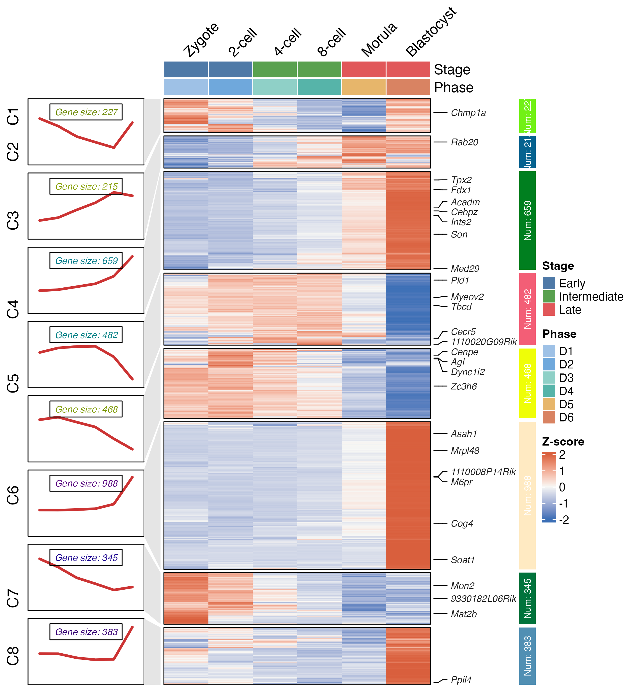
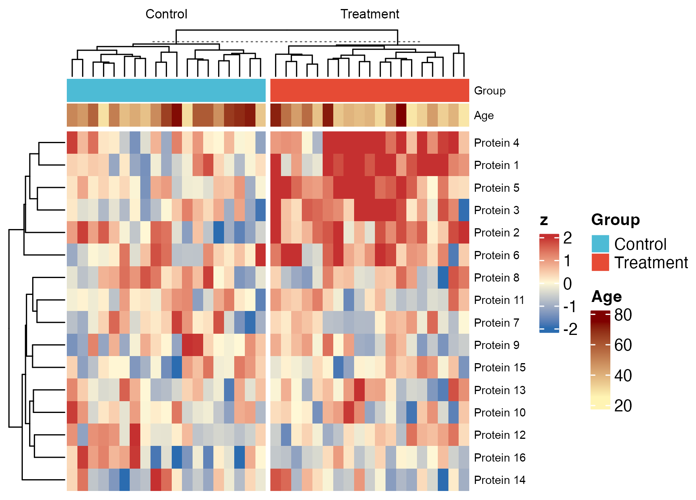
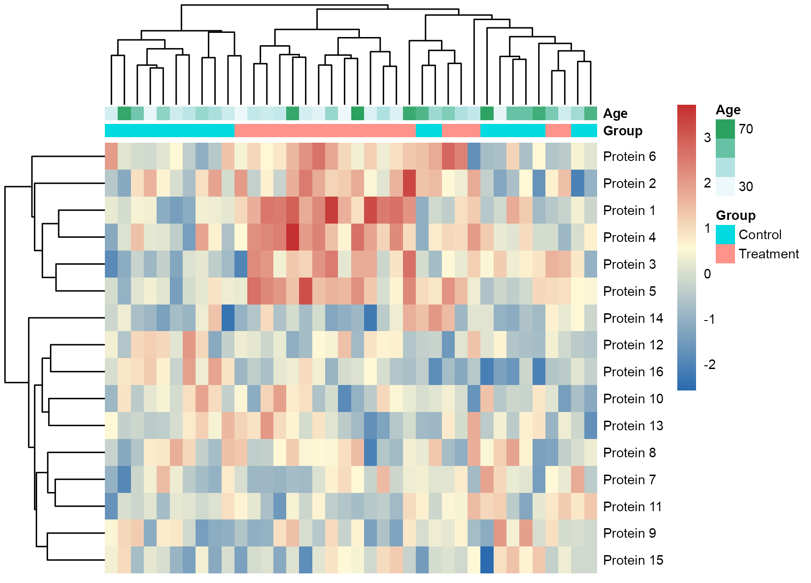

# 热图与矩阵注释 / Heatmaps

[全部分类 / Categories](../GALLERY.md) · [首页 / Home](../../README.md) · [逐图清单 / Inventory](catalog.csv)

本类 **25 张**；第 **3/4 页**。页码：[1](heatmaps.md) · [2](heatmaps-2.md) · **3** · [4](heatmaps-4.md)

图型与数据来源分别标注；旧版折叠保留。收录不等于原论文数据复现或完整 CP 验收。 Data origin is stated per figure. Historical versions are folded. Inclusion does not certify scientific fidelity.

## BF-0126 · 样本信息 Circos 环图

模拟数据／方法展示；非原论文数据复现。

状态：方法展示／仍待修订，不能视为高保真验收通过。

[原尺寸](../../docs/assets/archive-gallery/scidraw-001-065/53_sample_information_circos.png) · [脚本](../../biofigure/examples/archive-gallery/scidraw-001-065/scripts/render_cases_46_55.R) · [方法来源](https://mp.weixin.qq.com/s/AD0NWQJPlkVOs0O8r8joww) · [记录](catalog.csv)

## BF-0146 · 顶刊案例008：OncoPrint 突变景观

模拟数据／方法展示；非原论文数据复现。

状态：方法展示／仍待修订，不能视为高保真验收通过。

[原尺寸](../../docs/assets/archive-gallery/topjournal-001-010/08_oncoprint_landscape.png) · [脚本](../../biofigure/examples/archive-gallery/topjournal-001-010/scripts/render_topjournal_001_010.R) · [记录](catalog.csv)

## BF-0153 · PBMC：候选标记基因热图

公开数据演示：10x PBMC1k、ENCODE K562 或参考组装；不代表完整上游分析。

[原尺寸](../../docs/assets/archive-gallery/public-omics/05_scrna_candidate_marker_heatmap.png) · [脚本](../../biofigure/examples/archive-gallery/public-omics/scripts/analysis.R) · [记录](catalog.csv)

## BF-0178 · 聚类热图与行趋势

模拟数据／方法展示；非原论文数据复现。

[原尺寸](../../docs/assets/archive-gallery/topjournal-early/issue059_cluster_heatmap.png) · [脚本](../../biofigure/examples/archive-gallery/topjournal-early/scripts/issue059_cluster_heatmap_reproduction.R) · [记录](catalog.csv)

## BF-0181 · 环形聚类热图与树

模拟数据／方法展示；非原论文数据复现。

[原尺寸](../../docs/assets/archive-gallery/topjournal-early/issue078_circular_heatmap.png) · [脚本](../../biofigure/examples/archive-gallery/topjournal-early/scripts/issue078_circular_heatmap_reproduction.R) · [记录](catalog.csv)

## BF-0188 · 聚类注释热图：复用变体

模拟数据／方法展示；非原论文数据复现。

[原尺寸](../../docs/assets/archive-gallery/full-reproduction/figure_066_cluster_annotation_heatmap_reused.png) · [批次脚本](../../biofigure/examples/archive-gallery/full-reproduction/scripts) · [记录](catalog.csv)

## BF-0196 · ComplexHeatmap 注释矩阵

模拟数据／方法展示；非原论文数据复现。

[原尺寸](../../docs/assets/archive-gallery/full-reproduction/figure_078_issue069_complexheatmap.png) · [脚本](../../biofigure/examples/archive-gallery/full-reproduction/scripts/code_driven_071_087.R) · [记录](catalog.csv)

## BF-0197 · pheatmap 注释矩阵

模拟数据／方法展示；非原论文数据复现。

[原尺寸](../../docs/assets/archive-gallery/full-reproduction/figure_079_issue069_pheatmap.png) · [脚本](../../biofigure/examples/archive-gallery/full-reproduction/scripts/code_driven_071_087.R) · [记录](catalog.csv)

页码：[1](heatmaps.md) · [2](heatmaps-2.md) · **3** · [4](heatmaps-4.md)

[全部分类](../GALLERY.md) · [脚本存档说明](../../biofigure/examples/archive-gallery/README.md)
