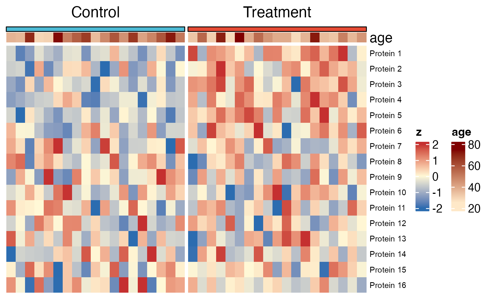

# 热图与矩阵注释 / Heatmaps

[全部分类 / Categories](../GALLERY.md) · [首页 / Home](../../README.md) · [逐图清单 / Inventory](catalog.csv)

本类 **25 张**；第 **4/4 页**。页码：[1](heatmaps.md) · [2](heatmaps-2.md) · [3](heatmaps-3.md) · **4**

图型与数据来源分别标注；旧版折叠保留。收录不等于原论文数据复现或完整 CP 验收。 Data origin is stated per figure. Historical versions are folded. Inclusion does not certify scientific fidelity.

## BF-0198 · 整洁数据热图

模拟数据／方法展示；非原论文数据复现。

[原尺寸](../../docs/assets/archive-gallery/full-reproduction/figure_080_issue069_tidy_heatmap.png) · [脚本](../../biofigure/examples/archive-gallery/full-reproduction/scripts/code_driven_071_087.R) · [记录](catalog.csv)

页码：[1](heatmaps.md) · [2](heatmaps-2.md) · [3](heatmaps-3.md) · **4**

[全部分类](../GALLERY.md) · [脚本存档说明](../../biofigure/examples/archive-gallery/README.md)
