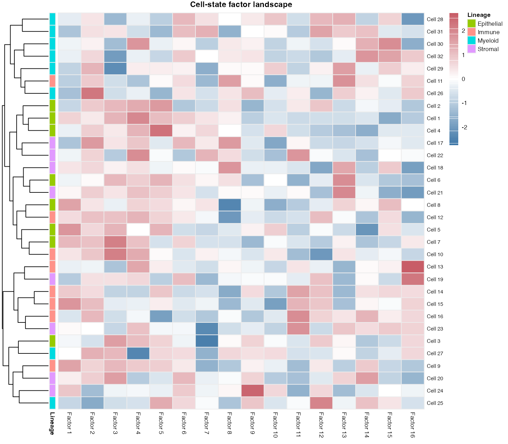

# 热图与矩阵注释 / Heatmaps

[全部分类 / All categories](../GALLERY.md) · [首页 / Home](../../README.md)

表达矩阵、临床注释、突变能量与环形多轨热图。 共 6 张。

全部为模拟数据示例；展示不代表完整验收，不能据此推断真实生物学结论。 Simulated examples only; display does not imply full validation or biological findings.

## 1. 表达热图

基础与领域模拟示例。

[原尺寸 / Full size](../assets/gallery/template-heatmap.png) · [生成脚本 / Script](../../biofigure/examples/gallery/generate_core_gallery.R) · [运行说明 / Instructions](../../biofigure/examples/gallery/README.md) · [分类目录 / Categories](../GALLERY.md)

## 2. 染色质信号热图

基础与领域模拟示例。

[原尺寸 / Full size](../assets/gallery/domain-chromatin-heatmap.png) · [生成脚本 / Script](../../biofigure/examples/gallery/generate_domain_gallery.R) · [运行说明 / Instructions](../../biofigure/examples/gallery/README.md) · [分类目录 / Categories](../GALLERY.md)

## 3. 临床注释热图

64–80 期方法迁移示例。

[原尺寸 / Full size](../assets/reproduction-gallery/figure_077_issue068_clinical_heatmap.png) · [生成脚本 / Script](../../biofigure/examples/reproduction-gallery/generate_064_080_gallery.R) · [运行说明 / Instructions](../../biofigure/examples/reproduction-gallery/README.md) · [分类目录 / Categories](../GALLERY.md)

## 4. 半圆多轨热图

64–80 期方法迁移示例。

[原尺寸 / Full size](../assets/reproduction-gallery/figure_076_issue067_circlize_rainbow_heatmap.png) · [生成脚本 / Script](../../biofigure/examples/reproduction-gallery/generate_064_080_gallery.R) · [运行说明 / Instructions](../../biofigure/examples/reproduction-gallery/README.md) · [分类目录 / Categories](../GALLERY.md)

## 5. 突变能量热图

来源知情迁移预览；全部 CP 验收未完成。

[原尺寸 / Full size](../assets/reference-transfer/mutation.png) · [生成脚本 / Script](../../biofigure/examples/reference-transfer/scripts/draw.R) · [运行说明 / Instructions](../../biofigure/examples/reference-transfer/README.md) · [分类目录 / Categories](../GALLERY.md)

## 6. 细胞状态注释热图

SciDraw 方法迁移示例。

[原尺寸 / Full size](../assets/scidraw-gallery-batch2/14_annotated_pheatmap.png) · [生成脚本 / Script](../../biofigure/examples/scidraw-gallery/scripts/generate_batch20.R) · [运行说明 / Instructions](../../biofigure/examples/scidraw-gallery/README.md) · [分类目录 / Categories](../GALLERY.md)

来源与边界：[来源声明](../../NOTICE.md) · [设计来源](../DESIGN-SOURCES.md) · [验收规则](../../biofigure/references/benchmark-protocol.md)。
