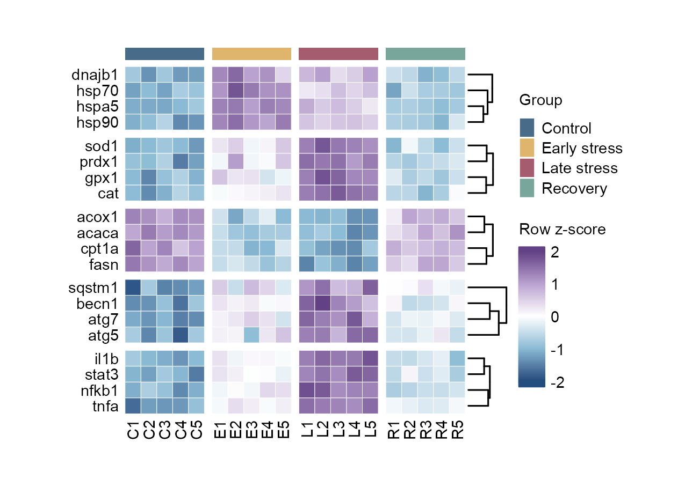
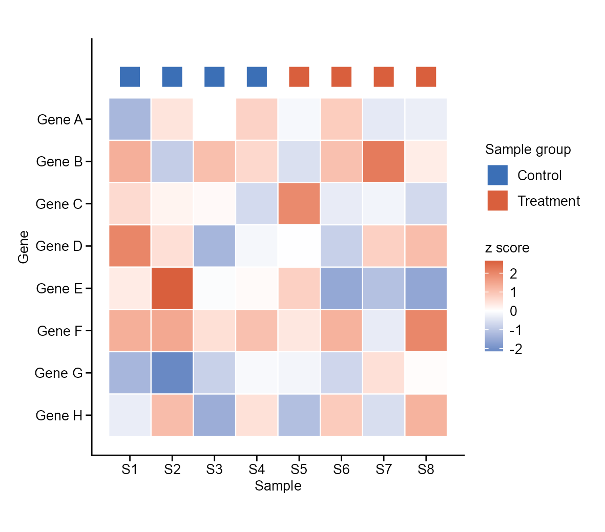

# 热图与矩阵注释 / Heatmaps

[全部分类 / Categories](../GALLERY.md) · [首页 / Home](../../README.md) · [逐图清单 / Inventory](catalog.csv)

本类 **25 张**；第 **1/4 页**。页码：**1** · [2](heatmaps-2.md) · [3](heatmaps-3.md) · [4](heatmaps-4.md)

图型与数据来源分别标注；旧版折叠保留。收录不等于原论文数据复现或完整 CP 验收。 Data origin is stated per figure. Historical versions are folded. Inclusion does not certify scientific fidelity.

## BF-0001 · 染色质信号热图

模拟数据／方法展示；非原论文数据复现。

[原尺寸](../../docs/assets/gallery/domain-chromatin-heatmap.png) · [脚本](../../biofigure/examples/gallery/generate_domain_gallery.R) · [记录](catalog.csv)

## BF-0013 · 表达热图

模拟数据／方法展示；非原论文数据复现。

[原尺寸](../../docs/assets/gallery/template-heatmap.png) · [脚本](../../biofigure/examples/gallery/generate_core_gallery.R) · [记录](catalog.csv)

## BF-0021 · 突变能量热图

模拟数据／方法展示；非原论文数据复现。

[原尺寸](../../docs/assets/reference-transfer/mutation.png) · [脚本](../../biofigure/examples/reference-transfer/scripts/draw.R) · [记录](catalog.csv)

## BF-0023 · 半圆多轨热图

模拟数据／方法展示；非原论文数据复现。

[原尺寸](../../docs/assets/reproduction-gallery/figure_076_issue067_circlize_rainbow_heatmap.png) · [脚本](../../biofigure/examples/reproduction-gallery/generate_064_080_gallery.R) · [记录](catalog.csv)

## BF-0024 · 临床注释热图

模拟数据／方法展示；非原论文数据复现。

[原尺寸](../../docs/assets/reproduction-gallery/figure_077_issue068_clinical_heatmap.png) · [脚本](../../biofigure/examples/reproduction-gallery/generate_064_080_gallery.R) · [记录](catalog.csv)

## BF-0051 · 细胞状态注释热图

模拟数据／方法展示；非原论文数据复现。

[原尺寸](../../docs/assets/scidraw-gallery-batch2/14_annotated_pheatmap.png) · [脚本](../../biofigure/examples/scidraw-gallery/scripts/generate_batch20.R) · [记录](catalog.csv)

## BF-0060 · 模块化表达注释热图

模拟数据／方法展示；非原论文数据复现。

[原尺寸](../../docs/assets/archive-gallery/maintenance-examples/heatmap.png) · [脚本](../../biofigure/examples/archive-gallery/maintenance-examples/scripts/render_checks.R) · [记录](catalog.csv)

## BF-0061 · 基准：分组注释热图

模拟数据／方法展示；非原论文数据复现。

[原尺寸](../../docs/assets/archive-gallery/benchmark-six/annotated_heatmap.png) · [脚本](../../biofigure/examples/archive-gallery/benchmark-six/scripts/generate_natural_r_benchmarks.R) · [记录](catalog.csv)

页码：**1** · [2](heatmaps-2.md) · [3](heatmaps-3.md) · [4](heatmaps-4.md)

[全部分类](../GALLERY.md) · [脚本存档说明](../../biofigure/examples/archive-gallery/README.md)
