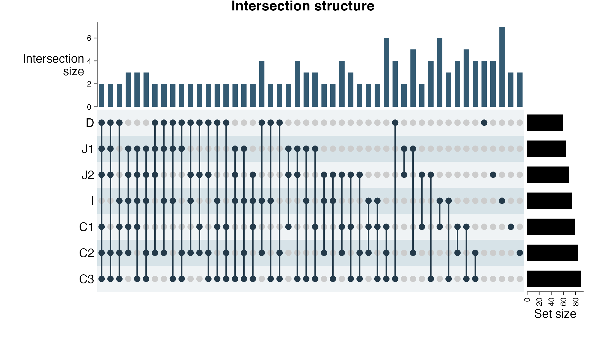
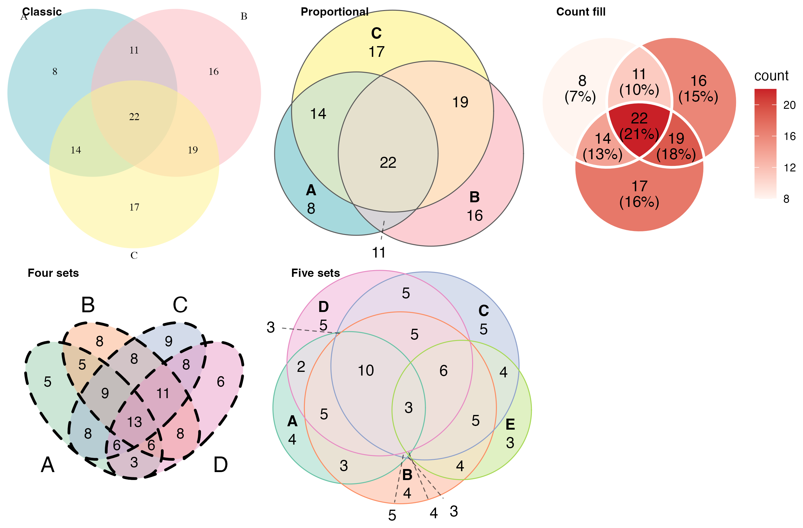

# 集合交叠与 UpSet / Set intersections

[全部分类 / Categories](../GALLERY.md) · [首页 / Home](../../README.md) · [逐图清单 / Inventory](catalog.csv)

本类 **2 张**；第 **1/1 页**。页码：**1**

图型与数据来源分别标注；旧版折叠保留。收录不等于原论文数据复现或完整 CP 验收。 Data origin is stated per figure. Historical versions are folded. Inclusion does not certify scientific fidelity.

## BF-0175 · 基因集合 UpSet

模拟数据／方法展示；非原论文数据复现。

[原尺寸](../../docs/assets/archive-gallery/topjournal-early/issue025_upset.png) · [脚本](../../biofigure/examples/archive-gallery/topjournal-early/scripts/issue025_chord_upset_reproduction.R) · [记录](catalog.csv)

## BF-0212 · 多种 Venn 图布局

模拟数据／方法展示；非原论文数据复现。

[原尺寸](../../docs/assets/archive-gallery/full-reproduction/revision_v1_49_venn_gallery.png) · [脚本](../../biofigure/examples/archive-gallery/full-reproduction/scripts/batch41_50_reproduction.R) · [记录](catalog.csv)

页码：**1**

[全部分类](../GALLERY.md) · [脚本存档说明](../../biofigure/examples/archive-gallery/README.md)
