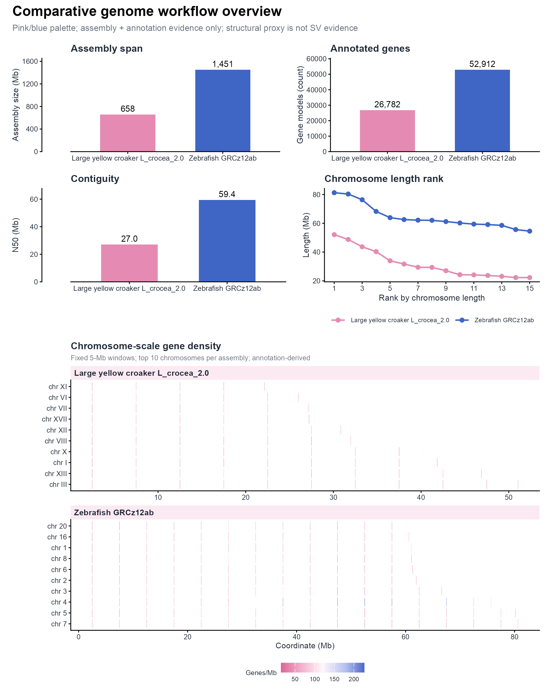

# 机制、图像与多面板 / Mechanisms and panels

[全部分类 / Categories](../GALLERY.md) · [首页 / Home](../../README.md) · [逐图清单 / Inventory](catalog.csv)

本类 **4 张**；第 **1/1 页**。页码：**1**

图型与数据来源分别标注；旧版折叠保留。收录不等于原论文数据复现或完整 CP 验收。 Data origin is stated per figure. Historical versions are folded. Inclusion does not certify scientific fidelity.

## BF-0003 · 图像实验板示意

模拟数据／方法展示；非原论文数据复现。

[原尺寸](../../docs/assets/gallery/domain-imaging-assay.png) · [脚本](../../biofigure/examples/gallery/generate_domain_gallery.R) · [记录](catalog.csv)

## BF-0004 · 机制关系示意

模拟数据／方法展示；非原论文数据复现。

[原尺寸](../../docs/assets/gallery/domain-mechanism.png) · [脚本](../../biofigure/examples/gallery/generate_domain_gallery.R) · [记录](catalog.csv)

## BF-0008 · 多面板证据组合

模拟数据／方法展示；非原论文数据复现。

[原尺寸](../../docs/assets/gallery/domain-multipanel-evidence.png) · [脚本](../../biofigure/examples/gallery/generate_domain_gallery.R) · [记录](catalog.csv)

## BF-0172 · 比较基因组综合面板

斑马鱼与大黄鱼公开参考组装／注释示例；无全基因组比对或 SV calling。

[原尺寸](../../docs/assets/archive-gallery/comparative-genomics/06_comparative_genomics_workflow_overview.png) · [脚本](../../biofigure/examples/archive-gallery/comparative-genomics/scripts/analysis.R) · [记录](catalog.csv)

页码：**1**

[全部分类](../GALLERY.md) · [脚本存档说明](../../biofigure/examples/archive-gallery/README.md)
