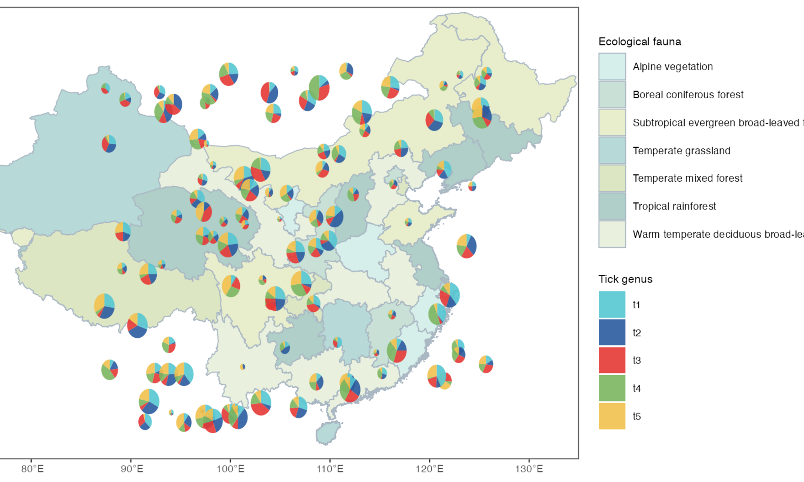
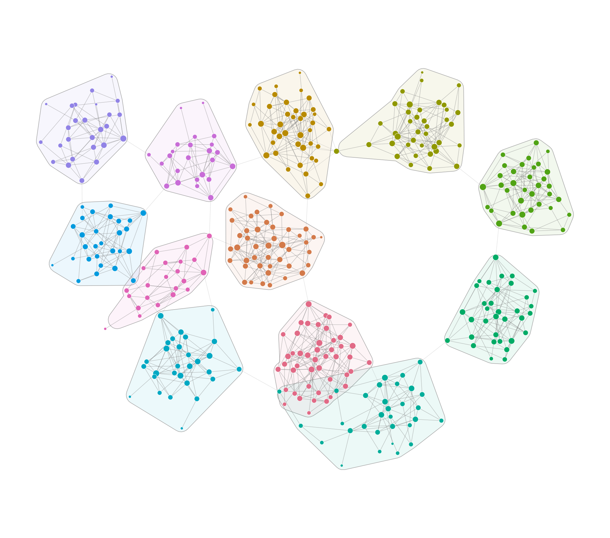

# 网络与地图 / Networks and maps

[全部分类 / Categories](../GALLERY.md) · [首页 / Home](../../README.md) · [逐图清单 / Inventory](catalog.csv)

本类 **10 张**；第 **2/2 页**。页码：[1](networks.md) · **2**

图型与数据来源分别标注；旧版折叠保留。收录不等于原论文数据复现或完整 CP 验收。 Data origin is stated per figure. Historical versions are folded. Inclusion does not certify scientific fidelity.

## BF-0132 · 中国地图与散点饼图

GADM 地图边界；生态区标签、采样点和饼图数值为模拟，不能作真实地理分布解读。

状态：方法展示／仍待修订，不能视为高保真验收通过。

[原尺寸](../../docs/assets/archive-gallery/scidraw-001-065/59_china_scatterpie.png) · [脚本](../../biofigure/examples/archive-gallery/scidraw-001-065/scripts/render_cases_56_65.R) · [方法来源](https://mp.weixin.qq.com/s/a8-pyP8L9KdE32l1gTnlpw) · [记录](catalog.csv)

## BF-0182 · 细胞簇网络

模拟数据／方法展示；非原论文数据复现。

[原尺寸](../../docs/assets/archive-gallery/full-reproduction/figure_055_cluster_network_code_driven.png) · [脚本](../../biofigure/examples/archive-gallery/full-reproduction/scripts/non_single_cell_055_069.R) · [记录](catalog.csv)

页码：[1](networks.md) · **2**

[全部分类](../GALLERY.md) · [脚本存档说明](../../biofigure/examples/archive-gallery/README.md)
