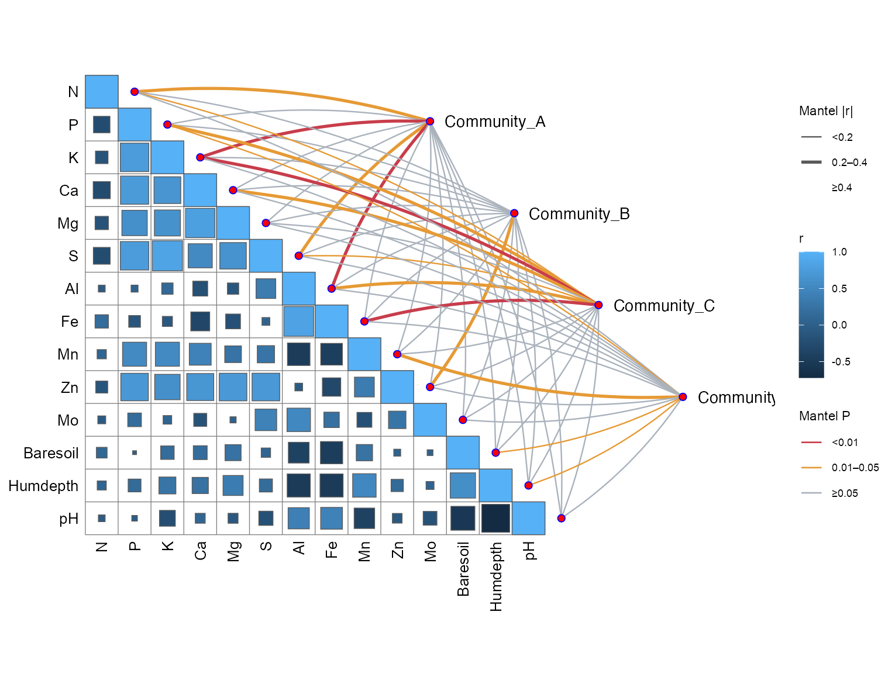

# 网络与地理流向 / Networks and flows

[全部分类 / All categories](../GALLERY.md) · [首页 / Home](../../README.md)

层级网络、相关网络及地理流向。 共 3 张。

全部为模拟数据示例；展示不代表完整验收，不能据此推断真实生物学结论。 Simulated examples only; display does not imply full validation or biological findings.

## 1. 花瓣式层级网络

64–80 期方法迁移示例。

[原尺寸 / Full size](../assets/reproduction-gallery/figure_086_issue074_petal_network.png) · [生成脚本 / Script](../../biofigure/examples/reproduction-gallery/generate_064_080_gallery.R) · [运行说明 / Instructions](../../biofigure/examples/reproduction-gallery/README.md) · [分类目录 / Categories](../GALLERY.md)

## 2. 相关网络与矩阵组合

SciDraw 方法迁移示例。

[原尺寸 / Full size](../assets/scidraw-gallery-batch2/18_linket_correlation_network.png) · [生成脚本 / Script](../../biofigure/examples/scidraw-gallery/scripts/generate_batch20.R) · [运行说明 / Instructions](../../biofigure/examples/scidraw-gallery/README.md) · [分类目录 / Categories](../GALLERY.md)

## 3. 地理流向地图

64–80 期方法迁移示例。

[原尺寸 / Full size](../assets/reproduction-gallery/figure_090_issue080_flow_map.png) · [生成脚本 / Script](../../biofigure/examples/reproduction-gallery/generate_064_080_gallery.R) · [运行说明 / Instructions](../../biofigure/examples/reproduction-gallery/README.md) · [分类目录 / Categories](../GALLERY.md)

来源与边界：[来源声明](../../NOTICE.md) · [设计来源](../DESIGN-SOURCES.md) · [验收规则](../../biofigure/references/benchmark-protocol.md)。
