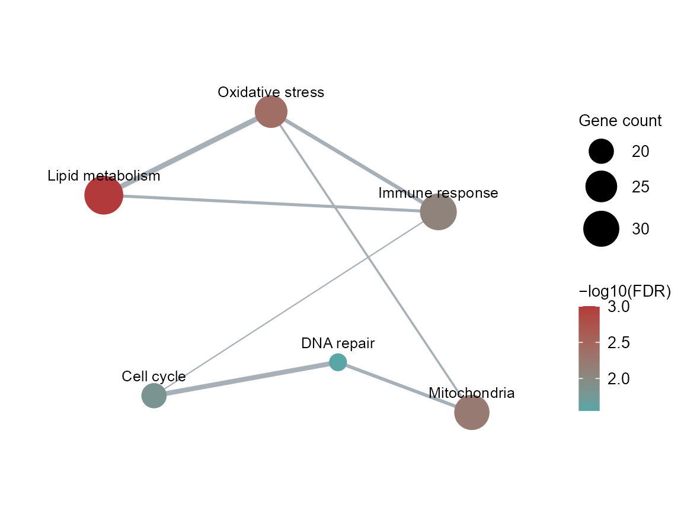
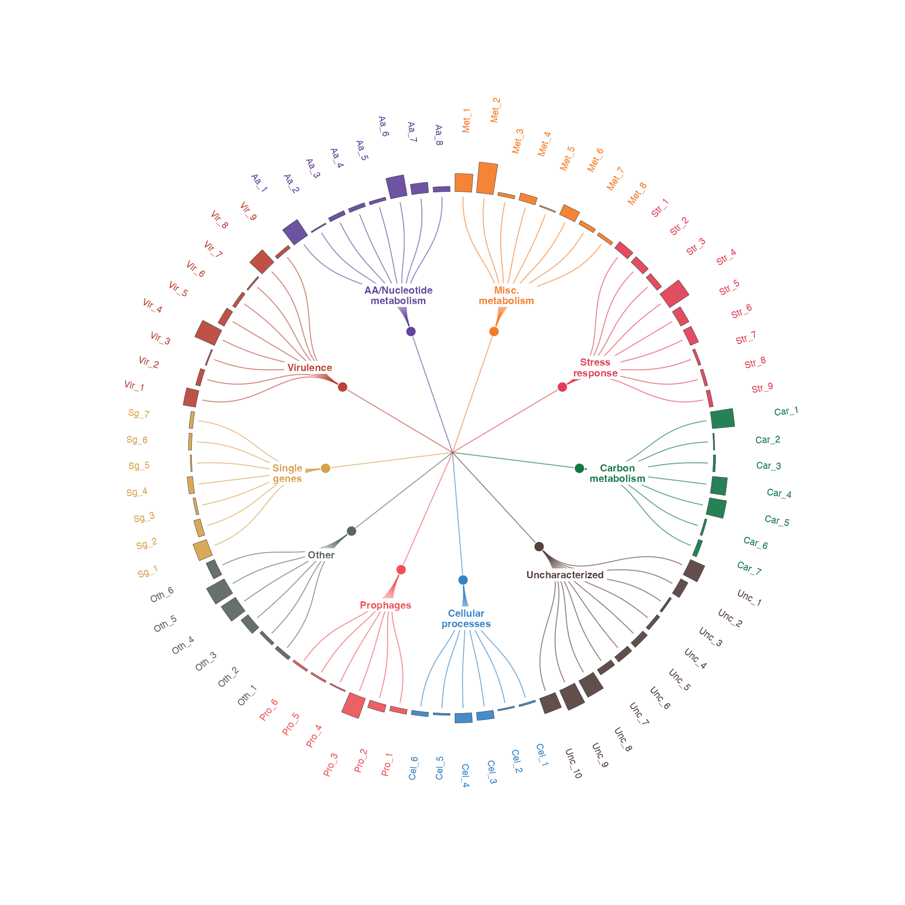
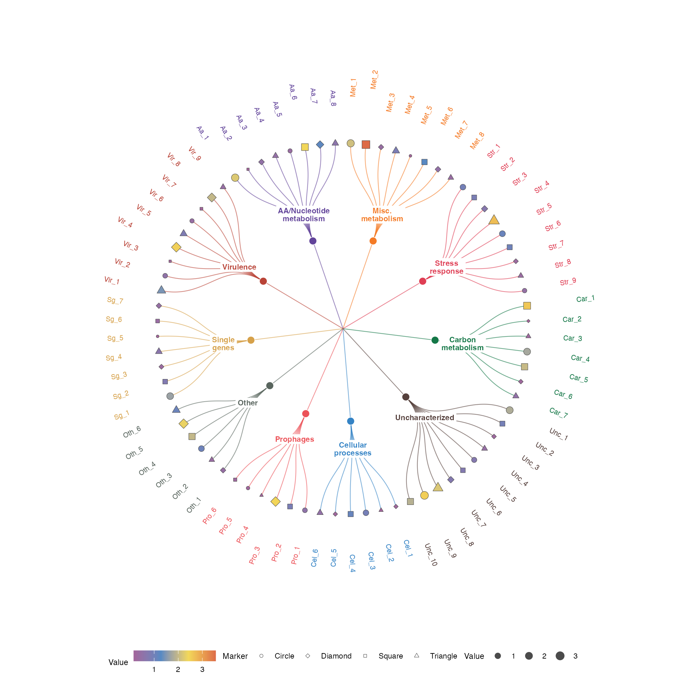
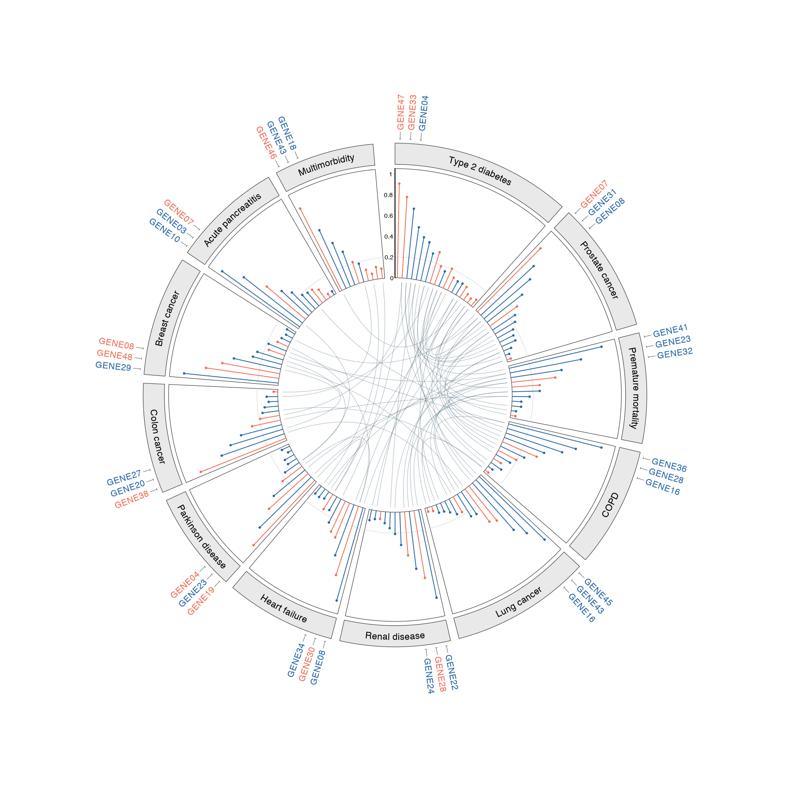
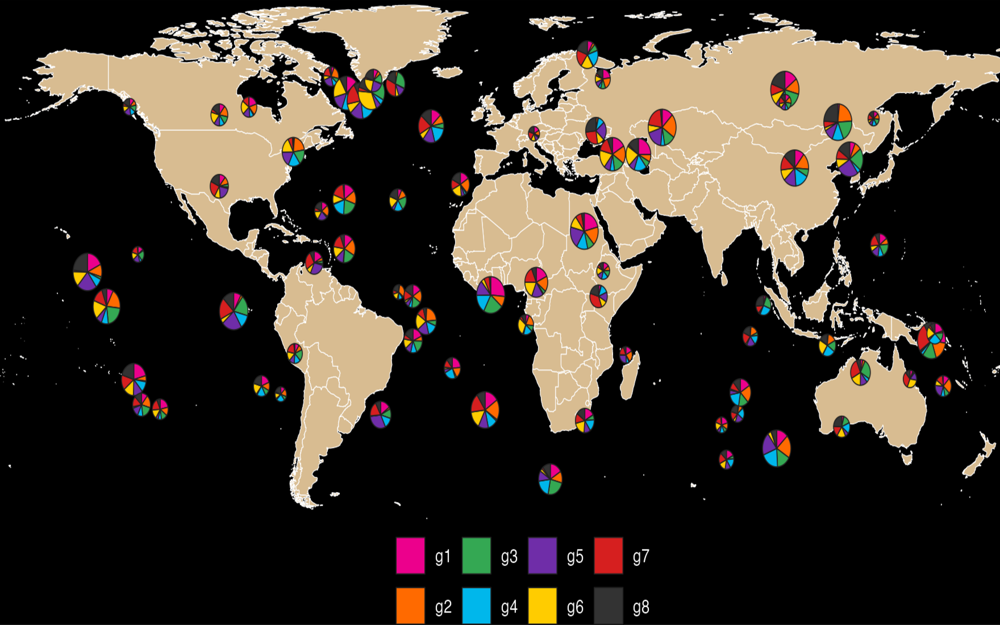

# 网络与地图 / Networks and maps

[全部分类 / Categories](../GALLERY.md) · [首页 / Home](../../README.md) · [逐图清单 / Inventory](catalog.csv)

本类 **10 张**；第 **1/2 页**。页码：**1** · [2](networks-2.md)

图型与数据来源分别标注；旧版折叠保留。收录不等于原论文数据复现或完整 CP 验收。 Data origin is stated per figure. Historical versions are folded. Inclusion does not certify scientific fidelity.

## BF-0027 · 花瓣式层级网络

模拟数据／方法展示；非原论文数据复现。

[原尺寸](../../docs/assets/reproduction-gallery/figure_086_issue074_petal_network.png) · [脚本](../../biofigure/examples/reproduction-gallery/generate_064_080_gallery.R) · [记录](catalog.csv)

## BF-0029 · 地理流向地图

模拟数据／方法展示；非原论文数据复现。

[原尺寸](../../docs/assets/reproduction-gallery/figure_090_issue080_flow_map.png) · [脚本](../../biofigure/examples/reproduction-gallery/generate_064_080_gallery.R) · [记录](catalog.csv)

## BF-0055 · 相关网络与矩阵组合

模拟数据／方法展示；非原论文数据复现。

[原尺寸](../../docs/assets/scidraw-gallery-batch2/18_linket_correlation_network.png) · [脚本](../../biofigure/examples/scidraw-gallery/scripts/generate_batch20.R) · [记录](catalog.csv)

## BF-0063 · 基准：富集关联网络

模拟数据／方法展示；非原论文数据复现。

[原尺寸](../../docs/assets/archive-gallery/benchmark-six/enrichment_network.png) · [脚本](../../biofigure/examples/archive-gallery/benchmark-six/scripts/generate_natural_r_benchmarks.R) · [记录](catalog.csv)

## BF-0089 · 径向网络与外圈柱图

模拟数据／方法展示；非原论文数据复现。

状态：方法展示／仍待修订，不能视为高保真验收通过。

[原尺寸](../../docs/assets/archive-gallery/scidraw-001-065/16_network_circular_bar.png) · [脚本](../../biofigure/examples/archive-gallery/scidraw-001-065/scripts/render_cases_16_18.R) · [方法来源](https://mp.weixin.qq.com/s/m0zb6F7PpycKcGABHt-qqw) · [记录](catalog.csv)

## BF-0090 · 径向网络与外圈气泡

模拟数据／方法展示；非原论文数据复现。

状态：方法展示／仍待修订，不能视为高保真验收通过。

[原尺寸](../../docs/assets/archive-gallery/scidraw-001-065/17_network_circular_bubble.png) · [脚本](../../biofigure/examples/archive-gallery/scidraw-001-065/scripts/render_cases_16_18.R) · [方法来源](https://mp.weixin.qq.com/s/m0zb6F7PpycKcGABHt-qqw) · [记录](catalog.csv)

## BF-0091 · 环形棒棒糖与关联连线

模拟数据／方法展示；非原论文数据复现。

状态：方法展示／仍待修订，不能视为高保真验收通过。

[原尺寸](../../docs/assets/archive-gallery/scidraw-001-065/18_circular_lollipop_links.png) · [批次脚本](../../biofigure/examples/archive-gallery/scidraw-001-065/scripts) · [方法来源](https://mp.weixin.qq.com/s/ABiUom7wjWAK8dK5qFZUbw) · [记录](catalog.csv)

## BF-0131 · 世界地图与散点饼图

地图上的采样点、位置与组成是模拟；不能作真实地理分布解读。

状态：方法展示／仍待修订，不能视为高保真验收通过。

[原尺寸](../../docs/assets/archive-gallery/scidraw-001-065/58_world_scatterpie.png) · [脚本](../../biofigure/examples/archive-gallery/scidraw-001-065/scripts/render_cases_56_65.R) · [方法来源](https://mp.weixin.qq.com/s/mvTk5wcc_N7l5l4kHm3G0w) · [记录](catalog.csv)

页码：**1** · [2](networks-2.md)

[全部分类](../GALLERY.md) · [脚本存档说明](../../biofigure/examples/archive-gallery/README.md)
