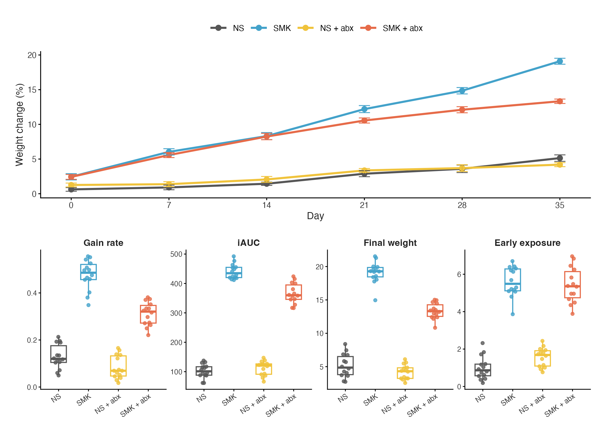
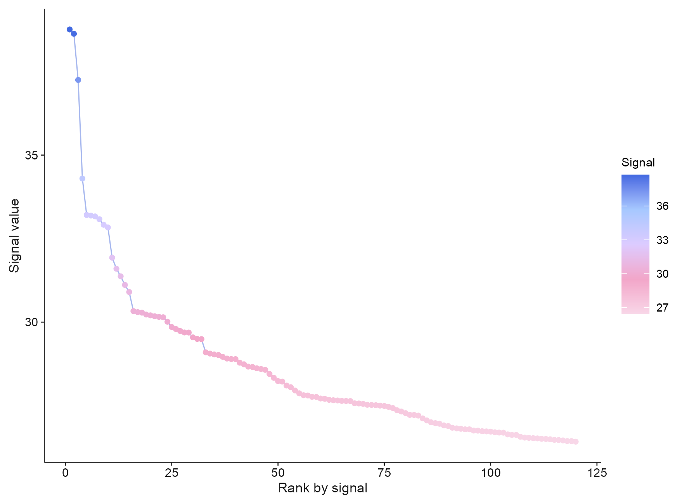
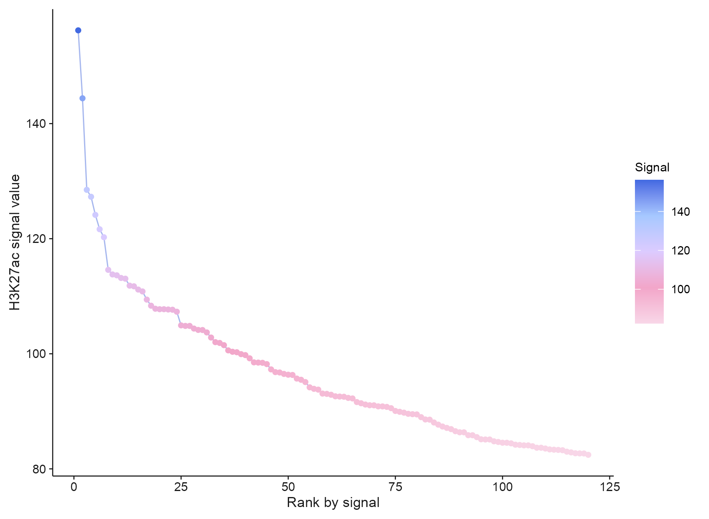
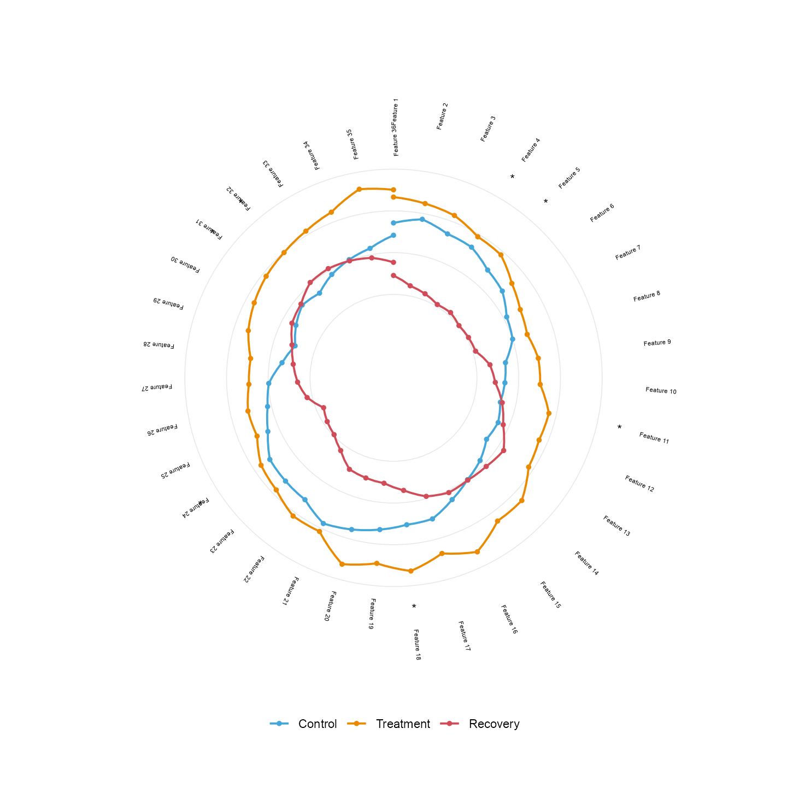

# 时序、曲线与信号 / Time courses and profiles

[全部分类 / Categories](../GALLERY.md) · [首页 / Home](../../README.md) · [逐图清单 / Inventory](catalog.csv)

本类 **14 张**；第 **2/2 页**。页码：[1](profiles.md) · **2**

图型与数据来源分别标注；旧版折叠保留。收录不等于原论文数据复现或完整 CP 验收。 Data origin is stated per figure. Historical versions are folded. Inclusion does not certify scientific fidelity.

## BF-0138 · 多条件对数频率曲线

模拟数据／方法展示；非原论文数据复现。

状态：方法展示／仍待修订，不能视为高保真验收通过。

[原尺寸](../../docs/assets/archive-gallery/scidraw-001-065/65_log_frequency_curves.png) · [脚本](../../biofigure/examples/archive-gallery/scidraw-001-065/scripts/render_cases_56_65.R) · [方法来源](https://mp.weixin.qq.com/s/vejTfuLTdhn-3qG8RSal5A) · [记录](catalog.csv)

## BF-0144 · 顶刊案例006：纵向多面板组合

模拟数据／方法展示；非原论文数据复现。

状态：方法展示／仍待修订，不能视为高保真验收通过。

[原尺寸](../../docs/assets/archive-gallery/topjournal-001-010/06_longitudinal_multi_panel.png) · [脚本](../../biofigure/examples/archive-gallery/topjournal-001-010/scripts/render_topjournal_001_010.R) · [记录](catalog.csv)

## BF-0155 · ATAC：峰信号排名曲线

公开数据演示：10x PBMC1k、ENCODE K562 或参考组装；不代表完整上游分析。

[原尺寸](../../docs/assets/archive-gallery/public-omics/07_atac_top_peak_rank.png) · [脚本](../../biofigure/examples/archive-gallery/public-omics/scripts/analysis.R) · [记录](catalog.csv)

## BF-0158 · ChIP：峰信号排名曲线

公开数据演示：10x PBMC1k、ENCODE K562 或参考组装；不代表完整上游分析。

[原尺寸](../../docs/assets/archive-gallery/public-omics/10_chip_top_peak_rank.png) · [脚本](../../biofigure/examples/archive-gallery/public-omics/scripts/analysis.R) · [记录](catalog.csv)

## BF-0184 · 个体肿瘤变化蜘蛛图

模拟数据／方法展示；非原论文数据复现。

[原尺寸](../../docs/assets/archive-gallery/full-reproduction/figure_059_spider_code_driven.png) · [脚本](../../biofigure/examples/archive-gallery/full-reproduction/scripts/non_single_cell_055_069.R) · [记录](catalog.csv)

BF-0087 · 环形轨迹：早期版本（历史存档，点击展开）

## BF-0087 · 环形轨迹：早期版本

早期环形轨迹；对应分组曲线修订版见 BF-0086。

[查看当前修订版 BF-0086](profiles.md#bf-0086)

[原尺寸](../../docs/assets/archive-gallery/scidraw-001-065/14_circular_trajectory.png) · [批次脚本](../../biofigure/examples/archive-gallery/scidraw-001-065/scripts) · [方法来源](https://mp.weixin.qq.com/s/u8IgzYxdRHu8xwnnlvgawQ) · [记录](catalog.csv)

页码：[1](profiles.md) · **2**

[全部分类](../GALLERY.md) · [脚本存档说明](../../biofigure/examples/archive-gallery/README.md)
