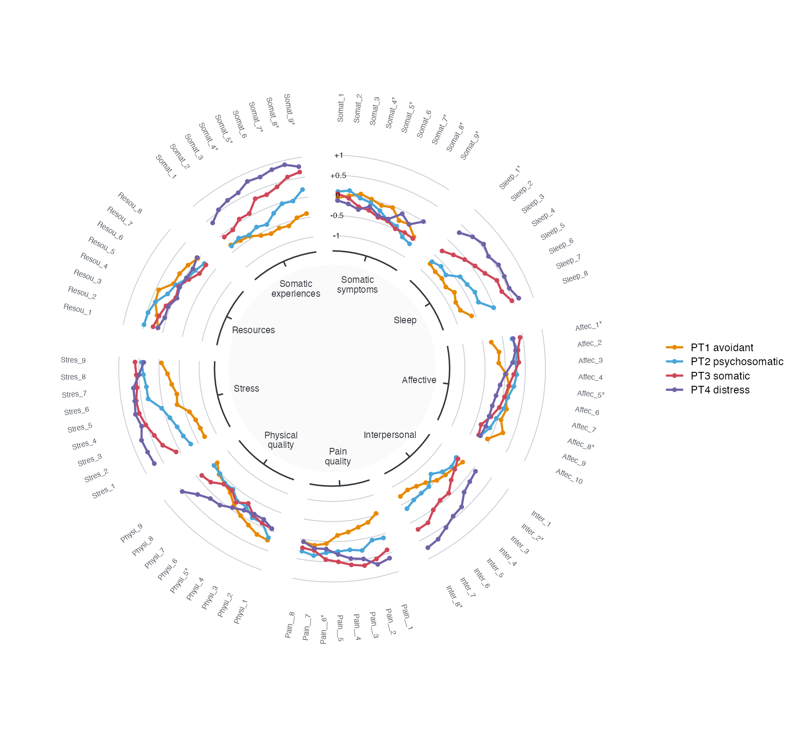
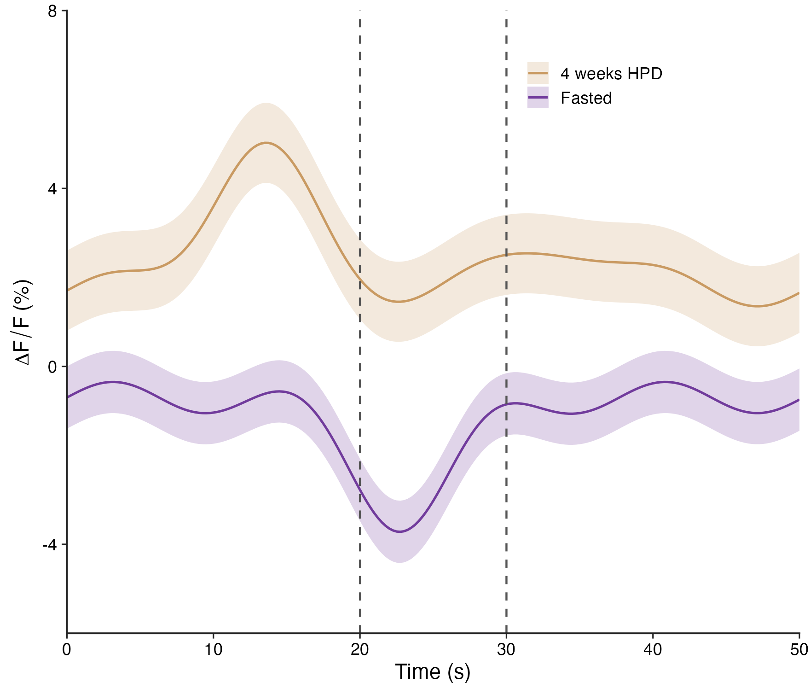
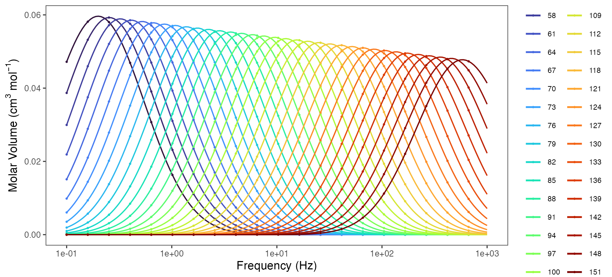
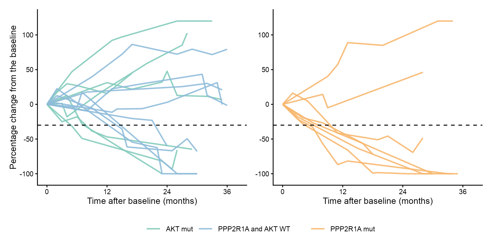

# 时序、曲线与信号 / Time courses and profiles

[全部分类 / Categories](../GALLERY.md) · [首页 / Home](../../README.md) · [逐图清单 / Inventory](catalog.csv)

本类 **5 张代表图**，每个细分图型保留一例。

按结构与用途选取代表图，去除同类配色、数据集及历史变体。数据来源逐图标注；收录不等于完整 CP 验收。 One representative per visual subtype; color-only, dataset-only and historical variants are omitted. Inclusion does not certify scientific fidelity.

## BF-0002 · 染色质信号曲线

图型：染色质信号。模拟数据／方法展示；非原论文数据复现。

[原尺寸](../../docs/assets/gallery/domain-chromatin-profile.png) · [脚本](../../biofigure/examples/gallery/generate_domain_gallery.R) · [记录](catalog.csv)

## BF-0086 · 环形分组曲线

图型：环形曲线。模拟数据／方法展示；非原论文数据复现。

[原尺寸](../../docs/assets/archive-gallery/scidraw-001-065/14_circular_grouped_profiles.png) · [脚本](../../biofigure/examples/archive-gallery/scidraw-001-065/scripts/render_cases_10_14.R) · [方法来源](https://mp.weixin.qq.com/s/u8IgzYxdRHu8xwnnlvgawQ) · [记录](catalog.csv)

## BF-0129 · 分组时序与误差带

图型：时序与误差带。模拟数据／方法展示；非原论文数据复现。

状态：方法展示／仍待修订，不能视为高保真验收通过。

[原尺寸](../../docs/assets/archive-gallery/scidraw-001-065/56_timeseries_ribbon.png) · [脚本](../../biofigure/examples/archive-gallery/scidraw-001-065/scripts/render_cases_56_65.R) · [方法来源](https://mp.weixin.qq.com/s/mAOgsMJJJnHVHHMteS5O_A) · [记录](catalog.csv)

## BF-0138 · 多条件对数频率曲线

图型：对数频率曲线。模拟数据／方法展示；非原论文数据复现。

状态：方法展示／仍待修订，不能视为高保真验收通过。

[原尺寸](../../docs/assets/archive-gallery/scidraw-001-065/65_log_frequency_curves.png) · [脚本](../../biofigure/examples/archive-gallery/scidraw-001-065/scripts/render_cases_56_65.R) · [方法来源](https://mp.weixin.qq.com/s/vejTfuLTdhn-3qG8RSal5A) · [记录](catalog.csv)

## BF-0184 · 个体肿瘤变化蜘蛛图

图型：个体蜘蛛轨迹。模拟数据／方法展示；非原论文数据复现。

[原尺寸](../../docs/assets/archive-gallery/full-reproduction/figure_059_spider_code_driven.png) · [脚本](../../biofigure/examples/archive-gallery/full-reproduction/scripts/non_single_cell_055_069.R) · [记录](catalog.csv)

[全部分类](../GALLERY.md) · [脚本存档说明](../../biofigure/examples/archive-gallery/README.md)
