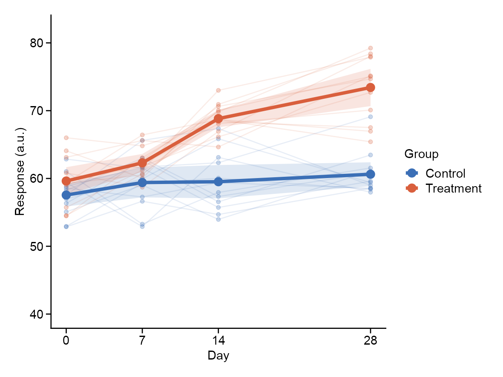
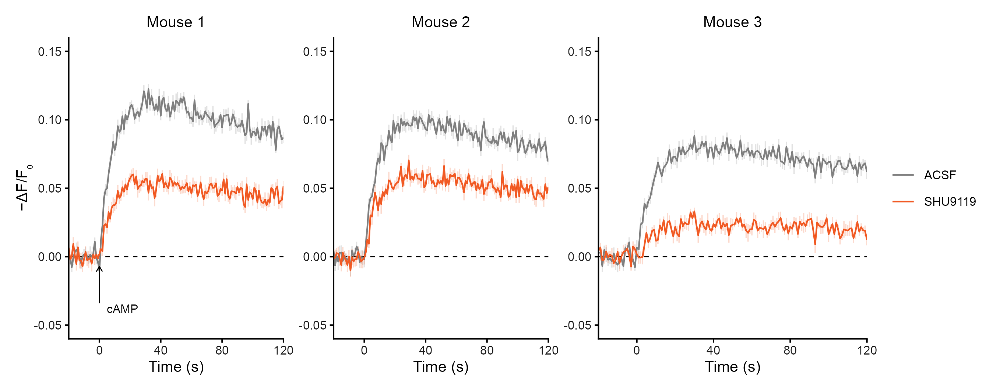
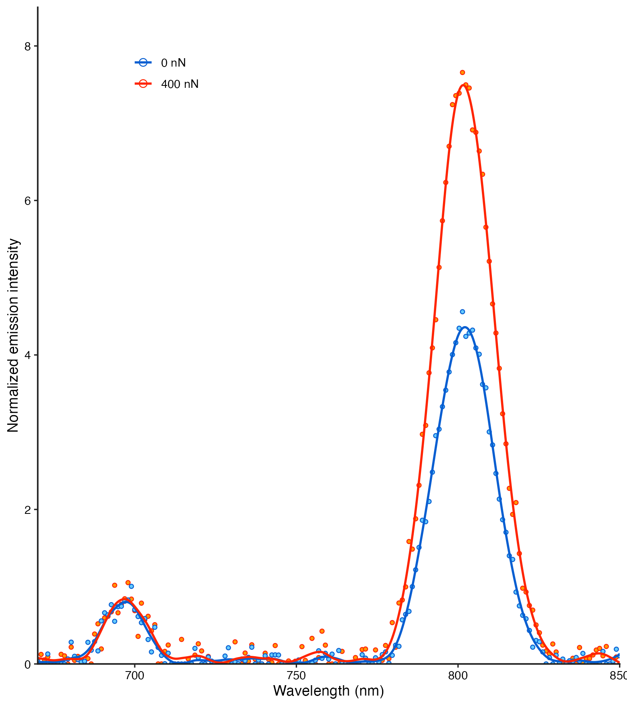
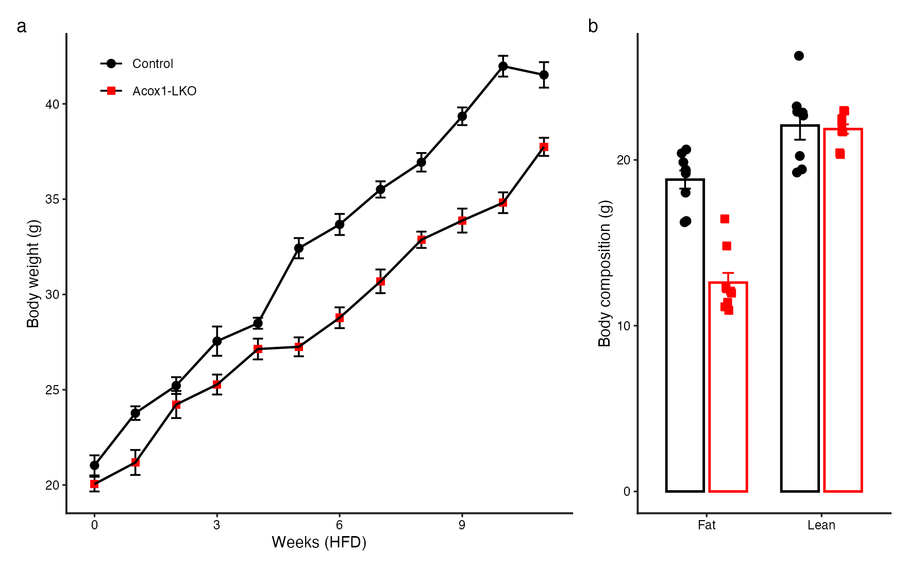
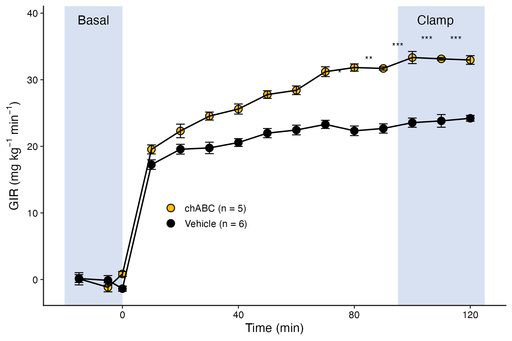

# 时序、曲线与信号 / Time courses and profiles

[全部分类 / Categories](../GALLERY.md) · [首页 / Home](../../README.md) · [逐图清单 / Inventory](catalog.csv)

本类 **14 张**；第 **1/2 页**。页码：**1** · [2](profiles-2.md)

图型与数据来源分别标注；旧版折叠保留。收录不等于原论文数据复现或完整 CP 验收。 Data origin is stated per figure. Historical versions are folded. Inclusion does not certify scientific fidelity.

## BF-0002 · 染色质信号曲线

模拟数据／方法展示；非原论文数据复现。

[原尺寸](../../docs/assets/gallery/domain-chromatin-profile.png) · [脚本](../../biofigure/examples/gallery/generate_domain_gallery.R) · [记录](catalog.csv)

## BF-0066 · 基准：个体轨迹与时序均值

模拟数据／方法展示；非原论文数据复现。

[原尺寸](../../docs/assets/archive-gallery/benchmark-six/time_series.png) · [脚本](../../biofigure/examples/archive-gallery/benchmark-six/scripts/generate_natural_r_benchmarks.R) · [记录](catalog.csv)

## BF-0067 · 分面荧光信号时序

模拟数据／方法展示；非原论文数据复现。

[原尺寸](../../docs/assets/archive-gallery/reference-transfer/time.png) · [脚本](../../biofigure/examples/archive-gallery/reference-transfer/scripts/draw.R) · [记录](catalog.csv)

## BF-0086 · 环形分组曲线

模拟数据／方法展示；非原论文数据复现。

[原尺寸](../../docs/assets/archive-gallery/scidraw-001-065/14_circular_grouped_profiles.png) · [脚本](../../biofigure/examples/archive-gallery/scidraw-001-065/scripts/render_cases_10_14.R) · [方法来源](https://mp.weixin.qq.com/s/u8IgzYxdRHu8xwnnlvgawQ) · [记录](catalog.csv)

## BF-0121 · 多峰平滑频谱

模拟数据／方法展示；非原论文数据复现。

状态：方法展示／仍待修订，不能视为高保真验收通过。

[原尺寸](../../docs/assets/archive-gallery/scidraw-001-065/48_custom_smooth_spectrum.png) · [脚本](../../biofigure/examples/archive-gallery/scidraw-001-065/scripts/render_cases_46_55.R) · [方法来源](https://mp.weixin.qq.com/s/KA6UW4q-BzmnIdpqvoI5lQ) · [记录](catalog.csv)

## BF-0122 · 纵向折线与终点柱图

模拟数据／方法展示；非原论文数据复现。

状态：方法展示／仍待修订，不能视为高保真验收通过。

[原尺寸](../../docs/assets/archive-gallery/scidraw-001-065/49_line_bar_combo.png) · [脚本](../../biofigure/examples/archive-gallery/scidraw-001-065/scripts/render_cases_46_55.R) · [方法来源](https://mp.weixin.qq.com/s/rAlb9MeQzqT-iQP1-aesyA) · [记录](catalog.csv)

## BF-0129 · 分组时序与误差带

模拟数据／方法展示；非原论文数据复现。

状态：方法展示／仍待修订，不能视为高保真验收通过。

[原尺寸](../../docs/assets/archive-gallery/scidraw-001-065/56_timeseries_ribbon.png) · [脚本](../../biofigure/examples/archive-gallery/scidraw-001-065/scripts/render_cases_56_65.R) · [方法来源](https://mp.weixin.qq.com/s/mAOgsMJJJnHVHHMteS5O_A) · [记录](catalog.csv)

## BF-0130 · 重复测量曲线与阶段背景

模拟数据／方法展示；非原论文数据复现。

状态：方法展示／仍待修订，不能视为高保真验收通过。

[原尺寸](../../docs/assets/archive-gallery/scidraw-001-065/57_repeated_measures_clamp.png) · [脚本](../../biofigure/examples/archive-gallery/scidraw-001-065/scripts/render_cases_56_65.R) · [方法来源](https://mp.weixin.qq.com/s/mAOgsMJJJnHVHHMteS5O_A) · [记录](catalog.csv)

页码：**1** · [2](profiles-2.md)

[全部分类](../GALLERY.md) · [脚本存档说明](../../biofigure/examples/archive-gallery/README.md)
